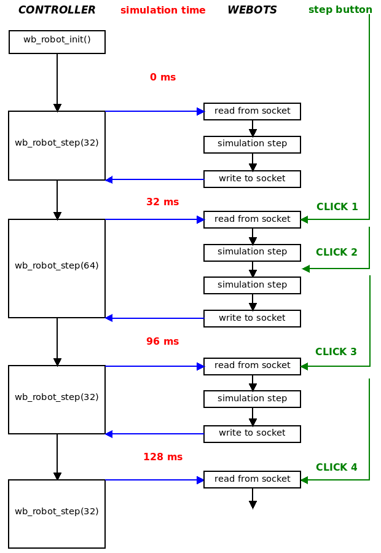

## Controller Programming

The programming examples provided here are in C, but same concepts apply to C++, Java, Python and MATLAB.

### Hello World Example

The tradition in computer science is to start with a "Hello World!" example.
So here is a "Hello World!" example for a Webots controller:

```c
#include <webots/robot.h>
#include <stdio.h>

int main() {
  wb_robot_init();

  while(wb_robot_step(32) != -1)
    printf("Hello World!\n");

  wb_robot_cleanup();

  return 0;
}
```

This code repeatedly prints `"Hello World!"` to the standard output stream which is redirected to Webots console.
The standard output and error streams are automatically redirected to Webots console for all Webots supported languages.

Webots C API (Application Programming Interface) is provided by regular C header files.
These header files must be included using statements like `#include <webots/xyz.h>` where `xyz` represents the name of a Webots node in lowercase.
Like with any regular C code it is also possible to include the standard C headers, e.g. `#include <stdio.h>`.
A call to the initialization `wb_robot_init` function is required before any other C API function call.
This function initializes the communication between the controller and Webots.
The `wb_robot_cleanup` function does the opposite: it closes the communication between the controller and Webots to terminate the controller smoothly.
Note that the `wb_robot_init` and `wb_robot_cleanup` functions exist only in the C API, they do not have any equivalent in the other supported programming languages.

Usually the highest level control code is placed inside a `for` or a `while` loop.
Within that loop there is a call to the `wb_robot_step` function.
This function synchronizes the controller's data with the simulator.
The `wb_robot_step` function needs to be present in every controller and it must be called at regular intervals, therefore it is usually placed in the main loop as in the above example.
The value 32 specifies the duration of the control steps, i.e., the `wb_robot_step` function shall compute 32 milliseconds of simulation and then return.
This duration specifies an amount of simulated time, not real (wall clock) time, so it may actually take 1 millisecond or one minute of real time, depending on the complexity of the simulated world.

Note that in this "Hello World!" example, the exit condition of the `while` loop is the return value of the `wb_robot_step` function.
This function will indeed return `-1` when Webots terminates the controller (see [Controller Termination](#controller-termination)).
Therefore, in this example, the control loop will run as long as the simulation runs.
When the loop exists, no further communication with Webots is possible and the only option is to confirm to Webots to close the communication by calling the `wb_robot_cleanup` function.

### Reading Sensors

Now that we have seen how to print a message to the console, we shall see how to read the sensors of a robot.
The next example does continuously update and print the value returned by a [DistanceSensor](../reference/distancesensor.md):

```c
#include <webots/robot.h>
#include <webots/distance_sensor.h>
#include <stdio.h>

#define TIME_STEP 32

int main() {
  wb_robot_init();

  WbDeviceTag ds = wb_robot_get_device("my_distance_sensor");
  wb_distance_sensor_enable(ds, TIME_STEP);

  while (wb_robot_step(TIME_STEP) != -1) {
    double dist = wb_distance_sensor_get_value(ds);
    printf("sensor value is %f\n", dist);
  }

  wb_robot_cleanup();

  return 0;
}
```

As you can notice, prior to using a device, it is necessary to get the corresponding device tag (`WbDeviceTag`); this is done using the `wb_robot_get_device` function.
The `WbDeviceTag` is an opaque type that is used to identify a device in the controller code.
Note that the string passed to this function, *"my\_distance\_sensor"* in this example, refers to a device name specified in the robot description (".wbt" or ".proto" file).
If the robot has no device with the specified name, this function returns 0.

Each sensor must be enabled before it can be used.
If a sensor is not enabled it returns undefined values.
Enabling a sensor is achieved by using the corresponding `wb_*_enable` function, where the star (`*`) stands for the sensor type.
Every `wb_*_enable` function allows to specify an update delay in milliseconds.
The update delay specifies the desired interval between two updates of the sensor's data.

In the usual case, the update delay is chosen to be similar to the control step (`TIME_STEP`) and hence the sensor will be updated at every `wb_robot_step` function call.
If, for example, the update delay is chosen to be twice the control step then the sensor data will be updated every two `wb_robot_step` function calls: this can be used to simulate a slow device.
Note that a larger update delay can also speed up the simulation, especially for CPU intensive devices like the [Camera](../reference/camera.md).
On the contrary, it would be pointless to choose an update delay smaller than the control step, because it will not be possible for the controller to process the device's data at a higher frequency than that imposed by the control step.
It is possible to disable a device at any time using the corresponding `wb_*_disable` function.
This may increase the simulation speed.

The sensor value is updated during the call to the `wb_robot_step` function.
The call to the `wb_distance_sensor_get_value` function retrieves the latest value.

Note that some device return vector values instead of scalar values, for example these functions:

```c
const double *wb_gps_get_values(WbDeviceTag tag);
const double *wb_accelerometer_get_values(WbDeviceTag tag);
const double *wb_gyro_get_values(WbDeviceTag tag);
```

Each function returns a pointer to three double values.
The pointer is the address of an array allocated by the function internally.
These arrays should never be explicitly deleted by the controller code.
They will be automatically deleted when necessary.
The array contains exactly three double values.
Hence accessing the array beyond index 2 is illegal and may crash the controller.
Finally, note that the array elements should not be modified, for this reason the pointer is declared as *const*.
Here are correct examples of code using these functions:

```c
const double *pos = wb_gps_get_values(gps);

// OK, to read the values they should never be explicitly deleted by the controller code.
printf("MY_ROBOT is at position: %g %g %g\n", pos[0], pos[1], pos[2]);

// OK, to copy the values
double x, y, z;
x = pos[0];
y = pos[1];
z = pos[2];

// OK, another way to copy the values
double a[3] = { pos[0], pos[1], pos[2] };

// OK, yet another way to copy these values
double b[3];
memcpy(b, pos, sizeof(b));
```

And here are incorrect examples:

```c
const double *pos = wb_gps_get_values(gps);

pos[0] = 3.5;      // ERROR: assignment of read-only location
double a = pos[3]; // ERROR: index out of range
delete [] pos;     // ERROR: illegal free
free(pos);         // ERROR: illegal free
```

### Using Actuators

The example below shows how to make a rotational motor oscillate with a 2 Hz sine signal.

Just like sensors, each Webots actuator must be identified by a `WbDeviceTag` returned by the `wb_robot_get_device` function.
However, unlike sensors, actuators don't need to be expressly enabled; they actually don't have `wb_*_enable` functions.

To control a motion, it is generally useful to decompose that motion in discrete steps that correspond to the control step.
As before, an infinite loop is used here: at each iteration a new target position is computed according to a sine equation.
The `wb_motor_set_position` function stores a new position request for the corresponding rotational motor.
Note that the `wb_motor_set_position` function stores the new position, but it does not immediately actuate the motor.
The effective actuation starts on the next line, in the call to the `wb_robot_step` function.
The `wb_robot_step` function sends the actuation command to the [RotationalMotor](../reference/rotationalmotor.md) but it does not wait for the [RotationalMotor](../reference/rotationalmotor.md) to complete the motion (i.e. reach the specified target position); it just simulates the motor's motion for the specified number of milliseconds.

```c
#include <webots/robot.h>
#include <webots/motor.h>
#include <math.h>

#define TIME_STEP 32

int main() {
  wb_robot_init();

  WbDeviceTag motor = wb_robot_get_device("my_motor");

  double F = 2.0;   // frequency 2 Hz
  double t = 0.0;   // elapsed simulation time

  while (wb_robot_step(TIME_STEP) != -1) {
    double pos = sin(t * 2.0 * M_PI * F);
    wb_motor_set_position(motor, pos);
    t += (double)TIME_STEP / 1000.0;
  }

  wb_robot_cleanup();

  return 0;
}
```

When the `wb_robot_step` function returns, the motor has moved by a certain (linear or rotational) amount which depends on the target position, the duration of the control step (specified with the `wb_robot_step` function argument), the velocity, acceleration, force, and other parameters specified in the ".wbt" description of the `Motor`.
For example, if a very small control step or a low motor velocity is specified, the motor will not have moved much when the `wb_robot_step` function returns.
In this case several control steps are required for the [RotationalMotor](../reference/rotationalmotor.md) to reach the target position.
If a longer duration or a higher velocity is specified, then the motor may have fully completed the motion when the `wb_robot_step` function returns.

Note that the `wb_motor_set_position` function only specifies the *desired* target position.
Just like with real robots, it is possible (in physics-based simulations only), that the [RotationalMotor](../reference/rotationalmotor.md) is not able to reach this position, because it is blocked by obstacles or because the motor's torque (`maxForce`) is insufficient to oppose gravity, etc.

If you want to control the motion of several [RotationalMotors](../reference/rotationalmotor.md) simultaneously, then you need to specify the desired position for each [RotationalMotor](../reference/rotationalmotor.md) separately, using the `wb_motor_set_position` function.
Then you need to call the `wb_robot_step` function once to actuate all the [RotationalMotors](../reference/rotationalmotor.md) simultaneously.

### The "step" and "wb\_robot\_step" Functions

Webots uses two different time steps:

- The simulation step (specified in the Scene Tree: `WorldInfo.basicTimeStep`)
- The control step (specified as an argument of the `wb_robot_step` function for each robot)

The simulation step is the value specified in `WorldInfo.basicTimeStep` (in milliseconds).
It indicates the duration of one step of simulation, i.e. the time interval between two computations of the position, speed, collisions, etc. of every simulated object.
If the simulation uses physics (vs. kinematics), then the simulation step also specifies the interval between two computations of the forces and torques that need to be applied to the simulated rigid bodies.

The control step is the duration of an iteration of the control loop.
It corresponds to the parameter passed to the `wb_robot_step` function.
The `wb_robot_step` function advances the controller time of the specified duration.
It also synchronizes the sensors and actuators data with the simulator according to the controller time.

Every controller needs to call the `wb_robot_step` function at regular intervals.
If a controller does not call the `wb_robot_step` function, then the sensors and actuators won't be updated and the simulator will block (in synchronous mode only).
Because it needs to be called regularly, the `wb_robot_step` function call is usually placed in the main loop of the controller.

The execution of a simulation step is an atomic operation: it cannot be interrupted.
Hence a sensor measurement or a motor actuation can only take place between two simulation steps.
For that reason the control step specified with each `wb_robot_step` function calls must be a multiple of the simulation step.
So, for example, if the simulation step is 16 ms, then the control step argument passed to the `wb_robot_step` function can be 16, 32, 64, 128, etc.

If the simulation is run in step-by-step mode, i.e., by clicking on the **Step** button (see [The User Interface](the-user-interface.md) section), then a single step having the simulation step duration is executed.
The following [figure](#synchronization-of-simulation-and-controller-steps) depicts in details the synchronization between the simulation status, the controller status and the step clicks.

%figure "Synchronization of simulation and controller steps"



%end

At every step, all the commands before the `wb_robot_step` function call statements are executed first and the simulation stops in the middle of the execution of the `wb_robot_step` function.
Webots API functions are executed but they are applied to the simulation world only when calling the `wb_robot_step` function, that is when the controller process communicates with Webots process.
When the simulation stops, the new simulation status has already been computed, the simulation time has been updated and the new sensors values are ready.
Note that the first step includes the initialization too.
So all the statements before the second `wb_robot_step` function call are executed.

### Using Sensors and Actuators Together

Webots and each robot controller are executed in separate processes.
For example, if a simulation involves two robots, there will be three processes in total: one for Webots and two for the two robots.
Each controller process exchanges sensors and actuators data with the Webots process during the `wb_robot_step` function calls.
So for example, the `wb_motor_set_position` function does not immediately send the data to Webots.
Instead it stores the data locally and the data is effectively sent when the `wb_robot_step` function is called.

For that reason the following code snippet is a bad example.
Clearly, the value specified with the first call to the `wb_motor_set_position` function will be overwritten by the second call:

```c
wb_motor_set_position(my_leg, 0.34);  // BAD: ignored
wb_motor_set_position(my_leg, 0.56);
wb_robot_step(40); // BAD: we don't test the return value of this function
```

Similarly this code does not make much sense either:

```c
while (wb_robot_step(40) != -1) {
  double d1 = wb_distance_sensor_get_value(ds1);
  double d2 = wb_distance_sensor_get_value(ds1);
  if (d2 > d1)   // WRONG: d2 will always equal d1 here
    avoidCollision();
}
```

Since there was no call to the `wb_robot_step` function between the two sensor readings, the values returned by the sensor cannot have changed in the meantime.
A working version would look like this:

```c
while (wb_robot_step(40) != -1) {
  double d1 = wb_distance_sensor_get_value(ds1);
  if (wb_robot_step(40) == -1)
    break;
  double d2 = wb_distance_sensor_get_value(ds1);
  if (d2 > d1)
    avoidCollision();
}
```

However, the generally recommended approach is to have a single `wb_robot_step` function call in the main control loop, and to use it to update all the sensors and actuators simultaneously, like this:

```c
while (wb_robot_step(TIME_STEP) != -1) {
  readSensors();
  actuateMotors();
}
```

Note that it is important to call the `wb_robot_step` function at the beginning of the loop, in order to make sure that the sensors already have valid values prior to entering the `readSensors` function.
Otherwise the sensors will have undefined values during the first iteration of the loop, hence, the following is not a good example:

```c
do {
  readSensors(); // warning: sensor values are undefined on the first iteration
  actuateMotors();
} while (wb_robot_step(TIME_STEP) != -1);
```

Here is a complete example of using sensors and actuators together.
The robot used here is using differential steering.
It uses two proximity sensors ([DistanceSensor](../reference/distancesensor.md)) to detect obstacles.

```c
#include <webots/robot.h>
#include <webots/motor.h>
#include <webots/distance_sensor.h>

#define TIME_STEP 32

int main() {
  wb_robot_init();

  WbDeviceTag left_sensor = wb_robot_get_device("left_sensor");
  WbDeviceTag right_sensor = wb_robot_get_device("right_sensor");
  wb_distance_sensor_enable(left_sensor, TIME_STEP);
  wb_distance_sensor_enable(right_sensor, TIME_STEP);

  left_motor = wb_robot_get_device("left wheel motor");
  right_motor = wb_robot_get_device("right wheel motor");
  wb_motor_set_position(left_motor, INFINITY);
  wb_motor_set_position(right_motor, INFINITY);
  wb_motor_set_velocity(left_motor, 0.0);
  wb_motor_set_velocity(right_motor, 0.0);

  while (wb_robot_step(TIME_STEP) != -1) {

    // read sensors
    double left_dist = wb_distance_sensor_get_value(left_sensor);
    double right_dist = wb_distance_sensor_get_value(right_sensor);

    // compute behavior
    double left = compute_left_speed(left_dist, right_dist);
    double right = compute_right_speed(left_dist, right_dist);

    // actuate wheel motors
    wb_motor_set_velocity(left_motor, left);
    wb_motor_set_velocity(right_motor, right);
  }

  wb_robot_cleanup();

  return 0;
}
```

### Using Controller Arguments

In the ".wbt" file, it is possible to specify arguments that are passed to a controller when it starts.
They are specified in the `controllerArgs` field of the [Robot](../reference/robot.md) node, and they are passed as parameters of the `main` function.
For example, this can be used to specify parameters that vary for each robot's controller.

For example if we have:

```
Robot {
  ...
  controllerArgs "one two three"
  ...
}
```

And if the controller's name is *"demo"*, then this sample controller code:

```c
#include <webots/robot.h>
#include <stdio.h>

int main(int argc, const char *argv[]) {
  wb_robot_init();

  int i;
  for (i = 0; i < argc; i++)
    printf("argv[%i]=%s\n", i, argv[i]);

  wb_robot_cleanup();

  return 0;
}
```

This will print:

```
argv[0]=demo
argv[1]=one
argv[2]=two
argv[3]=three
```

### Controller Termination

Usually a controller process runs in an endless loop: it is terminated (killed) when Webots quits, the simulation is reset, the world is reloaded, a new simulation is loaded, or the controller name is changed in the Webots scene tree.
The controller cannot prevent its own termination but it can be notified shortly before this happens.
The `wb_robot_step` function returns -1 when the controller process is going to be terminated by Webots.
Then the controller has 1 second (real time) to save important data, close files, etc. before it is effectively killed by Webots.
Here is an example that shows how to save data before the upcoming termination:

```c
#include <webots/robot.h>
#include <webots/distance_sensor.h>
#include <stdio.h>

#define TIME_STEP 32

int main() {
  wb_robot_init();

  WbDeviceTag ds = wb_robot_get_device("my_distance_sensor");
  wb_distance_sensor_enable(ds, TIME_STEP);

  while (wb_robot_step(TIME_STEP) != -1) {
    double dist = wb_distance_sensor_get_value();
    printf("sensor value is %f\n", dist);
  }

  // Webots triggered termination detected!

  saveExperimentData();

  wb_robot_cleanup();

  return 0;
}
```

In some cases, it is up to the controller to make the decision of terminating the simulation.
For example in the case of search and optimization algorithms: the search may terminate when a solution is found or after a fixed number of iterations (or generations).

In this case the controller should just save the experiment results and quit by returning from the `main` function or by calling the `exit` function.
This will terminate the controller process and freeze the simulation at the current simulation step.
The physics simulation and every robot involved in the simulation will stop.

```c
// freeze the whole simulation
if (finished) {
  saveExperimentData();
  exit(0);
}
```

If only one robot controller needs to terminate but the simulation should continue with the other robots, then the terminating robot should call the `wb_robot_cleanup` function right before quitting:

```c
// terminate only this robot controller
if (finished) {
  saveExperimentsData();
  wb_robot_cleanup();
  exit(0);
}
```

Note that the exit status as well as the value returned by the `main` function are ignored by Webots.

### Shared Libraries

Creating shared libraries can be very useful to share code between controllers and/or plugins.
There are several ways to do so, but we recommend to place them into a subdirectory of the `libraries` directory of your project.
Indeed the environment variables of the controllers are modified to include these paths into your [[DY]LD\_LIBRARY\_]PATH environment variable (depending on the OS).
Moreover the main Makefile ("[WEBOTS\_HOME/resources/Makefile.include](https://github.com/omichel/webots/tree/master/resources/Makefile.include)") used to compile Webots controllers is able to create shared libraries and to link easily with the Controller libraries, ODE or the Qt framework.

A good example of this is the Qt utility library located there: "[WEBOTS\_HOME/resources/projects/libraries/qt\_utils](https://github.com/omichel/webots/tree/master/resources/projects/libraries/qt_utils)".

If for some reason shared libraries cannot be in the `libraries` directory, the `WEBOTS_LIBRARY_PATH` environment variable will be very helpful.
The paths it contains will be added at the beginning of the library search path([[DY]LD\_LIBRARY\_]PATH) when starting the controller.

### Environment Variables

For some projects it will be necessary to define or change variables defined in your environment.
They can be changed in the settings of the computer but it may last only for the current session or create conflict with other applications or projects.
Webots offers an elegant solution to this.
A configuration file named "runtime.ini" can be added to the controller directory.
Any environment variable defined in this file will be loaded to the environment each time the controller starts.

This configuration file uses the standard INI template that is really simple and easy to write and read.
It contains pairs of key and value that can be inside [sections].
Comments can be written on a line after using a semicolon ';' character.

Environment variables in this file can contain references to other environment variables using this syntax : `$(MY_VARIABLE_NAME)`.
They will be automatically replaced by the actual value already existing in the environment.
The Webots "runtime.ini" supports 7 sections:

- `[environment variables with relative paths]`

    This section should contain only environment variables with relative paths.
    Paths must be separated by the colon symbol ':' and the separator between
    directories is the slash symbol '/'. Variables declared in this section will be
    added on every platform. On Windows, colons will be replaced by semicolon and
    slash will be replaced by backslash according to the Windows syntax.

- `[environment variables]`

    Environment variables defined in this section will also be added to the
    environment on every platform but they will be written directly with no syntax
    change. It's a good location for variables that don't contain any path.

- `[environment variables for Windows]`

    Variables defined in this section will only be added to the environment if the
    controller is ran on the Windows platform. If you want to declare paths in this
    section, the value should be written between double-quotes symbols ".

- `[environment variables for macOS]`

    Variables defined here will only be added on macOS and ignored on other
    platforms.

- `[environment variables for Linux]`

    Variables defined here will be added on all Linux platforms but not on Mac nor
    Windows.

- `[environment variables for Linux 32]`

    These variables will be added only if the Linux platform is 32 bit.

- `[environment variables for Linux 64]`

    These variables will be added only if the Linux platform is 64 bit.

Here is an example of a typical runtime.ini file.

```ini
; typical runtime.ini

[environment variables with relative paths]
WEBOTS_LIBRARY_PATH = lib:$(WEBOTS_LIBRARY_PATH):../../library

[environment variables]
ROS_MASTER_URI = http://localhost:11311

[environment variables for Windows]
NAOQI_LIBRARY_FOLDER = "bin;C:\Users\My Documents\Naoqi\bin"

[environment variables for macOS]
NAOQI_LIBRARY_FOLDER = lib

[environment variables for Linux]
NAOQI_LIBRARY_FOLDER = lib
```

### Languages Settings

The "runtime.ini" file may also contain language specific sections, named `[java]`, `[python]` and `[matlab]`.
Each of this section may include two keys, namely `COMMAND` and `OPTIONS`.
The `COMMAND` key allows you to define a specific version of the language interpreter whereas the `OPTIONS` key allows you to access specific options that will be passed immediately to the language interpreter.
For example:

```ini
; runtime.ini for a Python controller on macOS

[python]
COMMAND = /opt/local/bin/python2.7
OPTIONS = -m package.name.given
```

In the example above, the resulting command issued by Webots will be: `/opt/local/bin/python2.7 -m package.name.given my_controller.py` possibly followed by the value of the `controllerArgs` field of the corresponding [Robot](../reference/robot.md) node.

```ini
; runtime.ini for a Java controller on Windows

[environment variables with relative paths]
CLASSPATH = ../lib/MyLibrary.jar
JAVA_LIBRARY_PATH = ../lib

[java]
COMMAND = javaw.exe
OPTIONS = -Xms6144k
```

> **Note**: The Java `-classpath` (or -`cp`) option is automatically generated from the `CLASSPATH` environment variable.
Therefore you should not add it to the `OPTIONS` key, but rather to a standard environment variable in your "runtime.ini" file.
In the example above, the final `-classpath` option passed to the Java virtual machine includes "$(WEBOTS\_HOME)/lib/Controller.jar", either the current directory (".") or, if present, the controller jar file ("MyController.jar") and finally "../lib/MyLibrary.jar".
