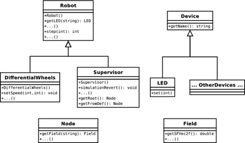

## C++/Java/Python

This section explains the main differences between the C API and the C++/Java/Python APIs.

### Classes and Methods

C++, Java and Python are object-oriented programming languages and therefore the corresponding Webots APIs are organized in classes.
The class hierarchy is built on top of the C API and currently contains about 25 classes and 200 methods (functions).

The Java and Python APIs are automatically generated from the C++ API using SWIG.
Therefore the class and method names, as well as the number of parameters and their types, are very similar in these three languages.

%figure "Webots APIs Overview"
%chart
graph BT
  Java[SWIG generated Java API] --> CPP[C++ API]
  Python[SWIG generated Python API] --> CPP
  Ros[ROS API] --> CPP
    CPP --> C["C API (implemented in libcontroller)"]
    MATLAB[MATLAB API] --> C
      C --> Webots["Webots (binary interface)"]
%end
%end

The naming convention of the C++/Java/Python classes and methods directly matches the C API function names.
For example, for this C function: `double wb_distance_sensor_get_value(WbDeviceTag tag)` there will be a matching C++/Java/Python method called `getValue` located in a class called `DistanceSensor`.
Usually the C++/Java/Python methods have the same parameters as their C API counterparts, but without the `WbDeviceTag` parameter.

### Controller Class

The C++/Java/Python controller implementation should be placed in a user-defined class derived from one of the Webots classes: `Robot` or `Supervisor`.
The controller class should derive from the `Robot` class if the `supervisor` field of the [Robot](../reference/robot.md) node is `FALSE` and from the `Supervisor` class if it is `TRUE`.

As you can see in [this figure](#a-small-subset-of-webots-oriented-object-apis), `Supervisor` is a subclass of the `Robot` class.
Hence it is possible to call the `Robot`'s methods, such as, e.g., the `step` or `getLED` functions, from the `Supervisor` controllers.
But it is not possible to call the `Supervisor` methods from a `Robot` controller.
For example it won't be possible to call the `worldReload` function from a `Robot` controller.

%figure "A small subset of Webots oriented-object APIs"



%end

Generally, the user-defined controller class should have a `run` function that implements the main controller loop.
That loop should contain a call to the `Robot`'s `step` method.
Then, the only responsibility of the controller's `main` function is to create an instance of the user-defined controller class, call its `run` method and finally delete (C++ only) the instance: see examples below.
Note that the controller should never create more than one instance of a derived class, otherwise the results are undefined.

Note that unlike the C API, the C++/Java/Python APIs don't have (and don't need) functions like the `wb_robot_init` and `wb_robot_cleanup` functions.
The necessary initialization and cleanup routines are automatically invoked from the constructor and destructor of the base class.

In C++/Java/Python, each Webots device is implemented as a separate class, there is a `DistanceSensor` class, a `TouchSensor` class, a `RotationalMotor` class, etc.
The various devices instances can be obtained with dedicated methods of the `Robot` class, like the `getDistanceSensor` or the `getTouchSensor` functions.
There is no `WbDeviceTag` in C++/Java/Python.

### C++ Example

```cpp
#include <webots/Robot.hpp>
#include <webots/LED.hpp>
#include <webots/DistanceSensor.hpp>

using namespace webots;

int main() {
  Robot robot;

  int timeStep = (int) robot.getBasicTimeStep();
  LED *led = robot.getLED("ledName");
  DistanceSensor *distanceSensor = robot.getDistanceSensor("distanceSensorName");
  distanceSensor->enable(timeStep);

  // Main control loop
  while (robot.step(timeStep) != -1) {
    // Read the sensors
    double val = distanceSensor->getValue();

    // Process sensor data here

    // Enter here functions to send actuator commands
    led->set(1);
  }

  return 0;
}
```

### Java Example

```java
import com.cyberbotics.webots.controller.*;

public class MyController {
  public static void main(String[] args) {
    Robot robot = new Robot();

    int timeStep = (int) Math.round(robot.getBasicTimeStep());
    LED led = robot.getLED("my_led");
    DistanceSensor distanceSensor = robot.getDistanceSensor("my_distance_sensor");
    distanceSensor.enable(timeStep);

    // main control loop
    while (robot.step(timeStep) != -1) {
      // Read the sensors, like:
      double val = distanceSensor.getValue();

      // Process sensor data here

      // Enter here functions to send actuator commands, like:
      led.set(1);
    }

    // Enter here exit cleanup code
  }
}
```

### Python Example

```python
"""my controller description."""

from controller import *

robot = Robot()

timestep = int(robot.getBasicTimeStep())

led = robot.getDevice('ledName')
distanceSensor = robot.getDevice('distanceSensorName')
distanceSensor.enable(timestep)

while (robot.step(timestep) != -1):
  # Read the sensors, like:
  val = distanceSensor.getValue()

  # Process sensor data here

  # Enter here functions to send actuator commands, like:
  led.set(1)

# Enter here exit cleanup code
```
