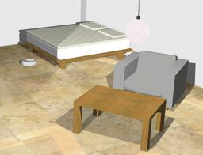

## iRobot's Create

%robot create images/robots/create/model.thumbnail.png

The [iRobot Create](http://www.irobot.com/About-iRobot/STEM/Create-2.aspx) robot is a customizable frame based on the famous Roomba vacuum cleaning platform, and is produced by iRobot.

### Movie Presentation


### Create PROTO

Derived from [Robot](../reference/robot.md).

```
Create {
  SFVec3f    translation     0 0.044 0
  SFRotation rotation        0 1 0 0
  SFString   name            "Create"
  SFString   controller      "create_avoid_obstacles"
  MFString   controllerArgs  []
  SFString   customData      ""
  SFBool     supervisor      FALSE
  SFBool     synchronization TRUE
  MFNode     bodySlot        []
}
```

> **File location**: "WEBOTS\_HOME/projects/robots/irobot/create/protos/Create.proto"

#### Create Field Summary

- `bodySlot`: Extends the robot with new nodes in the body slot.

### Samples

You will find the following sample in this folder: "WEBOTS\_HOME/projects/robots/irobot/create/worlds".

#### create.wbt

 This simulation shows the Create robot which cleans a small apartment.
The robot moves straight ahead.
When hitting an obstacle or detecting a virtual wall, the robot turns randomly.
The dust on the ground is a texture of a [Display](../reference/display.md) device managed by a [Supervisor](../reference/supervisor.md) controller.
The [Supervisor](../reference/supervisor.md) draws transparent circles into this texture at the robot's location to simulate cleaning dust.
