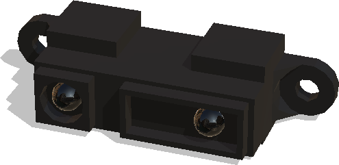
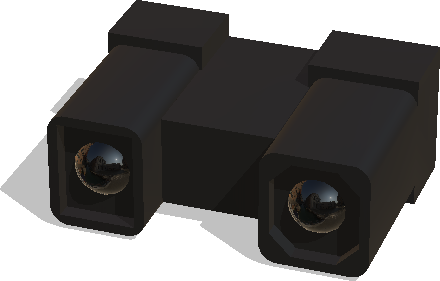
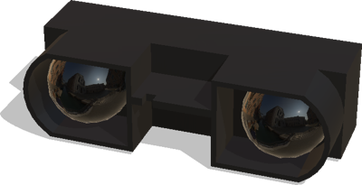

## DistanceSensor Sensors

Adding a generic [DistanceSensor](../reference/distancesensor.md) node is sufficient for most of the applications because they are customizable (resolution, lookupTable, aperture, etc.).

Additionally, some predefined commercialized models are available in Webots such as some infrared sensors.

### Sharp

#### Sharp GP2D120

%figure "Sharp GP2D120 model"



%end

The [Sharp GP2D120](https://www.pololu.com/file/0J157/GP2D120-DATA-SHEET.pdf) is a distance measuring sensor with integrated signal processing and analog voltage output.
This device outputs the voltage corresponding to the detection distance.

The model has the following specifications:

- `effective range`: 4 to 30 [cm]
- `output type`: analog
- `response time`: 39 [ms]
- `start up delay`: 44 [ms]
- `average consumption`: 33 [mA]

```
PROTO SharpGP2D120 {
  SFVec3f     translation  0 0 0
  SFRotation  rotation     0 1 0 0
  SFString    name         "Sharp's IR sensor GP2D120"
  SFString    model        "GP2D120"
}
```

The `lookupTable` field of the [DistanceSensor](../reference/distancesensor.md) is already implemented according to the characteristics found in the [datasheet](https://www.pololu.com/file/0J157/GP2D120-DATA-SHEET.pdf).

The `wb_distance_sensor_get_value` function returns the voltage/intensity of the measurement. To convert these values, use the following formulas:
- Convert meters to voltage: `y(x) = 0.5131*x^(-0.5735)-0.6143`
- Convert voltage to meters: `y(x) = 0.1594*x^(-0.8533)-0.02916`

#### Sharp GP2Y0A02YK0F

%figure "Sharp GP2Y0A02YK0F model"



%end

The [Sharp GP2Y0A02YK0F](https://global.sharp/products/device/lineup/data/pdf/datasheet/gp2y0a02yk_e.pdf) is a distance measuring sensor unit, composed of an integrated combination of PSD (position sensitive detector), IR-LED (infrared emitting diode) and signal processing circuit.
The variety of the reflectivity of the object, the environmental temperature and the operating duration are not influenced easily to the distance detection because of adopting the triangulation method.
This device outputs the voltage corresponding to the detection distance.
So this sensor can also be used as a proximity sensor.

The model has the following specifications:

- `effective range`: 20 to 150 [cm]
- `output type`: analog
- `response time`: 33 [ms]
- `start up delay`: 50 [ms]
- `average consumption`: 33 [mA]

```
PROTO SharpGP2Y0A02YK0F {
  SFVec3f     translation  0 0 0
  SFRotation  rotation     0 1 0 0
  SFString    name         "Sharp's IR sensor GP2Y0A02YK0F"
}
```

The `lookupTable` field of the [DistanceSensor](../reference/distancesensor.md) is already implemented according to the characteristics found in the [datasheet](https://global.sharp/products/device/lineup/data/pdf/datasheet/gp2y0a02yk_e.pdf).

The `wb_distance_sensor_get_value` function returns the voltage/intensity of the measurement. To convert these values, use the following formulas:
- Convert meters to voltage: `y(x) = 1.784*x^(-0.4215)-1.11`
- Convert voltage to meters: `y(x) = 0.7611*x^(-0.9313)-0.1252`

#### Sharp GP2Y0A41SK0F

%figure "Sharp GP2Y0A41SK0F model"


%end

The [Sharp GP2Y0A41SK0F](https://global.sharp/products/device/lineup/data/pdf/datasheet/gp2y0a41sk_e.pdf) is a distance measuring sensor unit, composed of an integrated combination of PSD (position sensitive detector), IR-LED (infrared emitting diode) and signal processing circuit.
The variety of the reflectivity of the object, the environmental temperature and the operating duration are not influenced easily to the distance detection because of adopting the triangulation method.
This device outputs the voltage corresponding to the detection distance.
So this sensor can also be used as a proximity sensor.

The model has the following specifications:

- `effective range`: 4 to 30 [cm]
- `output type`: analog
- `response time`: 16.5 [ms]
- `start up delay`: 26 [ms]
- `average consumption`: 12 [mA]

```
PROTO SharpGP2Y0A41SK0F {
  SFVec3f     translation  0 0 0
  SFRotation  rotation     0 1 0 0
  SFString    name         "Sharp's IR sensor GP2Y0A41SK0F"
}
```
The `lookupTable` field of the [DistanceSensor](../reference/distancesensor.md) is already implemented according to the characteristics found in the [datasheet](https://global.sharp/products/device/lineup/data/pdf/datasheet/gp2y0a41sk_e.pdf).

The `wb_distance_sensor_get_value` function returns the voltage/intensity of the measurement. To convert these values, use the following formulas:
- Convert meters to voltage: `y(x) = 0.5131*x^(-0.5735)-0.6143`
- Convert voltage to meters: `y(x) = 0.1594*x^(-0.8533)-0.02916`


#### Sharp GP2Y0A710K0F

%figure "Sharp GP2Y0A710K0F model"



%end

The [Sharp GP2Y0A710K0F](https://global.sharp/products/device/lineup/data/pdf/datasheet/gp2y0a710k_e.pdf) is a distance measuring sensor unit, composed of an integrated combination of PSD (position sensitive detector), IR-LED (infrared emitting diode) and signal processing circuit.
The variety of the reflectivity of the object, the environmental temperature and the operating duration are not influenced easily to the distance detection because of adopting the triangulation method.
This device outputs the voltage corresponding to the detection distance.
So this sensor can also be used as a proximity sensor.

The model has the following specifications:

- `effective range`: 100 to 550 [cm]
- `output type`: analog
- `response time`: 21 [ms]
- `start up delay`: 26 [ms]
- `average consumption`: 30 [mA]


```
PROTO SharpGP2Y0A710K0F {
  SFVec3f     translation  0 0 0
  SFRotation  rotation     0 1 0 0
  SFString    name         "Sharp's IR sensor GP2Y0A710K0F"
}
```
The `lookupTable` field of the [DistanceSensor](../reference/distancesensor.md) is already implemented according to the characteristics found in the [datasheet](https://global.sharp/products/device/lineup/data/pdf/datasheet/gp2y0a710k_e.pdf).

The `wb_distance_sensor_get_value` function returns the voltage/intensity of the measurement. To convert these values, use the following formulas:
- Convert meters to voltage: `y(x) = 1.962*x^(-0.5214)+0.4926`
- Convert voltage to meters: `y(x) = 20.24*x^(-4.76)+0.6632`
