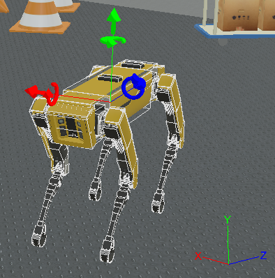
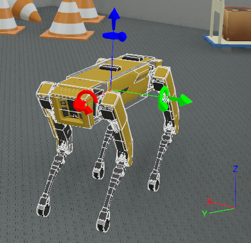

# Upgrade from R2021b to R2022a

Starting from the R2022a version, all geometries, devices, and PROTOs that come with Webots use the _FLU_ axis orientation (x-**F**orward, y-**L**eft, and z-**U**p).
We introduced the update to be consistent with ROS (see [REP 103](https://www.ros.org/reps/rep-0103.html)) and other robotics systems.
If your Webots world uses Webots geometries, devices, and PROTOs then you will probably need to adapt your world.

|  |  |
|:--:|:--:|
| *spot.wbt in 2021b: spot is RUB and the world is NUE.* | *spot.wbt in 2022a: spot is FLU and the world is ENU.* |

Changes breaking the backward compatibility are listed in bold in the [Change Log](../reference/changelog-r2022.md).

## How to Adapt your World or PROTO to Webots R2022a

### Backward Compatibility Mechanism
We introduced a backward compatibility mechanism to adapt worlds automatically.
This mechanism will be launched when you open a world in the R2022a version. It will keep the same axis orientation and objects axis system you had before but it will rotate the geometries and devices to retrieve the old behavior.
Nevertheless, the mechanism has limited capabilities and it is likely you will need to assist the world adaptation.

* If your world or PROTO does not contain too many objects, you should simply adapt them as wanted using the interface and save it.

* If your world or PROTO is too complex to be handled by hand, you should directly use the script to convert it to _ENU/FLU_ (see [automatic conversion to ENU FLU](#automatic-conversion-to-enu-flu)). Instead of the backward compatibility algorithm, this script can perform children nodes conversion and takes in charge some of the Webots PROTOs which can be useful to avoid to rotate them by hand.

In any case, it is important to understand how Webots nodes are affected by the update and how they should be rotated to preserve the old behavior:

| Node | Required rotation to preserve the old behavior | Strategy code |
|---|:---:|:---:|
| [Cylinder](../reference/cylinder.md) | | B1 |
| [Capsule](../reference/capsule.md) |  | B1 |
| [ElevationGrid](../reference/elevationgrid.md) |  | B1 |
| [Cone](../reference/cone.md) |  | B1 |
| [Plane](../reference/plane.md) |  | B1 |
| [Camera](../reference/camera.md) |  | A2 |
| [Lidar](../reference/lidar.md) |  | A2 |
| [Radar](../reference/radar.md) |  | A2 |
| [Viewpoint](../reference/viewpoint.md) |  | A1 |
| [Track](../reference/track.md) |  | A2 |
| [Pen](../reference/camera.md) |  | A2 |
| [Emitter](../reference/emitter.md) |  | A2 |
| [Receiver](../reference/receiver.md) |  | A2 |
| [Connector](../reference/connector.md) |  | A2 |
| [TouchSensor](../reference/touchsensor.md) |  | A2 |
| Webots PROTOs | , but there are numerous exceptions to this rule as the PROTOs did not followed any specific convention any now | C |

### Automatic Conversion to ENU FLU

This script [convert\_nue\_to\_enu\_rub\_to\_flu.py](https://github.com/cyberbotics/webots/blob/master/scripts/converter/convert_nue_to_enu_rub_to_flu.py) intends to help you to adapt your world or PROTOs from an old version to the new version of Webots.
You can find detailed explanations into the script (dependencies, usage, limitations and conversion process).

|  |  |  
|:--:|:--:|
| *Example of a complex world (village_realistic.wbt) after backward compatibility algorithm.* | *Example of a complex world after the execution of the script.* |

This script will convert your world from _NUE_ to _ENU_ and the objects contained in the world from _RUB_ to _FLU_. It could be needed to rotate some parts by hand.

Simple usage:
```
python3 convert_nue_to_enu_rub_to_flu.py /your_path_to_your_projects/worlds/my_world.wbt
```

If your PROTO is _RUB_ (x-**R**ight, y-**U**p, z-**B**ack) and does not contain JavaScript or Lua code, you can convert it to _FLU_ using the same script. You may have to rotate some parts of your PROTOs by hand.

**Notes:** check that the conversion went successfully by displaying the different renderings `View/Optional rendering`. In addition, we advise you to check the differences of your `.wbt` or `.proto` before and after the script with a text comparator.

### Convert Forest to FLU

To meet the [Forest.proto](https://github.com/cyberbotics/webots/blob/master/projects/objects/trees/protos/Forest.proto) R2022a version, you need to convert your `.forest` files. you can use the script [convert\_forest\_flu.py](https://github.com/cyberbotics/webots/blob/master/scripts/converter/convert_forest_flu.py):
```
python convert_forest_flu.py /path/to/forest/file.forest
```

## New Axis System Recommendations (Optional)

Once the world and PROTOs have the desired behavior in Webots R2022a, you can change the object axis system to _FLU_ and the world axis system to _ENU_. Indeed, as of Webots R2022a, we recommend the _FLU_ (x-**F**orward, y-**L**eft, and z-**U**p) axis orientation for objects and _ENU_ (x-**E**ast, y-**N**orth, and z-**U**p, see [Axes conventions](https://en.wikipedia.org/wiki/Axes_conventions)) for worlds.

### Convert PROTOs to FLU

If your PROTO file does not contain JavaScript or Lua code and it follows the _RUB_ axis system (x-**R**ight, y-**U**p, z-**B**ack) then you can use the script [convert\_proto.py](https://github.com/cyberbotics/webots/blob/master/scripts/converter/convert_proto.py):
```
python scripts/converter/convert_proto.py /path/to/PROTO/file.PROTO
```

### Convert Worlds to ENU

You can use the script [convert\_nue\_to\_enu.py](https://github.com/cyberbotics/webots/blob/master/scripts/converter/convert_nue_to_enu.py) to convert _NUE_ worlds to _ENU_ axis system:
```
python scripts/converter/convert_nue_to_enu.py /path/to/world/file.wbt
```
