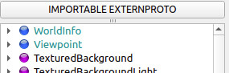

# Upgrade from R2022a to R2022b
PROTO nodes are a powerful way of describing complex objects or robots.
PROTO files however evolve, bugs are fixed, and given that there is no inherent way of defining a specific version of a PROTO to be used when loading a world, older simulations no longer behave the same way due to these changes.
Moreover, with the addition of JavaScript as a template language for procedural PROTO nodes, having PROTO files as external assets that can be downloaded on the fly opens up, for example, the possibility of rendering PROTO files directly from the web.

For these reasons, from R2022b, all PROTO files used by a world need to be declared using the `EXTERNPROTO` keyword.
Similarly, every PROTO inserted during the execution of the simulation by a supervisor needs to be declared an `IMPORTABLE EXTERNPROTO` prior to import it.

Changes breaking the backward compatibility are listed in bold in the [Change Log](../reference/changelog-r2022.md).

## What is New
### What is EXTERNPROTO

It is a keyword at the top of your world/PROTO file that allows Webots to know where it should search for a defined PROTO. Most of the time it will be on the official GitHub respository of Cyberbotics.
However, it is also possible to define the source as being a PROTO you designed or even one from another person on GitHub.

### Offline Assets

PROTO, texture, mesh and sound assets are downloaded on-the-fly when needed during the loading of a world.
Subsequent loads of the same world, or other worlds that rely in the same assets, does not require them to be downloaded again and they are instead loaded from the cache.

With R2022b, the entirety of these assets is also provided as a zip (`assets-R2022b.zip`) file, which can be downloaded and extracted following the procedure described [here](installation-procedure.md#asset-cache-download).

## Preparing your World for R2022b

If your world was created before R2022b, generally speaking it should be sufficient for you to load it with Webots R2022b.
Upon load however the console will show a long list of declarations that are currently missing both in the world and in your local PROTO if you have defined any.
The world is technically usable at this point as a backwards compatibility mechanism attempts to add these declarations for you, however as long as they are missing from the world file (and PROTO files alike), the messages will persist.

To simplify the procedure of converting your worlds and PROTO to R2022b, a script is provided that does this conversion for you.
To use it, do the following:

1. Download the script: [declare\_externproto.py](https://raw.githubusercontent.com/cyberbotics/webots/master/scripts/converter/declare_externproto.py)
2. Place it at the root level of your project (the same directory that contains the `protos`, `worlds` and `controllers` folders)
3. Run the script by providing the location of your webots installation as argument. For example, on Linux this could be: `python3 declare_externproto.py /usr/local/webots`
4. If all goes well, when loading the world, no warnings or errors should be present.
5. If you open your world file or PROTO with a text editor, you should notice that EXTERNPROTO declarations have been added to the header.

Note that the script only declares PROTO that are used when the world is loaded.
If your controller spawns additional PROTO nodes using a supervisor, you need to declare them as `IMPORTABLE EXTERNPROTO` using the similarly named panel available in the interface.

If you wish to know more about what the script does, or if you wish to do the process manually, you can read the following sections.

### How are EXTERNPROTO (and IMPORTABLE EXTERNPROTO) Declared

When opening a world file using a text editor, declared PROTO will look like:

```
#VRML_SIM R2022b utf8

EXTERNPROTO "https://raw.githubusercontent.com/cyberbotics/webots/R2022b/projects/objects/backgrounds/protos/TexturedBackground.proto"
IMPORTABLE EXTERNPROTO "../protos/RectangleArena.proto"

WorldInfo {
  basicTimeStep 16
}
Viewpoint {
}
TexturedBackground {
}
```

In the world above, the PROTO **TexturedBackground** will be retrieved from the corresponding URL.
As shown by the snippet no instances of **RectangleArena** are present at load time however by flagging it as `IMPORTABLE EXTERNPROTO` we denote that this object may appear during the execution.
Similarly, a PROTO may reference another PROTO, and in this case a declaration is also necessary.
For example the following **MyBox** PROTO uses the **Plastic** appearance and therefore needs to declare it.

```
#VRML_SIM R2022b utf8

EXTERNPROTO "https://raw.githubusercontent.com/cyberbotics/webots/R2022b/projects/appearances/protos/Plastic.proto"

PROTO MyBox [
  field SFVec3f  size    0.1 0.1 0.1  # Defines the size of the box.
]
{
  Shape {
    appearance Plastic {
    }
    geometry Box {
      size IS size
    }
  }
}

```

In general, the URL can be defined multiple ways:

```
# remote PROTO
EXTERNPROTO "https://raw.githubusercontent.com/cyberbotics/webots/R2022b/projects/objects/backgrounds/protos/TexturedBackground.proto"

# local PROTO (absolute path)
EXTERNPROTO "/home/user/Documents/my_project/protos/TexturedBackground.proto"

# local PROTO (relative path, be it relative to a world or to the PROTO itself depending on the situation)
EXTERNPROTO "../protos/TexturedBackground.proto"
```
The location (URL) for official PROTO can be found in the file: `WEBOTS_HOME/resources/proto-list.xml`.
When inserting PROTO nodes using the **add-node** button, a declaration is added automatically.

### IMPORTABLE EXTERNPROTO Declaration

PROTO nodes that are spawned by a supervisor and therefore may appear later in the execution need to be declared in the world file in the same manner, using however the key word `IMPORTABLE EXTERNPROTO` rather than just `EXTERNPROTO`.
Note that declaring a node as `IMPORTABLE EXTERNPROTO` automatically implies that the PROTO is also an `EXTERNPROTO`.
In other words, only one declaration suffices.

The list of PROTO nodes that can be spawned using a Supervisor is shown in the `IMPORTABLE EXTERNPROTO` panel, which can be opened by clicking the similarly named button:

%figure

%end

Doing so will open the panel:

%figure

%end

Which will allow you to add or remove entries.
Only PROTO in this list can be spawned by a Supervisor.
