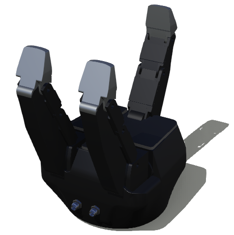

## Grippers

It is quite easy to create any kind of gripper using [Joint](../reference/joint.md), [Motor](../reference/motor.md) and [Solid](../reference/solid.md) nodes.

### ROBOTIQ 3F Gripper

The `ROBOTIQ 3F Gripper` is a 3-fingers adaptive robot gripper.


%figure "Internal motor and position-sensor names"

| Motor Name                | Position Sensor Name               |
| ------------------------- | -------------------------------    |
| palm\_finger\_1\_joint    |  palm\_finger\_1\_joint\_sensor    |
| finger\_1\_joint\_1       |  finger\_1\_joint\_1_sensor        |
| finger\_1\_joint\_2       |  finger\_1\_joint\_2\_sensor       |
| finger\_1\_joint\_3       |  finger\_1\_joint\_3\_sensor       |
| palm\_finger\_2\_joint    |  palm\_finger\_2\_joint\_sensor    |
| finger\_2\_joint\_1       |  finger\_2\_joint\_1\_sensor       |
| finger\_2\_joint\_2       |  finger\_2\_joint\_2\_sensor       |
| finger\_2\_joint\_3       |  finger\_2\_joint\_3\_sensor       |
| finger\_middle\_joint\_1  |  finger\_middle\_joint\_1\_sensor  |
| finger\_middle\_joint\_2  |  finger\_middle\_joint\_2\_sensor  |
| finger\_middle\_joint\_3  |  finger\_middle\_joint\_3\_sensor  |


%end

%figure "ROBOTIQ 3F Gripper in Webots"



%end

```
PROTO Robotiq3fGripper [
  SFVec3f    translation    0 0 0
  SFRotation rotation       0 1 0 0
  SFString   name           "ROBOTIQ 3f Gripper"
]
```
