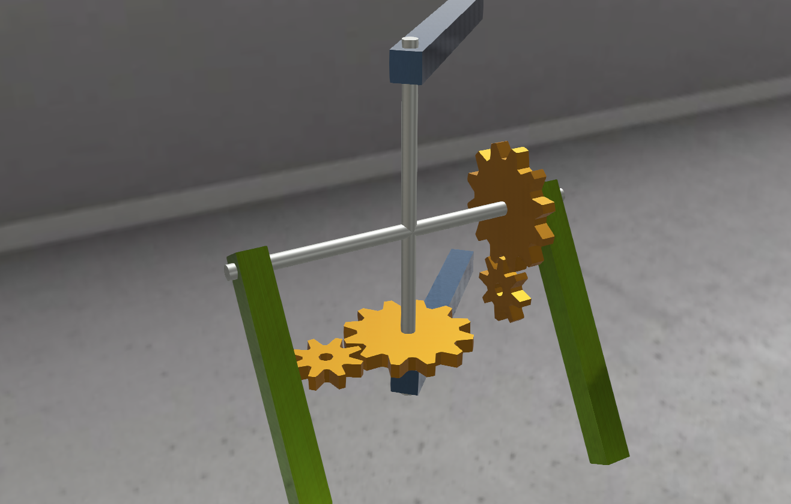

## Hinge2JointWithBacklash

%figure



%end

Derived from [Hinge2Joint](../reference/hinge2joint.md).

### Hinge2JointWithBacklash Model

```
Hinge2JointWithBacklash [
  SFNode       jointParameters     HingeJointParameters {}
  SFNode       jointParameters2    JointParameters {}
  SFFloat      backlash            0.01        # [0, inf)
  SFFloat      backlash2           0.01        # [0, inf)
  SFFloat      gearMass            0.1         # (0, inf)
  SFFloat      gearMass2           0.1         # (0, inf)
  MFNode       device              [ ]         # {RotationalMotor, PositionSensor, Brake}
  MFNode       device2             [ ]         # {RotationalMotor, PositionSensor, Brake}
  MFNode       outputSensor        [ ]         # {PositionSensor}
  MFNode       outputSensor2       [ ]         # {PositionSensor}
  MFNode       startPoint          NULL        # {Group, Transform, or Shape}
  MFNode       startPoint2         NULL        # {Group, Transform, or Shape}
  SFNode       endPoint            NULL        # {Solid, SolidReference, or Slot}
]
```

The backlash effect is modeled by having a [HingeJoint](../reference/hingejoint.md), followed by a [Hinge2Joint](../reference/hinge2joint.md) which in turn is followed by a second [HingeJoint](../reference/hingejoint.md).
The first axis of the [Hinge2Joint](../reference/hinge2joint.md) will act as limiter (in the `axis`  direction) and the last [HingeJoint](../reference/hingejoint.md) will act as limiter for `axis2`.
This is necessary because the physics engine does not support limiting of `axis2` in a [Hinge2Joint](../reference/hinge2joint.md) directly.
The first [HingeJoint](../reference/hingejoint.md) and `axis2` of the [Hinge2Joint](../reference/hinge2joint.md) can freely turn whereas the motion of the others is limited by setting the values of `minStop` and `maxStop` according to the desired `backlash` in each direction.
By doing so, the `endPoint` will begin to move only when either limit is reached hence modeling the clearance present in a transmission.

Given the nature of the implementation, this [PROTO](../reference/proto.md) won't achieve the desired effect if used in kinematic mode and therefore it requires the `endPoint` to have physics enabled.

### Field Summary

- `backlash`: this field specifies the amount of clearance in the transmission associated to `axis` of the [Hinge2Joint](../reference/hinge2joint.md). The backlash is defined as the maximum distance that the driving gear tooth can travel without any actual contact or transfer of power to the driven gear.
If set to zero, the limiter in this direction is removed and therefore the corresponding fields `gearMass` and `outputSensor` are ignored.
If both `backlash` and `backlash2` are set to zero, `startPoint` is also ignored and the [PROTO](../reference/proto.md) reverts to a classic [Hinge2Joint](../reference/hinge2joint.md).

- `backlash2`: this field specifies the amount of clearance in the transmission associated to `axis2` of the [Hinge2Joint](../reference/hinge2joint.md).
If set to zero, the limiter in this direction is removed and therefore the corresponding fields `gearMass2` and `outputSensor2` are ignored.
If both `backlash` and `backlash2` are set to zero, `startPoint` is also ignored and the [PROTO](../reference/proto.md) reverts to a classic [Hinge2Joint](../reference/hinge2joint.md).

- `gearMass`: this field specifies the mass associated to `axis` of the transmission.

- `gearMass2`: this field specifies the mass associated to `axis2` of the transmission.

- `device`: this field optionally specifies a [RotationalMotor](../reference/rotationalmotor.md), an angular [PositionSensor](../reference/positionsensor.md) and/or a [Brake](../reference/brake.md) device.
If no motor is specified, the joint is a passive joint.

- `device2`: this field optionally specifies a [RotationalMotor](../reference/rotationalmotor.md), an angular [PositionSensor](../reference/positionsensor.md) and/or a [Brake](../reference/brake.md) device.
If no motor is specified, the joint is a passive joint.

- `outputSensor`: this field optionally specifies an angular [PositionSensor](../reference/positionsensor.md) and it refers to `axis` on the output side of the transmission.

- `outputSensor2`: this field optionally specifies an angular [PositionSensor](../reference/positionsensor.md) and it refers to `axis2` on the output side of the transmission.

> **Note**: what these sensors return is the current position of the output axes in the range [-backlash/2, backlash/2] and [-backlash2/2, backlash2/2] respectively. When either limit is reached, the `endPoint` will begin to move.

- `startPoint`: this field optionally specifies the shape of the object attached to the first [HingeJoint](../reference/hingejoint.md) before the backlash in the `axis` direction takes place.
It must be either a [Transform](../reference/transform.md), a [Group](../reference/group.md) or a [Shape](../reference/shape.md).
This object doesn't affect the joint in any way but can be useful in order to better visualize the effect of the backlash.

- `startPoint2`: this field optionally specifies the shape of the object attached to the [Hinge2Joint](../reference/hinge2joint.md) before the backlash in the `axis2` direction takes place.
It must be either a [Transform](../reference/transform.md), a [Group](../reference/group.md) or a [Shape](../reference/shape.md).
This object doesn't affect the joint in any way but can be useful in order to better visualize the effect of the backlash.

- `endPoint`: this field specifies which [Solid](../reference/solid.md) is subject to the joint constraints. It must be either a [Solid](../reference/solid.md) child, or a reference to an existing [Solid](../reference/solid.md), i.e. a [SolidReference](../reference/solidreference.md).
Alternatively, a [Slot](../reference/slot.md) node can be inserted in the `endPoint` field, but this [Slot](../reference/slot.md) should be connected to another [Slot](../reference/slot.md) whose `endPoint` is either a [Solid](../reference/solid.md) or a [SolidReference](../reference/solidreference.md).

> **Note**: **Important**, due to the way the backlash is modeled, it is **necessary** for the `endPoint` solid to have physics **enabled** for the backlash effect to be active.
If the physics node isn't activated, the simulation will work without giving any error but the resulting behavior will not model any backlash as it will be simulated in kinematic mode and the contact between the hidden joints will be ignored.
