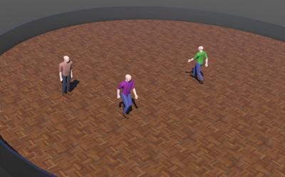

# Humans

This chapter gives an overview of different human simulations provided with the Webots package.
The example worlds can be tested easily; the ".wbt" files are located in various "worlds" directories of the "[WEBOTS\_HOME/projects/humans]({{ url.github_tree }}/projects/humans)" directory and can be directly opened from Webots using the `Open Sample World` item in `File` menu.
The controller code is located in the corresponding "controllers" directory.

## [skin\_animated\_humans]({{ url.github_tree }}/projects/humans/skin_animated_humans/worlds/skin_animated_humans.wbt) Sample

 This example shows how to use the [Skin](../reference/skin.md) node to animate human models and play [BVH](https://en.wikipedia.org/wiki/Biovision_Hierarchy) animations.
The [FBX](https://en.wikipedia.org/wiki/FBX) models have been generated using [MakeHuman](http://makehumancommunity.org/) and BVH files are taken from open source databases.
The [Skin PROTO models]({{ url.github_tree }}/projects/humans/skin_animated_humans/protos/) contain the definition of the appearance declared in the FBX files.
The "[bvh\_animation]({{ url.github_tree }}/projects/humans/skin_animated_humans/controllers/bvh_animation/bvh_animation.c)" C controller loads the BVH file, associates it with the [Skin](../reference/skin.md) model and plays the BVH animation by applying the poses to the [Skin](../reference/skin.md) bones.

### CharacterSkin PROTO

A skin node representing a human with predefined mesh and appearance.
Four different characters are available based on the 'model' field:
- "Anthony": a boy,
- "Robert": a men,
- "Sandra": a woman,
- "Sophia": a girl.

Derived from [Skin](../reference/skin.md).

```
CharacterSkin {
  SFVec3f     translation 0 0 0
  SFRotation  rotation    0 0 1 0
  SFVec3f     scale       1 1 1
  SFString    name        "skin"
  SFString    model       "Sandra"
  SFBool      castShadows FALSE
}
```

> **File location**: "[WEBOTS\_HOME/projects/humans/skin\_animated\_humans/protos/CharacterSkin.proto]({{ url.github_tree }}/projects/humans/skin_animated_humans/protos/CharacterSkin.proto)"

#### CharacterSkin Field Summary

- `model` : Defines which character should be used.
This field accepts the following values: "Anthony", "Robert", "Sandra", and "Sophia".

### [bvh\_util]({{ url.github_tree }}/projects/humans/skin_animated_humans/libraries/bvh_util/) Library
This C utility library allows users load and play BVH files.
The BVH file defines a skeleton in the form of hierarchy of bones, and a time series of angles for each joint in the skeleton.
Note that this skeleton is not necessarily the same as the skeleton associated with a [Skin](../reference/skin.md) node, since they come from different sources.
For this reason, this library also provides functions to adapt and re-target the BVH motion data to the [Skin](../reference/skin.md) model.

---

#### `wbu_bvh_read_file`
#### `wbu_bvh_cleanup`

*obtain and release BVH file handles*

%tab-component "language"

%tab "C"

```c
WbBvhDataRef wbu_bvh_read_file(const char *filename);
void wbu_bvh_cleanup(WbBvhDataRef motion);
```

%tab-end

%end

The `wbu_bvh_read_file` function parses the hierarchical skeleton data and motion data in the specified BVH file.
The `filename` can be specified either with an absolute path or a path relative to the controller directory.
The function returns a `WbBvhDataRef` object, which is a reference to the data read from the BVH file.
This object is NULL if an error occurred when reading the BVH file, for example when the file is corrupted or the path is incorrect.

The `wbu_bvh_cleanup` function frees all the memory associated with the `WbBvhDataRef` object.
After this function is called the corresponding `WbBvhDataRef` object can no longer be used.

---

#### `wbu_bvh_get_joint_count`
#### `wbu_bvh_get_joint_name`
#### `wbu_bvh_get_frame_count`
#### `wbu_bvh_set_scale`

*query joints and frames in the BVH file and set scale for translation data*

%tab-component "language"

%tab "C"

```c
int wbu_bvh_get_joint_count(WbBvhDataRef ref);
const char* wbu_bvh_get_joint_name(WbBvhDataRef ref, int joint_index);
int wbu_bvh_get_frame_count(WbBvhDataRef ref);
void wbu_bvh_set_scale(WbBvhDataRef ref, double scale);
void wbu_bvh_set_model_t_pose(const WbuBvhMotion motion, const double *axisAngle, int joint_id, bool global);
```

%tab-end

%end

The `wbu_bvh_get_joint_count` function returns the number of joints defined in the loaded BVH file.

The `wbu_bvh_get_joint_name` function returns the name of the joint indexed by the number `joint_index` in the loaded BVH file.

The `wbu_bvh_get_frame_count` function returns the number of frames of motion data in the loaded BVH file. Each frame corresponds to one entry of time-series data.

The `wbu_bvh_set_scale` function sets the scale factor, which is used to scale the translation data form the BVH animation file.
The default scale factor is 1.0.
Note that this value does not affect the rotation data.

The `wbu_bvh_set_model_t_pose` function associates the [Skin](../reference/skin.md) global and local T pose rotation of a bone with the corresponding BVH joint using the Webots axis-angle format.
For each joint both global and local T pose rotations are needed to convert the joint rotation defined in the BVH file to the Webots bone model.

---

#### `wbu_bvh_step`
#### `wbu_bvh_goto_frame`
#### `wbu_bvh_reset`

*go to next frame, jump to a specific frame, or jump to first frame*

%tab-component "language"

%tab "C"

```c
bool wbu_bvh_step(WbBvhDataRef ref);
bool wbu_bvh_goto_frame(WbBvhDataRef ref, int frame_number);
bool wbu_bvh_reset(WbBvhDataRef ref);
```

%tab-end

%end

The `wbu_bvh_step` function reads the joint angles and translation data in the next frame.
This function is typically called at the beginning of the main loop.
If the current frame is the last frame in the BVH file, calling this function reads the first frame again.
It returns TRUE on success.

The `wbu_bvh_goto_frame` function reads a specific frame, whose index is given in the `frame_number` argument.
It returns TRUE on success.
Note that if the `frame_number` argument is greater than the number of frames in the file, this causes an error, and the function returns FALSE.

The `wbu_bvh_reset` function jumps to the first frame.
Returns TRUE on success.

---

#### `wbu_bvh_get_joint_rotation`
#### `wbu_bvh_get_root_translation`

*get the joint rotation for a specific joint and the BVH object translation*

%tab-component "language"

%tab "C"

```c
double *wbu_bvh_get_joint_rotation(WbBvhDataRef ref, int joint_index);
double *wbu_bvh_get_root_translation(WbBvhDataRef ref);
```

%tab-end

%end

The `wbu_bvh_get_joint_rotation` function returns the rotation of the joint specified by `joint_index`.
The rotation is returned as an array of double.

The `wbu_bvh_get_root_translation` function returns the translation of the BVH object.
The translation is returned as an array of double.
This is typically used to set the translation of the [Skin](../reference/skin.md) node that is being animated by this BVH file.
The values can either be used directly, or scaled using the `wbu_bvh_set_scale` function.

## [C3D]({{ url.github_tree }}/projects/humans/c3d/worlds/c3d_viewer.wbt) Sample

 This example provides a basic viewer for [C3D](https://c3d.org) files containing biomechanical information and motion capture data.
The "[c3d\_viewer.py]({{ url.github_tree }}/projects/humans/c3d/controllers/c3d_viewer/c3d_viewer.py)" Python controller loads the C3D file, creates a solid [Sphere](../reference/sphere.md), and plays the motion by updating the position of the markers.
Additionally, "[c3d\_viewer.py]({{ url.github_tree }}/projects/humans/c3d/controllers/c3d_viewer/c3d_viewer.py)" also initializes the "[c3d\_viewer\_window]({{ url.github_tree }}/projects/humans/c3d/plugins/robot_windows/c3d_viewer_window)" robot window from which it is possible to set the transparency of the body representation and the playback speed, to change the color of the markers, and to visualize the graphs of the data provided in the C3D file.

### C3dViewer PROTO

A viewer to visualize C3D files.

Derived from [Robot](../reference/robot.md).

```
C3dViewer {
  SFVec3f     translation                      0 0 0
  SFRotation  rotation                         0 0 1 0
  SFString    c3dFile                          ""
  SFFloat     playbackSpeed                    1.0
  MFNode      markers                          []
  SFVec3f     leftGroundReactionForceOffset    0.28 0 0.28
  SFVec3f     rightGroundReactionForceOffset   -0.21 0 0.22
  SFFloat     bodyTransparency                 1
  SFFloat     bodyHeight                       -1
  SFFloat     bodyOffset                       0.25
  SFString    window                           "c3d_viewer_window"
  SFString    name                             "c3d_viewer"
}
```

> **File location**: "[WEBOTS\_HOME/projects/humans/c3d/protos/C3dViewer.proto]({{ url.github_tree }}/projects/humans/c3d/protos/C3dViewer.proto)"

#### C3dViewer Field Summary

- `c3dFile` : Defines which file should be displayed.
- `playbackSpeed` : Defines the speed at which should be played the C3D file.
- `markers`: The markers will be automatically inserted in this field.
- `leftGroundReactionForceOffset`: Defines the offset of the left Ground Reaction Force position.
- `rightGroundReactionForceOffset`: Defines the offset of the right Ground Reaction Force position.
- `bodyTransparency`: Defines the transparency of the body representation (transparency to 1 disables body representation).
- `bodyHeight`: Defines the height of the body representation, if negative, the height defined in the C3D file is used (or 1.83m if not set in the C3D file).
- `bodyOffset`: Defines the vertical offset of the body representation compared to the 'CenterOfMass' marker.


## [Pedestrian]({{ url.github_tree }}/projects/humans/pedestrian/worlds/pedestrian.wbt) Sample

 This example shows the simulation of simple walking rigid human models.
The walking gait is hard-coded in the "[pedestrian]({{ url.github_tree }}/projects/humans/pedestrian/controllers/pedestrian/pedestrian.py)" Python controller source code, but the trajectory, the speed and the time step can be passed as controller argument:
- `--trajectory`: Specify the trajectory in the format ``[x1 y1, x2 y2, ...]``.
- `--speed`: Specify walking speed in [m/s].
- `--step`: Specify time step.


### Pedestrian PROTO

%figure


%end

A simple [Pedestrian](#pedestrian-proto) PROTO model made of 13 passive joints: three for each arm and leg and one for the head.
Position of the [HingeJoint](../reference/joint.md) nodes can be set using the SFFloat fields of the [Pedestrian](#pedestrian-proto) PROTO  listed in the following table.
Just note that these fields are hidden and not visible in the Webots scene tree.

| Body part | Joint position fields                                   |
| --------- | --------------------------------------------------------|
| Head      | "headAngle"                                             |
| Left arm  | "leftArmAngle", "leftLowerArmAngle", "leftHandAngle",   |
| Right arm | "rightArmAngle", "rightLowerArmAngle", "rightHandAngle" |
| Left leg  | "leftLegAngle", "leftLowerLegAngle", "leftFootAngle"    |
| Right leg | "rightLegAngle", "rightLowerLegAngle", "rightFootAngle" |


Derived from [Robot](../reference/robot.md).

```
Pedestrian {
  SFVec3f    translation           0 0 1.27
  SFRotation rotation              0 0 1 0
  SFString   name                  "pedestrian"
  SFString   controller            "pedestrian"
  MFString   controllerArgs        []
  SFColor    shirtColor            0.25 0.55 0.20
  SFColor    pantsColor            0.24 0.25 0.5
  SFColor    shoesColor            0.28 0.15 0.06
  SFColor    skinColor             1.0 0.75 0.7
  SFBool     enableBoundingObject  FALSE
  MFNode     bodySlot              []
  MFNode     leftHandSlot          []
  MFNode     rightHandSlot         []
}
```

> **File location**: "[WEBOTS\_HOME/projects/humans/pedestrian/protos/Pedestrian.proto]({{ url.github_tree }}/projects/humans/pedestrian/protos/Pedestrian.proto)"

#### Pedestrian Field Summary

- `shirtColor` : Defines the color of the shirt.
- `pantsColor` : Defines the color of the pants.
- `shoesColor`: Defines the color of the shoes.
- `skinColor`: Defines the color of the skin.
- `enableBoundingObject`: Defines whether the human model should have a bounding object.
- `bodySlot`: Extends the robot with new nodes located at the [Robot](../reference/robot.md) center.
- `leftHandSlot`: Extends the robot with new nodes located on the left hand.
- `rightHandSlot`: Extends the robot with new nodes located on the right hand.
