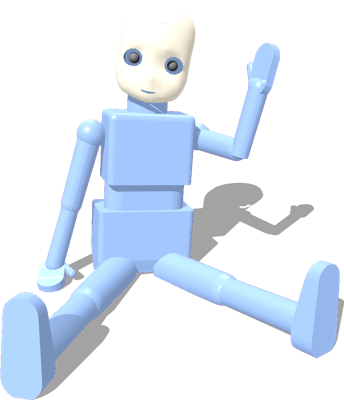
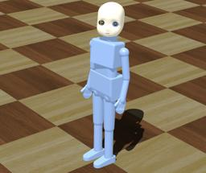

## RobotCub's iCub

%figure "iCub model in Webots"

%end

The [iCub](http://www.icub.org/) is the humanoid robot developed at IIT as part of the EU project [RobotCub](http://www.robotcub.org/).
It has 53 motors that move the head, arms & hands, waist, and legs.

### Samples

You will find the following sample in this folder: "WEBOTS\_HOME/projects/robots/robotcub/icub/worlds".

#### icub\_stand.wbt

 This simulation shows a standing iCub.
You can move the robot motors using the generic robot window (by double-clicking on the robot).
