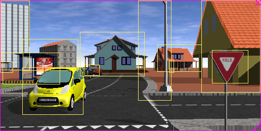

## IMU Sensors

Adding a generic [Camera](../reference/camera.md) node is sufficient for most of the applications.
Generic cameras are customizable (resolution, field of view, noise, etc.) and include a zoom and a focusing mechanism by default.
Special effects like motion blur, various models of noise, lens distortion and the use of a spherical projection are available.

In addition to adding generic [Camera](../reference/camera.md) nodes, some predefined camera models are also present in Webots.

### MPU-9250

If a [Recognition](../reference/recognition.md) node is added to the camera, the camera can return not only the image but also all objects detected in the camera image and their size and position.
It is therefore very easy to simulate smart cameras such as the Mobileye.

%figure "Smart camera output"

%end
