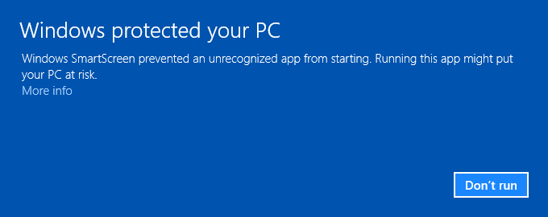
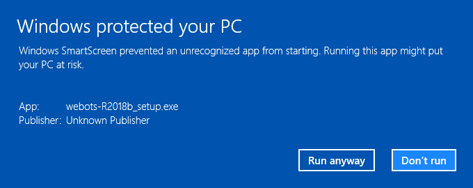
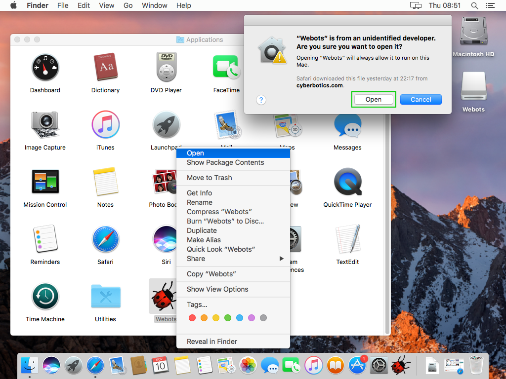

## Installation Procedure

Usually, you will need to have system administrator rights to install Webots.
Once installed, Webots can be used by a regular, unprivileged user.
To install Webots, please follow this procedure:

1. Uninstall completely any old version of Webots that may have been installed on your computer previously.
2. Install Webots for your operating system as explained below.

> **Note**: After installation, the most important Webots features will be available, but some third party tools (such as Java, Python or MATLAB) may be necessary to run or compile specific projects.
The [chapter](language-setup.md) covers the set up of these tools.

### Installation on Linux

Webots will run on most recent Linux distributions running glibc2.11.1 or earlier.
This includes fairly recent Ubuntu, Debian, Fedora, SuSE, RedHat, etc.
Webots comes in two different package types: `.deb` and `.tar.bz2` (tarball).
The `.deb` package is aimed at the latest LTS Ubuntu Linux distribution whereas the tarball package includes many dependency libraries and it is therefore best suited for installation on other Linux distributions.
These packages can be downloaded from our [website](https://cyberbotics.com/download).

> **Note**: Some of the following commands requires the `root` privileges.
You can get these privileges by preceding all the commands by the `sudo` command.

<!-- -->

> **Note**: Webots will run much faster if you install an accelerated OpenGL drivers.
If you have a NVIDIA or AMD graphics card, it is highly recommended that you install the Linux graphics drivers from these manufacturers to take the full advantage of the OpenGL hardware acceleration with Webots.
Please find instructions in [this section](verifying-your-graphics-driver-installation.md).

<!-- -->

> **Note**: Webots needs the *ffmpeg* program to create MPEG-4 movies that can be installed with *ffmpeg* and *libfdk-aac1* packages and *ubuntu-restricted-extras* for H.264 codec.
The package names could slightly change on different releases and distributions.

#### Using Advanced Packaging Tool (APT)

The advantage of this solution is that Webots will be updated with the system updates.
This installation requires the `root` privileges.

First of all, you may want to configure your APT package manager by adding the Cyberbotics repository.
Simply execute the following lines:

```sh
apt-add-repository 'deb http://www.cyberbotics.com/debian/ binary-amd64/'
apt-get update
```

As an alternative, you can easily add the Cyberbotics repository from the `Software and Updates` application.
In the `Other Software` tab, click on the `Add...` button and copy the following line:

```text
deb http://www.cyberbotics.com/debian/ binary-amd64/
```

When you will close the window, the APT packages list should be automatically updated.
Otherwise you can manually execute the following command:

```sh
apt-get update
```

Optionally, Webots can be authentified thanks to the `Cyberbotics.asc` signature file which can be downloaded [here](http://www.cyberbotics.com/linux), using this command:

```sh
apt-key add /path/to/Cyberbotics.asc
```

Then proceed to the installation of Webots using:

```sh
apt-get install webots
```

> **Note**: This procedure can also be done using any APT front-end tools such as the Synaptic Package Manager.
But only a command line procedure is documented here.

#### From the "tarball" Package

This section explains how to install Webots from the tarball package (having the `.tar.bz2` extension).
This package can be installed without the `root` privileges.
It can be uncompressed anywhere using the `tar` `xjf` command line.
Once uncompressed, it is recommended to set the WEBOTS\_HOME environment variable to point to the `webots` directory obtained from the uncompression of the tarball:

```sh
tar xjf webots-{{ webots.version.package }}-x86-64.tar.bz2
```

And:

```sh
export WEBOTS_HOME=/home/username/webots
```

The export line should however be included in a configuration script like "/etc/profile", so that it is set properly for every session.

Some additional libraries are needed in order to properly run Webots.
In particular *make*, *g++*, *libjpeg8-dev*, *ffmpeg*, and *libpci3* have to be installed on the system.
Other particular libraries could also be required to recompile some of the distributed binary files.
In this case an error message will be printed in the Webots console mentioning the missing dependency.

> **Note**: On old versions of Ubuntu or other linux distributions the library names and versions could be slightly different.

#### From the DEB Package

This procedure explains how to install Webots from the DEB package (having the `.deb` extension).

On Ubuntu, double-click on the DEB package file to open it with the Ubuntu Software App and click on the `Install` button.
If a previous version of Webots is already installed, then the text on the button could be different, like `Upgrade` or `Reinstall`.
Note that GNOME Software App distributed in the first release of Ubuntu 16.04 contains a bug preventing the installation of third-party packages.

Alternatively, the DEB package can also be installed using `apt` or `gdebi` with the `root` privileges:

```sh
apt install ./webots_{{ webots.version.debian_package }}_amd64.deb
```

Or:

```sh
gdebi webots_{{ webots.version.debian_package }}_amd64.deb
```

#### Server Edition

Webots requires some graphical features that are usually not available by default on a linux server edition and additional packages needs to be available to make it work:

- `xserver-xorg-core`
- `libpulse0`

These packages are automatically installed when using the DEB package, but in case of the tarball package the user has to manually install them.

Additionally, it is also necessary to install an OS GUI, for example the Unity desktop `ubuntu-desktop` package.

### Installation on Windows

1. Download the "webots-{{ webots.version.package }}\_setup.exe" installation file from our [website](https://cyberbotics.com/download).
2. Double click on this file.
3. Follow the installation instructions.

It is possible to install Webots silently from an administrator DOS console, by typing:

```bash
webots-{{ webots.version.package }}_setup.exe /SILENT
```

Or:

```bash
webots-{{ webots.version.package }}\_setup.exe /VERYSILENT
```

Once installed, if you observe 3D rendering anomalies or if Webots crashes, it is strongly recommend to upgrade your graphics driver.

### Windows SmartScreen

It may be possible that Windows Defender SmartScreen will display a warning when starting the Webots installer:

%figure "Windows SmartScreen warning"

%end

This is likely caused by the fact that the release of Webots is recent and was not yet approved by Microsoft.
If the Webots installer was downloaded from the [official Cyberbotics web site](https://www.cyberbotics.com/download) using the secure HTTPS protocol, then it is safe to install it.
You can pass this warning and install Webots by clicking on the "More info" link and the "Run anyway" button depicted below:

%figure "Windows SmartScreen pass"

%end

### Installation on macOS

1. Download the `webots-{{ webots.version.package }}.dmg` installation file from our [website](https://cyberbotics.com/download).
2. Double click on this file.
This will mount on the desktop a volume named "Webots" containing the "Webots" folder.
3. Move this folder to your "/Applications" folder or wherever you would like to install Webots.
4. It is recommended to increase the size of the system shared memory in order to run simulations with more than 8 camera or display devices (such as the PR2 robot).
In order to proceed, edit the following file from the Terminal application as administrator: `sudo pico /etc/sysctl.conf`.
It is likely this file doesn't exist on your system, in which case an empty file will be created.
Edit this file so that it contains the lines:

    ```
kern.sysv.shmmax=16777216
kern.sysv.shmmin=1
kern.sysv.shmmni=128
kern.sysv.shmseg=32
kern.sysv.shmall=4096
    ```

    These settings increase the amount of shared memory to four times the usual default.
The current values are provided by the following command line: `sysctl -A | grep sysv.shm`.
Please refer to the macOS documentation to understand the exact meaning of each value.
You will have to reboot your computer so that these changes are taken into account.

### macOS Security

During the first Webots launch, macOS may complain about opening Webots because it is from an unidentified developer (see [this figure](#unidentified-developer-dialog)).

%figure "Unidentified developer dialog"


%end

In this case, `Ctrl + click` (or right-click) on the Webots icon, and select the `Open` menu item.
`macOS` should propose to open the application anyway (see [this figure](#unidentified-developer-dialog)).

%figure "Open Webots anyway"



%end

In earlier versions of macOS, this last operation may not work.
In this case, refer to your macOS security settings to open Webots anyway (`System Preferences / Security & Privacy / General / Allow apps downloaded from:`).
