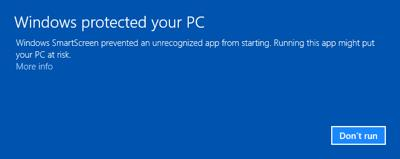
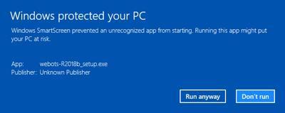

## Installation Procedure

Usually, you will need to have system administrator rights to install Webots.
Once installed, Webots can be used by a regular, unprivileged user.
To install Webots, please follow this procedure:

1. Uninstall completely any old version of Webots that may have been installed on your computer previously.
2. Install Webots for your operating system as explained below.

> **Note**: After installation, the most important Webots features will be available, but some third party tools (such as Java, Python or MATLAB) may be necessary to run or compile specific projects.
The [chapter](language-setup.md) covers the set up of these tools.

### Installation on Linux

Webots will run on most recent Linux distributions running glibc2.11.1 or earlier.
This includes fairly recent Ubuntu, Debian, Fedora, SuSE, RedHat, etc.
Webots comes in three different package types: `.deb` (Debian package), `.tar.bz2` (tarball package) and `.snap` (snap package).
The Debian package is aimed at the latest LTS Ubuntu Linux distribution whereas the tarball and snap packages includes many dependency libraries and are therefore best suited for installation on other Linux distributions.
All these packages can be installed from our [official GitHub repository](https://github.com/cyberbotics/webots/releases).

> **Note**: Webots will run much faster if you install an accelerated OpenGL drivers.
If you have a NVIDIA or AMD graphics card, it is highly recommended that you install the Linux graphics drivers from these manufacturers to take the full advantage of the OpenGL hardware acceleration with Webots.
Please find instructions in [this section](verifying-your-graphics-driver-installation.md).

#### Installing the Debian Package with the Advanced Packaging Tool (APT)

The advantage of this installation is that Webots will be updated automatically with system updates.
The installation requires the `root` privileges.

First of all, Webots should be authenticated with the [Cyberbotics.asc](https://cyberbotics.com/Cyberbotics.asc) signature file which can be installed using this command:

```sh
wget -qO- https://cyberbotics.com/Cyberbotics.asc | sudo apt-key add -
```

Then, you can configure your APT package manager by adding the Cyberbotics repository.
Simply execute the following lines:

```sh
sudo apt-add-repository 'deb https://cyberbotics.com/debian/ binary-amd64/'
sudo apt-get update
```

As an alternative, you can easily add the Cyberbotics repository from the `Software and Updates` application.
In the `Other Software` tab, click on the `Add...` button and copy the following line:

```text
deb https://cyberbotics.com/debian/ binary-amd64/
```

When you close the window, the APT packages list should be automatically updated.
Otherwise you can manually execute the following command:

```sh
sudo apt-get update
```

Then proceed to the installation of Webots using:

```sh
sudo apt-get install webots
```

> **Note**: Although only the command line procedure is documented here, it is also possible to use any APT front-end tool, such as the Synaptic Package Manager, to proceed with the APT installation of Webots.

#### Installing the Debian Package Directly

This procedure explains how to install Webots directly from the Debian package (having the `.deb` extension), without using the APT system.
Unlike with the APT system, you will have to repeat this operation manually each time you want to upgrade to a newer version of Webots.

On Ubuntu, double-click on the Debian package file to open it with the Ubuntu Software App and click on the `Install` button.
If a previous version of Webots is already installed, then the text on the button could be different, like `Upgrade` or `Reinstall`.

Alternatively, the Debian package can also be installed using `apt` or `gdebi` with the `root` privileges:

```sh
sudo apt install ./webots_{{ webots.version.debian_package }}_amd64.deb
```

Or:

```sh
sudo gdebi webots_{{ webots.version.debian_package }}_amd64.deb
```

#### Installing the "tarball" Package

This section explains how to install Webots from the tarball package (having the `.tar.bz2` extension).
Note that for the old Ubuntu versions 18.04 you should download the `webots-R2020b-x86-64_ubuntu-18.04.tar.bz2` package.

The tarball package can be installed without the `root` privileges.
It can be extracted anywhere using the `tar` `xjf` command line.
Once extracted, it is recommended to set the WEBOTS\_HOME environment variable to point to the `webots` directory obtained from the extraction of the tarball:

```sh
tar xjf webots-{{ webots.version.package }}-x86-64.tar.bz2
```

And:

```sh
export WEBOTS_HOME=/home/username/webots
```

The export line should however be included in a configuration script like "/etc/profile", so that it is set properly for every session.

You will need to install *make* and *g++* to compile your own robot controllers.
Other particular libraries could also be required to recompile some of the distributed binary files.
The package names could slightly change on different releases and distributions.
In this case an error message will be printed in the Webots console mentioning the missing dependency.
Webots also needs the *ffmpeg* and *libavcodec-extra* packages to create MPEG-4 movies.
Additionally *ubuntu-restricted-extras* could be needed to play the MPEG-4 movies encoded with H.264 codec.
Execute the following commands to enable the video creation and playback on Debian / Ubuntu based distributions:
```sh
sudo apt-get update
sudo apt-get install ffmpeg libavcodec-extra
sudo apt-get install ubuntu-restricted-extras
```
Using Anaconda could cause errors when recording videos, as the default conda installation of *ffmpeg* does not have *x264* enabled.
Execute the following command to install *ffmpeg* with *x264* support:
```sh
conda install x264 ffmpeg -c conda-forge
```


#### Installing the Snap Package

Snap packaging is a modern alternative to older packaging systems.
It runs software in a sand-boxed environment to guarantee the security of the operating system.
The snap package of Webots combines the advantages of the Debian package installed with APT and the tarball package.
To install it, simply follow the instructions from the official [snap store](https://snapcraft.io/webots) or proceed through the software center of your Ubuntu distribution.
It is very simple to install, automatically updates, runs on a large variety of Linux distributions and has no dependency.
However, the sand-boxing constraints of snaps yield the following limitations:

##### Download Size

The download is significantly bigger as it includes all the dependencies of Webots (ffmpeg, Python, C++ and Java compilers, etc.).
For Webots R2019b revision 1, the download size of the snap is 1.8GB compared to 1.3GB of the Debian and tarball packages.

##### Extern Controllers

It is not possible to change the built-in dependencies of the snap package (Python interpreter, C/C++/Java compilers, JRE, etc.), or install any extra dependencies (native libraries, Python modules, etc.), or run MATLAB controllers.
However, when developing robot controllers, it is often useful to use various components such as a different version of Python, some Python modules (pip), native shared libraries, or to run some MATLAB controllers.
If such components are needed, users can install them on their system or local environment to create, possibly compile and link their robot controllers.
However, because of the snap sand-boxing, Webots will be unable to launch these controller itself.
To work around this problem, such controllers should be launched as extern controllers from outside of Webots.
Before launching extern controllers, you should set the `WEBOTS_HOME` environment variable to point to `/snap/webots/current/usr/share/webots` and add `$WEBOTS_HOME/lib/controller` to your `LD_LIBRARY_PATH` environment variable, so that your controllers will find the necessary shared libraries.
The chapter entitled [running extern robot controllers](running-extern-robot-controllers.md) details how to run extern controllers, including with the snap version of Webots.

#### Installing the Docker Image

[Docker](https://www.docker.com) images of Webots based on Ubuntu 18.04 and 20.04 are available on [dockerhub](https://hub.docker.com/r/cyberbotics/webots).

These images can be used to run Webots in your continuous integration (CI) workflow without requiring any graphical user interface or to get a clean and sandboxed environment with Webots pre-installed including GPU accelerated graphical user interface.

##### Install Docker

Follow the [Docker installation instructions](https://docs.docker.com/engine/install/#server) to install docker.

##### Run Webots in Docker in Headless Mode

The docker image comes with a X virtual framebuffer (Xvfb) already installed and configured so that you can run Webots in headless mode.

To pull the image and start a docker container with it use the following command:
```
docker run -it cyberbotics/webots:latest
```

> **Note**: If you need a specific version of Webots or Ubuntu and not the latest ones, replace `latest` with the version you need (e.g. `R2020b-rev1-ubuntu20.04`).

After starting the docker container you can start Webots headlessly using xvfb:
```
xvfb-run webots --stdout --stderr --batch --mode=realtime /path/to/your/world/file
```

> **Note**: Since Webots runs in headless mode, the `--stdout` and `--stderr` arguments are used to redirect these streams from the Webots console to the console in which Webots was started, the `--batch` argument disables any blocking pop-up window and the `--mode=realtime` makes sure that the simulation is not started in pause mode (you may replace `realtime` by `fast`), finally don't forget to specify which simulation you want to run.

##### Run Webots in Docker with GUI

###### Without GPU Acceleration

To run Webots with a graphical user interface in a docker container, you need to enable connections to the X server before starting the docker container:
```
xhost +local:root > /dev/null 2>&1
```

> **Note**: If you need to disable connections to the X server, you can do it with the following command: `xhost -local:root > /dev/null 2>&1`.

You can then start the container with the following command:
```
docker run -it -e DISPLAY -v /tmp/.X11-unix:/tmp/.X11-unix:rw cyberbotics/webots:latest
```

Or if you want to directly launch Webots:
```
docker run -it -e DISPLAY -v /tmp/.X11-unix:/tmp/.X11-unix:rw cyberbotics/webots:latest webots
```

###### With GPU Acceleration

To run GPU accelerated docker containers, the `nvidia-docker2` package needs to be installed.
Please follow the [official instructions](https://docs.nvidia.com/datacenter/cloud-native/container-toolkit/install-guide.html) to install it.

> **Note**: GPU accelerated docker containers will work only with recent NVIDIA drivers and Docker versions (see the complete list of requirements [here](https://docs.nvidia.com/datacenter/cloud-native/container-toolkit/install-guide.html#pre-requisites)).

Once this package is installed, use the same procedure than without GPU acceleration, but add the `--gpus=all` when starting the docker container:
```
docker run --gpus=all -it -e DISPLAY -v /tmp/.X11-unix:/tmp/.X11-unix:rw cyberbotics/webots:latest
```

##### Troubleshooting

On some Linux systems, such as Arch Linux, you may get errors related to `fontconfig` when starting Webots.
If that happens, you should clear the font cache and start Webots again:

```bash
sudo rm /var/cache/fontconfig/*
rm ~/.cache/fontconfig/*
```

#### Server Edition

Webots requires some graphical features that are usually not available by default on a Linux server edition, [additional packages]({{ url.github_tree }}/scripts/install/linux_runtime_dependencies.sh) needs to be manually installed to make it work.

Webots can be run without GUI using a virtual framebuffer such as [Xvfb](https://en.wikipedia.org/wiki/Xvfb):
```
xvfb-run --auto-servernum webots --mode=fast --no-rendering --stdout --stderr --minimize --batch /path/to/world/file
```

### Installation on Windows

1. Download the "webots-{{ webots.version.package }}\_setup.exe" installation file from our [website](https://cyberbotics.com).
2. Double click on this file.
3. Follow the installation instructions.
4. (Optional) Follow the [programming language setup](language-setup.md) instructions, if you plan on using specific languages such as Python or Java.

It is possible to install Webots silently from an administrator DOS console, by typing:

```bash
webots-{{ webots.version.package }}_setup.exe /SILENT
```

Or:

```bash
webots-{{ webots.version.package }}\_setup.exe /VERYSILENT
```

Once installed, if you observe 3D rendering anomalies or if Webots crashes, it is strongly recommend to upgrade your graphics driver.

#### Windows SmartScreen

It may be possible that Windows Defender SmartScreen will display a warning when starting the Webots installer:

%figure "Windows SmartScreen warning"

%end

This is likely caused by the fact that the release of Webots is recent and was not yet approved by Microsoft.
If the Webots installer was downloaded from the [official Cyberbotics web site](https://cyberbotics.com) or [official GitHub repository](https://github.com/cyberbotics/webots/releases) using the secure HTTPS protocol, then it is safe to install it.
You can pass this warning and install Webots by clicking on the "More info" link and the "Run anyway" button depicted below:

%figure "Windows SmartScreen pass"

%end

### Installation on macOS

#### From the Installation File

It is better to download Webots using `curl` so that it doesn't get tagged as "downloaded from the Internet" and won't be blocked by macOS Gatekeeper.
To proceed, open the Terminal and type the following instructions to download and mount the Webots disk image:
```bash
curl -L -O https://github.com/cyberbotics/webots/releases/download/{{ webots.version.package }}/webots-{{ webots.version.package }}.dmg
open webots-{{ webots.version.package }}.dmg
```

To install Webots only for the current user, without administrator privileges, proceed with:
```bash
mkdir ~/Applications
cp -r /Volumes/Webots/Webots.app ~/Applications
```

To install Webots for any user, copy the Webots app to the system `/Applications` folder instead (administrator privileges required).

Finally, you can launch Webots typing any of these instructions:
```bash
open ~/Applications/Webots.app    # to launch Webots using the open command
~/Applications/Webots.app/webots  # to launch Webots directly
```

Alternatively, you can double-click on the Webots icon to launch it.


#### From the Homebrew Package

A [Homebrew package](https://formulae.brew.sh/cask/webots) is available for Webots.

If brew is not already installed on your computer, install it with the following command in a terminal:
```
/bin/bash -c "$(curl -fsSL https://raw.githubusercontent.com/Homebrew/install/released/install.sh)"
```

Webots can then be installed with:
```
brew install --cask webots
```

#### Working around macOS Gatekeeper

If Webots was downloaded from a web browser (e.g., not from a Terminal with `curl` or `wget`) macOS Gatekeeper may refuse to run Webots because it is from an unidentified developer (see [this figure](#unidentified-developer-dialog)).
You will need administrator privileges to be able to install Webots.

%figure "Unidentified developer dialog"


%end

You should <kbd>ctrl</kbd> + click (or right-click) on the Webots icon, and select the `Open` menu item.
Then, macOS should propose to open the application anyway (see [this figure](#unidentified-developer-dialog)).

%figure "Open Webots anyway"


%end

More information about disabling macOS Gatekeeper is available [here](https://disable-gatekeeper.github.io/).
You may also change your macOS security settings to open Webots anyway (`System Preferences / Security & Privacy / General / Allow apps downloaded from:`).
