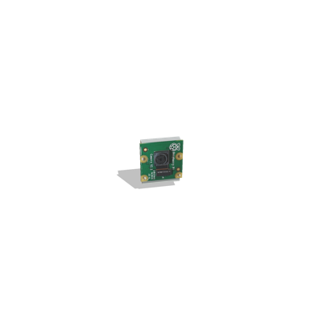
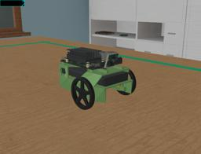

## NVIDIA JetBot

%robot jetbot images/robots/jetbot/model.thumbnail.png

JetBot is an open-source robot based on NVIDIA Jetson Nano.
The robot is an affordable two-wheeled robot distributed as a DIY kit.

More information on the JetBot robot can be found on this [website](https://jetbot.org).

### JetBot PROTO Nodes

#### JetBot PROTO

Derived from [Robot](../reference/robot.md).

```
JetBot {
  SFVec3f      translation        0 0 0
  SFRotation   rotation           0 1 0 0
  SFString     name               "JetBot"
  SFString     controller         "jetbot_basic_motion"
  MFString     controllerArgs     []
  SFString     customData         ""
  SFBool       supervisor         FALSE
  SFBool       synchronization    TRUE
  SFBool       chassis            TRUE
  SFColor      chassis_color      0.571 0.817 0.479
  SFNode       cameraSlot         JetBotRasperryPiCamera  {
                                    translation 0 0.042 0.0488
                                    rotation -0.1628450388833288 -0.1628450388833288 0.9731202323568112 -1.5980453071795866
                                  }
  MFNode       extensionSlot      []
  SFString     window             ""
}
```

> **File location**: "[WEBOTS\_HOME/projects/robots/nvidia/jetbot/protos/JetBot.proto]({{ url.github_tree }}/projects/robots/nvidia/jetbot/protos/JetBot.proto)"

##### JetBot Field Summary

- `chassis`: Defines if the robot has a chassis.
- `chassis_color`:  Defines the color of the robot's chassis.
- `cameraSlot`:  Extends the robot with a camera on the front.
- `extensionSlot`: Extends the robot with new nodes.

#### JetBotRaspberryPiCamera PROTO

Derived from [Transform](../reference/transform.md).
It contains a [Camera](../reference/camera.md) device.

%figure



%end

```
JetBotRaspberryPiCamera {
  SFVec3f      translation        0 0 0
  SFRotation   rotation           0 1 0 0
  SFString     name               "camera"
  SFFloat      fieldOfView        2.79253
  SFInt32      width              1280
  SFInt32      height             720
  SFFloat      near               0.01
  SFFloat      far                1.0
}
```

> **File location**: "[WEBOTS\_HOME/projects/robots/nvidia/jetbot/protos/JetBotRaspberryPiCamera.proto]({{ url.github_tree }}/projects/robots/nvidia/jetbot/protos/JetBotRaspberryPiCamera.proto)"

##### JetBotRaspberryPiCamera Field Summary

- `name`: Defines the [Camera.name](../reference/camera.md) value.
- `fieldOfView`:  Defines the [Camera.fieldOfView](../reference/camera.md) value.
- `width`: Defines the [Camera.width](../reference/camera.md) value.
- `height`: Defines the [Camera.height](../reference/camera.md) value.
- `near`: Defines the [Camera.near](../reference/camera.md) value.
- `far`: Defines the [Camera.far](../reference/camera.md) value.

### Sample

You will find the following sample in this folder: "[WEBOTS\_HOME/projects/robots/nvidia/jetbot/worlds]({{ url.github_tree }}/projects/robots/nvidia/jetbot/worlds)".
An additional example using PyTorch CNN to perform collision avoidance is available [here](https://github.com/cyberbotics/webots-projects/blob/projects/nvidia-jetbot-collision-avoidance).

#### jetbot.wbt

 In this example, you can see a JetBot robot performing basic motion.
The `jetbot` C controller replicates the basic motion provided by the official ["Basic Motion"](https://github.com/NVIDIA-AI-IOT/jetbot/blob/master/notebooks/basic_motion/basic_motion.ipynb) Jupyter notebook.
