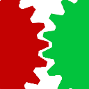
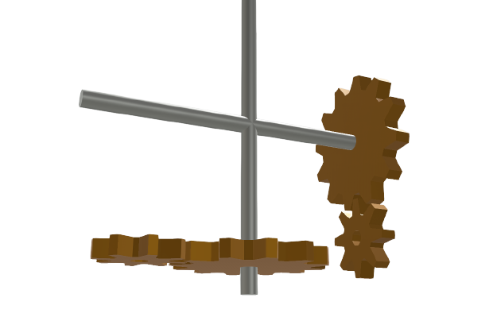

# Joints

Webots already disposes of several nodes to model the transmission of power across bodies, such as [HingeJoint](../reference/hingejoint.md), [Hinge2Joint](../reference/hinge2joint.md), [BallJoint](../reference/balljoint.md) and [SliderJoint](../reference/sliderjoint.md).
However, in some instances it is necessary to more accurately describe the real behavior by taking into consideration factors like, for example, the clearance among gears in a drive train. The [PROTO](../reference/proto.md) node described here extend the existing nodes by allowing more accurate modeling.

## Joints List

| Icon | PROTO | Description |
| :---: | --- | --- |
|  | [HingeJointWithBacklash](hinge-joint-with-backlash.md) | *Models the effect of backlash on a hinge joint.* |
|  | [Hinge2JointWithBacklash](hinge-2-joint-with-backlash.md) | *Models the effect of backlash on a hinge2 joint.* |
