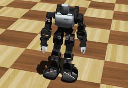

## KONDO's KHR-3HV

%robot khr-3hv images/robots/khr-3hv/model.thumbnail.png

The "Kondo KHR-3HV" is an humanoid robot with 17 degrees of freedom.

### Movie Presentation


### Khr3hv PROTO

Derived from [Robot](../reference/robot.md).

```
Khr3hv {
  SFVec3f    translation     0 0 0
  SFRotation rotation        0 1 0 0
  SFString   name            "KHR-3HV"
  SFString   controller      "void"
  MFString   controllerArgs  []
  SFString   customData      ""
  SFBool     supervisor      FALSE
  SFBool     synchronization TRUE
  SFBool     selfCollision   FALSE
  MFNode     bodySlot        []
}
```

> **File location**: "WEBOTS\_HOME/projects/robots/kondo/khr-3hv/protos/Khr3hv.proto"

#### Khr3hv Field Summary

- `bodySlot`: Extends the robot with new nodes in the body slot.

### Samples

You will find the following sample in this folder: "WEBOTS\_HOME/projects/robots/kondo/khr-3hv/worlds".

#### khr-3hv.wbt

 This simulation shows a KHR-3HV robot.
You can play with its motors using the generic robot window.
