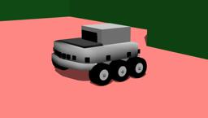

## K-Team's Koala

%robot koala images/robots/koala/model.thumbnail.png

The "Koala" robot is a six-wheeled indoor robot produced by [K-Team](https://www.k-team.com/mobile-robotics-products/koala).
It is mounted by multiple sensors including 16 distance sensors.

### Koala PROTO

Derived from [Robot](../reference/robot.md).

```
Koala {
  SFVec3f    translation     0 0 0
  SFRotation rotation        0 1 0 0
  SFString   name            "Koala"
  SFString   controller      "koala"
  MFString   controllerArgs  []
  SFString   customData      ""
  SFBool     supervisor      FALSE
  SFBool     synchronization TRUE
  MFNode     extensionSlot   []
}
```

> **File location**: "WEBOTS\_HOME/projects/robots/k-team/koala/protos/Koala.proto"

#### Koala Field Summary

- `extensionSlot`: Extends the robot with new nodes in the extension slot.

### Samples

You will find the following sample in this folder: "WEBOTS\_HOME/projects/robots/k-team/koala/worlds":

#### koala.wbt

 This simulation shows a Koala avoiding obstacles in a square arena.
