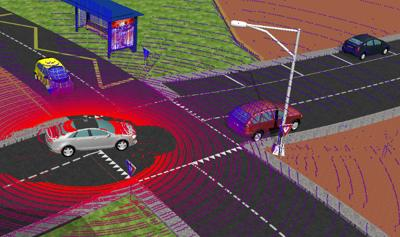

## Lidar Sensors

A wide range of lidar sensors have been modelled.

%figure "Lidar simulation"



%end

### Ibeo LUX

The `Ibeo LUX` is a 4 layers lidar with a range of up to 200 meters and a field of view of up to 110 degrees, it returns 680 points per layer per scan.

The model of the `Ibeo LUX` contains a spherical projection, a fixed resolution of 0.04 meter and a gaussian noise with a standard deviation of 0.1 meter.

%figure "Ibeo LUX lidar"


%end

```
IbeoLux {
  SFVec3f    translation             0 0 0
  SFRotation rotation                0 1 0 0
  SFString   name                    "Ibeo Lux"
  SFBool     useExtendedFieldOfView  FALSE
  SFBool     fastModel               FALSE
}
```

The `IbeoLux` PROTO can either be used in normal field of view mode (80 degrees field of view) or in extended field of view mode (110 degrees field of view) depending on the value of the `useExtendedFieldOfView` field.

The `fastModel` field can be used to simplify the model of the sensor by removing the spherical projection, the noise and the limited resolution in order to speed up the simulation.

### Hokuyo

#### Hokuyo URG-04LX

%figure "Hokuyo URG-04LX model"


%end

The [Hokuyo URG-04LX](https://www.hokuyo-aut.jp/search/single.php?serial=165) is a lidar designed for lightweight indoor robots.
The model has the following specifications:

- `field of view`: 240 [deg]
- `range`: 0.06 to 4.095 [m]
- `resolution`: 667 * 0.36 [deg]
- `dimension`: 0.05 x 0.07 x 0.05 [m]
- `weight`: 0.16 [kg]

```
HokuyoUrg04lx [
  SFVec3f    translation 0 0 0
  SFRotation rotation    0 1 0 0
  SFString   name        "Hokuyo URG-04LX"
  SFFloat    noise       0.0
  SFInt32    resolution  667
]
```

`resolution`: Defines the `horizontalResolution` field of the [Lidar](../reference/lidar.md).

#### Hokuyo URG-04LX-UG01

%figure "Hokuyo URG-04LX-UG01 model"


%end

The [Hokuyo URG-04LX-UG01](https://www.hokuyo-aut.jp/search/single.php?serial=166) is a lidar designed for lightweight indoor robots.
The model has the following specifications:

- `field of view`: 240 [deg]
- `range`: 0.2 to 5.6 [m]
- `resolution`: 667 * 0.36 [deg]
- `dimension`: 0.05 x 0.07 x 0.05 [m]
- `weight`: 0.16 [kg]

```
HokuyoUrg04lxug01 [
  SFVec3f    translation 0 0 0
  SFRotation rotation    0 1 0 0
  SFString   name        "Hokuyo URG-04LX-UG01"
  SFFloat    noise       0.0
  SFInt32    resolution  667
]
```

- `resolution`: Defines the `horizontalResolution` field of the [Lidar](../reference/lidar.md).

#### Hokuyo UTM-30LX

%figure "Hokuyo UTM-30LX model"


%end

The [Hokuyo UTM-30LX](https://www.hokuyo-aut.jp/search/single.php?serial=169) is a lidar designed for outdoor robots with a high moving speed.
The model has the following specifications:

- `field of view`: 270 [deg]
- `range`: 0.1 to 30 [m]
- `resolution`: 1080 * 0.25 [deg]
- `dimension`: 0.06 x 0.087 x 0.06 [m]
- `weight`: 0.37 [kg]

```
HokuyoUtm30lx {
  SFVec3f    translation 0 0 0
  SFRotation rotation    0 1 0 0
  SFString   name        "Hokuyo UTM-30LX"
  SFFloat    noise       0.0
  SFInt32    resolution  1080
}
```

- `resolution`: Defines the `horizontalResolution` field of the [Lidar](../reference/lidar.md).

### Robotis

#### Robotis LDS-01

The `Robotis LDS-01` is a 1 layer lidar with a range of up to 3.5 meters and a field of view of up to 360 degrees.

%figure "Robotis LDS-01 lidar"


%end

```
RobotisLds01 {
  SFVec3f    translation    0 0.02 0
  SFRotation rotation       0 1 0 0
  SFString   name           "LDS-01"
  SFFloat    noise          0.0043
  SFBool     enablePhysics  TRUE
}
```

The `noise` field specifies the standard deviation of the gaussian depth noise in meters.

The `enablePhysics` field specifies if the sensor should be affected by physics (mass = 0.125 [kg]) or not.

### SICK

#### SICK LMS 291

The `SICK LMS 291` is a 1 layer lidar with a range of up to 80 meters and a field of view of up to 180 degrees.

The model of the `SICK LMS 291` contains a spherical projection, a configurable fixed resolution and a configurable gaussian noise.

%figure "SICK LMS 291 lidar"


%end

```
SickLms291 {
  SFVec3f    translation 0 0 0
  SFRotation rotation    0 1 0 0
  SFString   name        "Sick LMS 291"
  SFFloat    noise       0.0
  SFInt32    resolution  180
}
```

The `noise` field specifies the standard deviation of the gaussian depth noise in meters.

The `resolution` field specifies the number of points returned per layer per scan.

#### SICK LD-MRS

The [SICK LD-MRS](https://www.sick.com/us/en/detection-and-ranging-solutions/3d-lidar-sensors/ld-mrs/c/g91913) is a multi-layer lidar designed for harsh outdoor environments.

The `SickLdMrs` PROTO contains a [Lidar](../reference/lidar.md) node which covers the main usual cases.
Its reference name (to get it from the Webots API) matches directly with the `SickLdMrs.name` field.
It has the following properties:

- Its number of layers is 4 except for the `800001S01` type which is 8.
- Its horizontal scanning range is 85°, shifted horizontally by 7,5°.
- Its maximal range is 300 meters.
- Each layer is separated vertically by 0.8°.

In addition to this main [Lidar](../reference/lidar.md) node, the PROTO contains a second [Lidar](../reference/lidar.md) in order to model the overlapping long-range layers.
This sensor reference name is the `SickLdMrs.name` field concatenated by the ` (long range)` string.
In addition to the properties of the main lidar, it has the following properties:

- Its horizontal scanning range is 110°, shifted horizontally by 5°.
- Its number of layers is `SickLdMrs.measurementLayers` divided by 2.

The internal [Lidars](../reference/lidar.md) are oriented as follows:

- Layer 0 corresponds to the bottom layer.
- First response values are corresponding to the device right.

In comparison to the real sensor, the simulated model has the following limitations:

- The scanning range resolution is constant over the entire scan.
- The vertical azimuth is constant over the entire scan.

%figure "SICK LD-MRS lidar"


%end

```
SickLdMrs {
  SFVec3f    translation       0 0 0
  SFRotation rotation          0 1 0 0
  SFString   name              "Sick LD-MRS"
  SFString   type              "400001"
  SFString   angularResolution "0.5 [deg]"
  SFFloat    noise             0.001
  SFBool     enablePhysics     TRUE
}
```

The `type` field specifies the `SICK LD-MRS` type (cf. [specifications](https://www.sick.com/us/en/detection-and-ranging-solutions/3d-lidar-sensors/ld-mrs/c/g91913)).
The value could be one of the following: `400001`, `400102`, `400001S01`, `400102S01` or `800001S01`.

The `noise` field specifies the standard deviation of gaussian image noise in meters.

The `angularResolution` field specifies the vertical angular gap between two measurements.
From the `SICK LD-MRS` specification, it can be either 0.5, 0.25 or 0.125 degrees.
Internally, the `Lidar.horizontalResolution` is directly affected by this field.
The value could be one of the following: `0.5 [deg]`, `0.25 [deg]` or `0.125 [deg]`.

The `enablePhysics` field specifies if the sensor should be affected by physics (mass = 1 [kg]) or not.

#### SICK S300

The [SICK S300](https://www.sick.com/ag/en/opto-electronic-protective-devices/safety-laser-scanners/s300-standard/s30b-2011ba/p/p53845) is a 3 layers safety lidar. The model has the following specifications:

- `field of view`: 270 [deg]
- `range`: up to 30 [m]
- `number of layers`: 3
- `angular resolution`: 0.5 [deg]
- `resolution`: 540
- `dimension`: 0.102 x 0.152 x 0.106 [m]
- `weight`: 1.2 [kg]

%figure "SICK S300 lidar"


%end

```
SickS300 [
  SFVec3f    translation    0 0 0
  SFRotation rotation       0 1 0 0
  SFString   name           "Sick S300"
  SFFloat    noise          0.0
  SFInt32    resolution     540
  SFBool     enablePhysics  TRUE
]
```

The `noise` field specifies the standard deviation of the gaussian depth noise in meters.

The `resolution` field specifies the number of points returned per layer per scan.

The `enablePhysics` field specifies if the sensor should be affected by physics or not.

### Velodyne

All the models of velodyne sensors are available.

#### Velodyne Puck

The `Velodyne Puck` is a 16 layers lidar with a range of up to 100 meters and a field of view of 360 degrees, it returns 3600 points per layer per scan. The `Velodyne Puck` comes in 3 different versions (selectable with the ` version`):
  - **Puck**: Default version (also known as the Velodyne VLP-16).
  - **Puck LITE**: Lighter weight version of the PUCK (590gr instead of 830gr).
  - **Puck Hi-Res**: Version with a 20° vertical FoV for a tighter layer distribution (1.33° between layers instead of 2.00°).

The model of the `Velodyne Puck` contains a spherical projection and a gaussian noise with a standard deviation of 0.03 meter.

%figure "Velodyne Puck model"


%end

```
VelodynePuck {
  SFVec3f    translation    0 0 0
  SFRotation rotation       0 1 0 0
  SFString   name           "Velodyne VLP-16"
  SFString   version        "Puck"
  SFBool     enablePhysics  TRUE
}
```

#### Velodyne HDL 32E

The `Velodyne HDL 32E` is a 32 layers lidar with a range of up to 70 meters and a field of view of 360 degrees, it returns 4500 points per layer per scan.

The model of the `Velodyne HDL 32` contains a gaussian noise with a standard deviation of 0.02 meter and a rotating head.

%figure "Velodyne HDL 32E lidar"


%end

```
VelodyneHDL-32E {
  SFVec3f    translation    0 0 0
  SFRotation rotation       0 1 0 0
  SFString   name           "Velodyne HDL-32E"
  SFBool     enablePhysics  TRUE
}
```

#### Velodyne HDL 64E

The `Velodyne HDL 64E` is a 64 layers lidar with a range of up to 120 meters and a field of view of 360 degrees, it returns 4500 points per layer per scan.

The model of the `Velodyne HDL 64` contains a gaussian noise with a standard deviation of 0.02 meter and a rotating head.

%figure "Velodyne HDL 64E lidar"


%end

```
VelodyneHDL-64E {
  SFVec3f    translation    0 0 0
  SFRotation rotation       0 1 0 0
  SFString   name           "Velodyne HDL-32E"
  SFBool     enablePhysics  TRUE
}
```
