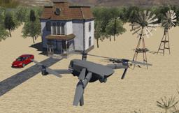

## DJI' Mavic 2 PRO

%robot mavic-2-pro images/robots/mavic-2-pro/model.thumbnail.png

The [Mavic 2 PRO](https://www.dji.com/ch/mavic-2) from [DJI](https://www.dji.com) is quadcopter drone mounted with a motorized camera.

### Movie Presentation


### Mavic2Pro PROTO

Derived from [Robot](../reference/robot.md).

```
PROTO Mavic2Pro {
  SFVec3f    translation         0 0 0
  SFRotation rotation            0 1 0 0
  SFString   name                "Mavic 2 PRO"
  SFString   controller          "mavic2pro"
  MFString   controllerArgs      []
  SFString   customData          ""
  SFBool     supervisor          FALSE
  SFBool     synchronization     TRUE
  MFNode     bodySlot            []
  MFNode     cameraSlot          [ Camera { width 400 height 240 } ]
}
```

> **File location**: "WEBOTS\_HOME/projects/robots/dji/mavic/protos/Mavic2Pro.proto"

#### Mavic2Pro Field Summary

- `bodySlot`: Extends the robot with new nodes.
- `cameraSlot`: Extends the camera with new nodes.

### Samples

You will find the following sample in this folder: [WEBOTS\_HOME/projects/robots/dji/mavic/worlds](https://github.com/omichel/webots/tree/master/projects/robots/dji/mavic/worlds).

#### mavic\_2\_pro.wbt

 This demonstration shows a DJI Mavic 2 PRO flying over a rural area.
After the drone has taken off, you can control it with the keyboard of your computer.
