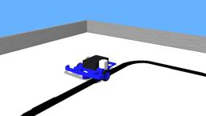

## PICAXE Microbot

%robot microbot images/robots/microbot/model.thumbnail.png

The [PICAXE microbot system](http://www.picaxe.com/Hardware/Robot-Kits/PICAXE-20X2-Microbot/) allows to create a robot from hardware pieces.
The system can be fully customized by the end user using different input sensors and output devices (in addition to the on-board motor/gearbox, [LED](../reference/led.md) and piezo outputs).
This default pack contains the motherboard, two motor/gearboxes, a bumper module, a line follower module, a pen holder and a servo connector.
It can be extended.

### Microbot PROTO

Derived from [Robot](../reference/robot.md).

```
Microbot {
  SFVec3f    translation      0 0.022 0
  SFRotation rotation         0 1 0 0
  SFString   name            "BOT120"
  SFString   controller      "void"
  MFString   controllerArgs  []
  SFString   customData      ""
  SFBool     supervisor      FALSE
  SFBool     synchronization TRUE
  MFNode     extensionSlot   []
}
```

> **File location**: "WEBOTS\_HOME/projects/robots/picaxe/microbot/protos/Microbot.proto"

#### Microbot Field Summary

- `extensionSlot`: Extends the robot with new nodes in the extension slot.

### Samples

You will find the following sample in this folder: "WEBOTS\_HOME/projects/robots/picaxe/microbot/worlds".

#### microbot\_pe.wbt

 This simulation shows a Microbot robot which follows a black line drawn on the ground.
