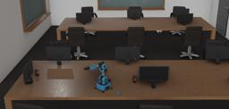

## Niryo's Ned

%robot ned images/robots/ned/model.thumbnail.png

Ned is a 6-axis collaborative robot developed by [Niryo](https://niryo.com/). It is  based on open-source technologies designed for education, professional training and research.

### Movie Presentation


### Ned PROTO

Derived from [Robot](../reference/robot.md).

```
PROTO Ned {
  field  SFVec3f     translation     0 0 0     # Is `Transform.translation`.
  field  SFRotation  rotation        0 1 0 0   # Is `Transform.rotation`.
  field  SFString    name            "Ned"     # Is `Robot.name`.
  field  SFString    controller      "ned"     # Is `Robot.controller`.
  field  MFString    controllerArgs  []        # Is `Robot.controllerArgs`.
  field  SFString    customData      ""        # Is `Robot.customData`.
  field  SFBool      supervisor      FALSE     # Is `Robot.supervisor`.
  field  SFBool      synchronization TRUE      # Is `Robot.synchronization`.
  field  SFBool      selfCollision   FALSE     # Is `Robot.selfCollision`.
}
```

> **File location**: "WEBOTS\_HOME/projects/robots/niryo/ned/protos/Ned.proto"

### Samples

You will find the following sample in this folder: [WEBOTS\_HOME/projects/robots/niryo/ned/worlds](https://github.com/omichel/webots/tree/released/projects/robots/niryo/ned/worlds).


#### ned.wbt

 This simulation shows Ned in a working environment. You can control the robot with your keyboard, launch a demo and run a pick and place operation. You can start from this simulation to create your own world, prototype industrial processes and edit controllers with Ned.
