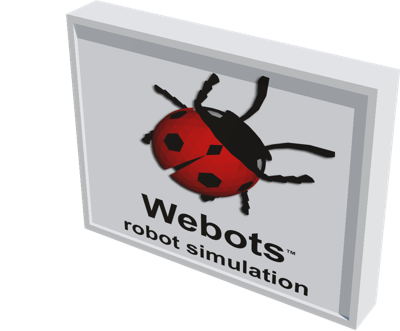

# Advertising Board

## AdvertisingBoard

Double sided and adjustable advertising board with the possibility of adding up to four poles.
Those poles can either be a `cylinder`, `box`, or an `H-shape`.

%figure



%end

Derived from [Solid](../reference/solid.md).

```
AdvertisingBoard {
  SFVec3f     translation       0 0 0
  SFRotation  rotation          0 1 0 0
  SFString    name              "advertising board"
  MFString    frontTexture      "textures/webots_billboard.jpg"
  MFString    backTexture       "textures/webots_billboard.jpg"
  MFColor     recognitionColors [ 1 1 1, 0.75 0 0 ]
  SFBool      displayBackLight  FALSE
  SFFloat     displayWidth      4
  SFFloat     displayHeight     3
  SFFloat     frameThickness    0.6
  SFColor     frameColor        0.886275 0.886275 0.886275
  SFColor     poleColor         0.886275 0.886275 0.886275
  SFInt32     poleNumber        0
  SFString    poleType          "cylinder"
  SFFloat     poleHeight        5
  SFFloat     poleThickness     0.4
  SFFloat     baseRatio         3.2
}
```

> **File location**: "[WEBOTS\_HOME/projects/objects/advertising\_board/protos/AdvertisingBoard.proto](https://github.com/cyberbotics/webots/tree/master/projects/objects/advertising_board/protos/AdvertisingBoard.proto)"

> **License**: Copyright Cyberbotics Ltd. Licensed for use only with Webots.
[More information.](https://cyberbotics.com/webots_assets_license)

### AdvertisingBoard Field Summary

- `name`: Defines the name of the advertising board.

- `frontTexture`: Defines the front display texture.

- `backTexture`: Defines the back display texture.

- `displayBackLight`: Defines wether the displays are backlit or not.

- `displayWidth`: Defines the width of the displays.

- `displayHeight`: Defines the height of the displays.

- `frameThickness`: Defines the thickness of the frame.

- `frameColor`: Defines the color of the outer frame of the board.

- `poleColor`: Defines the color of the pole if present.

- `poleNumber`: Defines the number of poles. Their position is defined by the number of poles. There can be up to 4 equally spaced poles per board.

- `poleType`: Defines the shape and behavious of the pole(s). `box` and `cylinder` pole types are placed at the center of the board and `H-shape` is placed behind. In the case of `H-shape`, backTexture is null and a base is not defined. This field accepts the following values: `"cylinder"`, `"box"` and `"H-shape"`.

- `poleHeight`: Defines the height of the pole.

- `poleThickness`: Defines the thickness of the pole (radius of the cylinder for `cylinder`).

- `baseRatio`: Defines the size of the base for `box` and `cylinder` poles. This field is based on a ratio of `poleThickness`.

