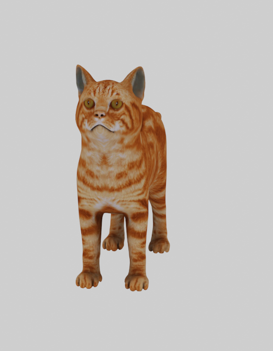
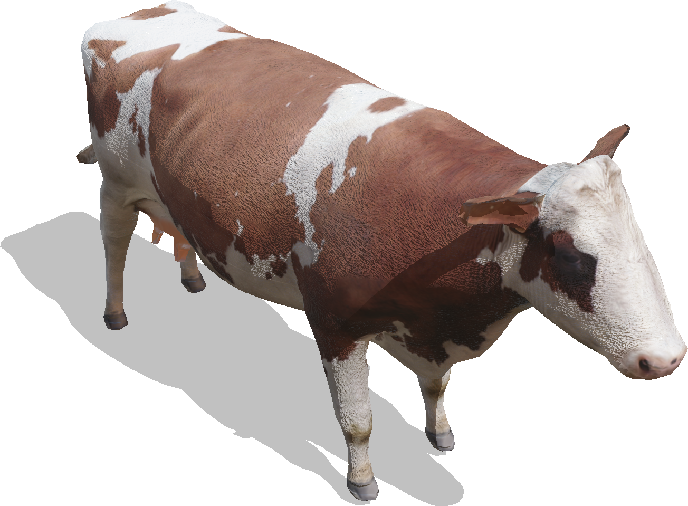
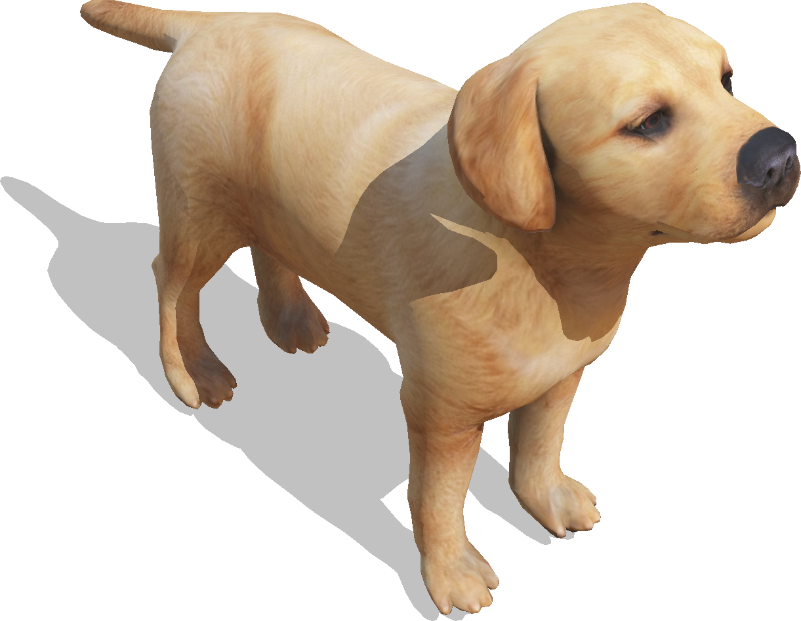
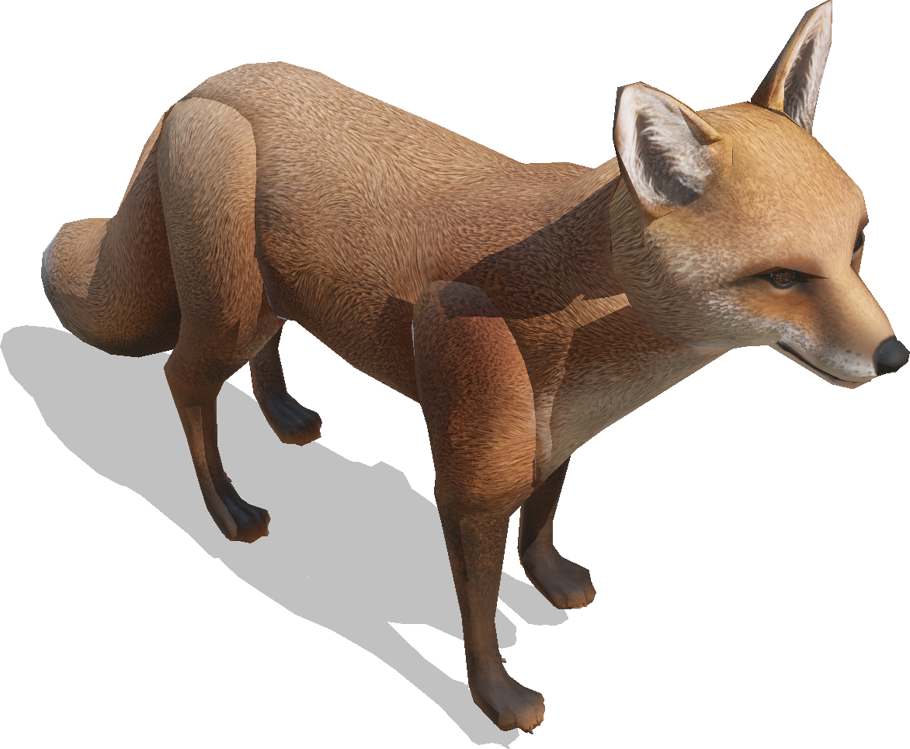
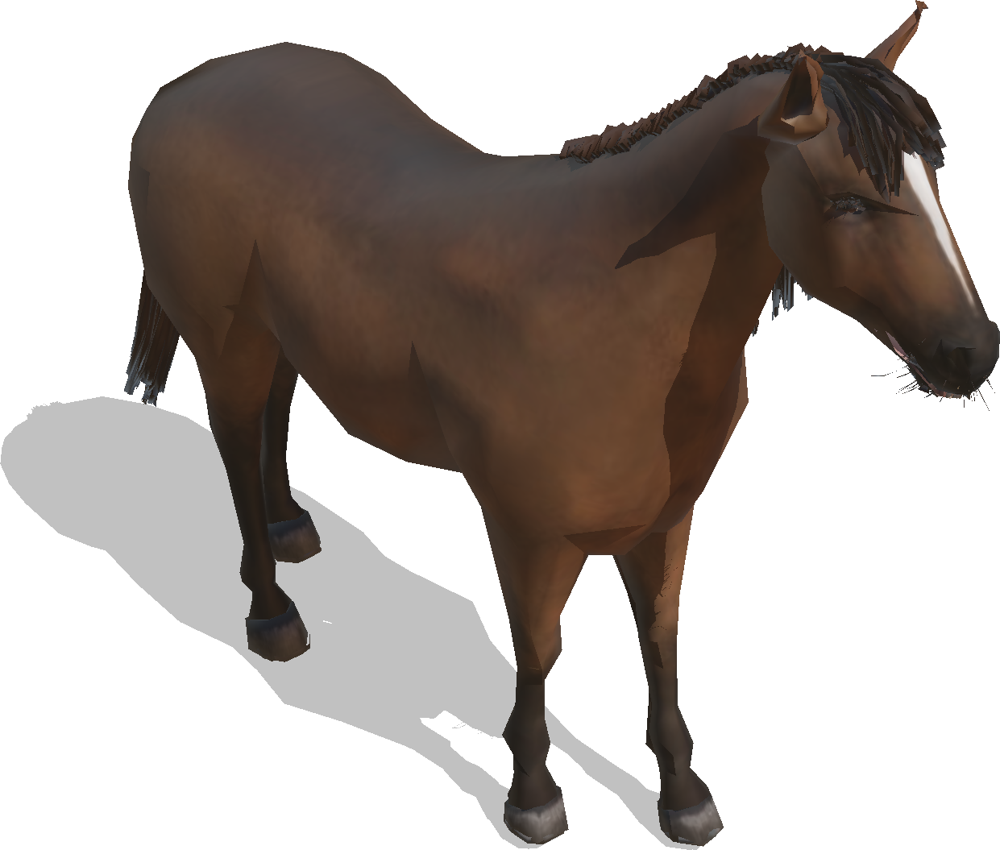
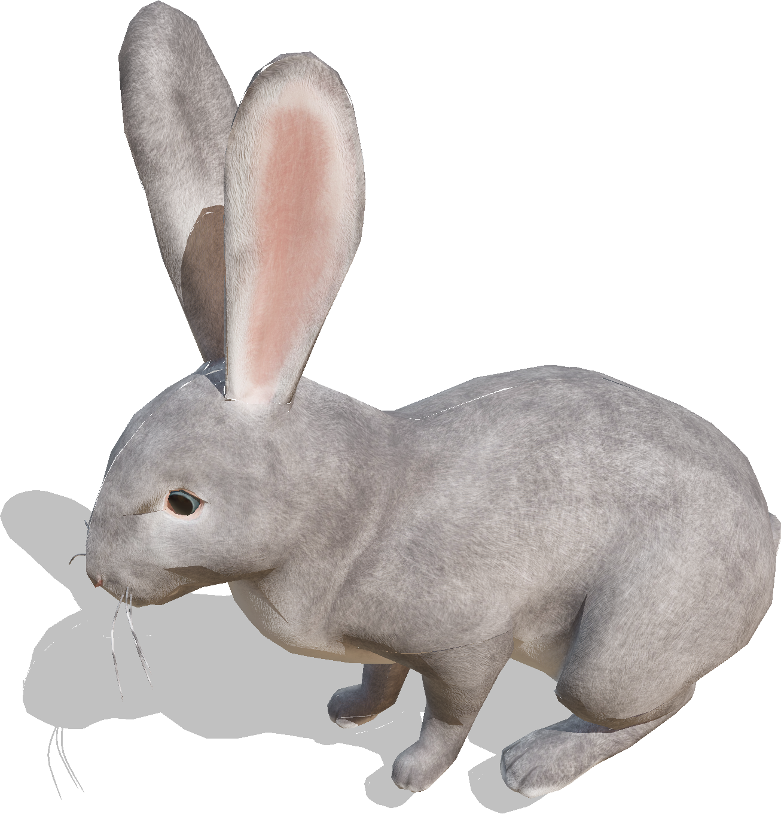
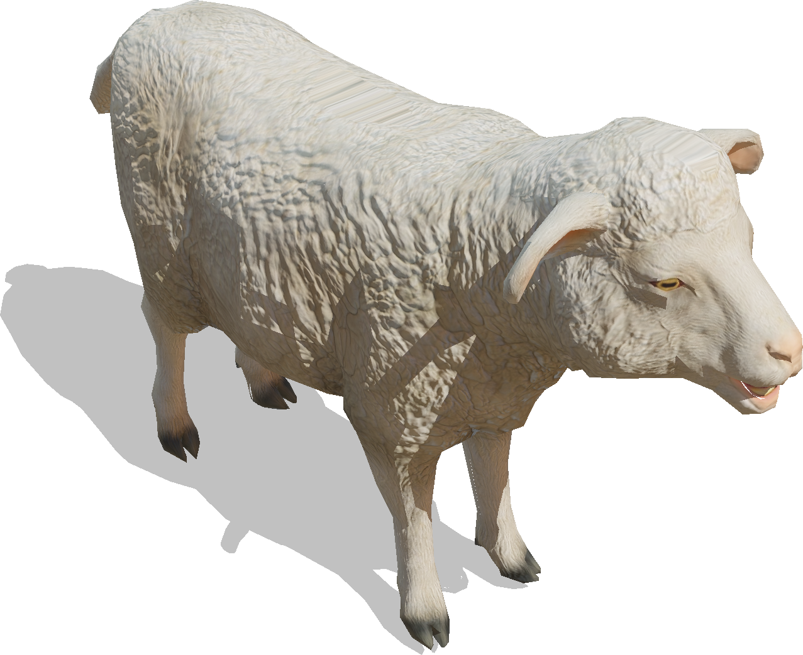

# Animals

## Cat

A Cat.
This object is physics-enabled so it can be pushed.

%figure



%end

Derived from [Solid](../reference/solid.md).

```
Cat {
  SFVec3f    translation  0 0 0
  SFRotation rotation     0 0 1 0
  SFFloat    scale        1
  SFString   name         "cat"
  SFFloat    mass         2.5
}
```

> **File location**: "[WEBOTS\_HOME/projects/objects/animals/protos/Cat.proto]({{ url.github_tree }}/projects/objects/animals/protos/Cat.proto)"

> **License**: Copyright Cyberbotics Ltd. Licensed for use only with Webots.
[More information.](https://cyberbotics.com/webots_assets_license)

### Cat Field Summary

- `scale`: Defines the global scaling factor.

- `mass`: Defines the mass of the cat in kg.

## Cow

A brown and white cow.
This object is physics-enabled so it can be pushed.

%figure



%end

Derived from [Solid](../reference/solid.md).

```
Cow {
  SFVec3f    translation  0 0 0
  SFRotation rotation     0 0 1 0
  SFFloat    scale        1
  SFString   name         "cow"
  SFFloat    mass         750
}
```

> **File location**: "[WEBOTS\_HOME/projects/objects/animals/protos/Cow.proto]({{ url.github_tree }}/projects/objects/animals/protos/Cow.proto)"

> **License**: Copyright Cyberbotics Ltd. Licensed for use only with Webots.
[More information.](https://cyberbotics.com/webots_assets_license)

### Cow Field Summary

- `scale`: Defines the global scaling factor.

- `mass`: Defines the mass of the cow in kg.

## Deer

A female deer.
This object is physics-enabled so it can be pushed.
Based on the model of Nyilonelycompany ([https://sketchfab.com/Nyilonelycompany](https://sketchfab.com/Nyilonelycompany)).

%figure


%end

Derived from [Solid](../reference/solid.md).

```
Deer {
  SFVec3f    translation 0 0 0
  SFRotation rotation    0 0 1 0
  SFFloat    scale       1
  SFString   name        "deer"
  SFFloat    mass        70
}
```

> **File location**: "[WEBOTS\_HOME/projects/objects/animals/protos/Deer.proto]({{ url.github_tree }}/projects/objects/animals/protos/Deer.proto)"

> **License**: Copyright Cyberbotics Ltd. Licensed for use only with Webots.
[More information.](https://cyberbotics.com/webots_assets_license)

### Deer Field Summary

- `scale`: Defines the global scaling factor.

- `mass`: Defines the mass of the deer in kg.

## Dog

A Dog.
This object is physics-enabled so it can be pushed.

%figure



%end

Derived from [Solid](../reference/solid.md).

```
Dog {
  SFVec3f    translation 0 0 0
  SFRotation rotation    0 0 1 0
  SFFloat    scale       1
  SFString   name        "dog"
  SFFloat    mass        25
}
```

> **File location**: "[WEBOTS\_HOME/projects/objects/animals/protos/Dog.proto]({{ url.github_tree }}/projects/objects/animals/protos/Dog.proto)"

> **License**: Copyright Cyberbotics Ltd. Licensed for use only with Webots.
[More information.](https://cyberbotics.com/webots_assets_license)

### Dog Field Summary

- `scale`: Defines the global scaling factor.

- `mass`: Defines the mass of the dog in kg.

## Fox

A Fox.
This object is physics-enabled so it can be pushed.
Based on the model of AIUM2 ([https://sketchfab.com/alfredonicolas](https://sketchfab.com/alfredonicolas)).

%figure



%end

Derived from [Solid](../reference/solid.md).

```
Fox {
  SFVec3f    translation 0 0 0
  SFRotation rotation    0 0 1 0
  SFFloat    scale       1
  SFString   name        "fox"
  SFFloat    mass        25
}
```

> **File location**: "[WEBOTS\_HOME/projects/objects/animals/protos/Fox.proto]({{ url.github_tree }}/projects/objects/animals/protos/Fox.proto)"

> **License**: Copyright Cyberbotics Ltd. Licensed for use only with Webots.
[More information.](https://cyberbotics.com/webots_assets_license)

### Fox Field Summary

- `scale`: Defines the global scaling factor.

- `mass`: Defines the mass of the fox in kg.

## Horse

A brown horse.
This object is physics-enabled so it can be pushed.

%figure



%end

Derived from [Solid](../reference/solid.md).

```
Horse {
  SFVec3f    translation 0 0 0
  SFRotation rotation    0 0 1 0
  SFFloat    scale       1
  SFString   name        "horse"
  SFFloat    mass        750
}
```

> **File location**: "[WEBOTS\_HOME/projects/objects/animals/protos/Horse.proto]({{ url.github_tree }}/projects/objects/animals/protos/Horse.proto)"

> **License**: Copyright Cyberbotics Ltd. Licensed for use only with Webots.
[More information.](https://cyberbotics.com/webots_assets_license)

### Horse Field Summary

- `scale`: Defines the global scaling factor.

- `mass`: Defines the mass of the cow in kg.

## Rabbit

A Rabbit.
This object is physics-enabled so it can be pushed.
Based on the model of Nyilonelycompany ([https://sketchfab.com/Nyilonelycompany](https://sketchfab.com/Nyilonelycompany)).

%figure



%end

Derived from [Solid](../reference/solid.md).

```
Rabbit {
  SFVec3f    translation 0 0 0
  SFRotation rotation    0 0 1 0
  SFFloat    scale       1
  SFString   name        "rabbit"
  SFFloat    mass        5
}
```

> **File location**: "[WEBOTS\_HOME/projects/objects/animals/protos/Rabbit.proto]({{ url.github_tree }}/projects/objects/animals/protos/Rabbit.proto)"

> **License**: Copyright Cyberbotics Ltd. Licensed for use only with Webots.
[More information.](https://cyberbotics.com/webots_assets_license)

### Rabbit Field Summary

- `scale`: Defines the global scaling factor.

- `mass`: Defines the mass of the rabbit in kg.

## Sheep

A white sheep.
This object is physics-enabled so it can be pushed.
Based on the model of hendrikReyneke ([https://sketchfab.com/hendrikReyneke](https://sketchfab.com/hendrikReyneke)).

%figure



%end

Derived from [Solid](../reference/solid.md).

```
Sheep {
  SFVec3f    translation 0 0 0
  SFRotation rotation    0 0 1 0
  SFFloat    scale       1
  SFString   name        "sheep"
  SFFloat    mass        80
}
```

> **File location**: "[WEBOTS\_HOME/projects/objects/animals/protos/Sheep.proto]({{ url.github_tree }}/projects/objects/animals/protos/Sheep.proto)"

> **License**: Copyright Cyberbotics Ltd. Licensed for use only with Webots.
[More information.](https://cyberbotics.com/webots_assets_license)

### Sheep Field Summary

- `scale`: Defines the global scaling factor.

- `mass`: Defines the mass of the sheep in kg.
