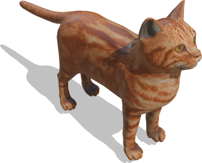
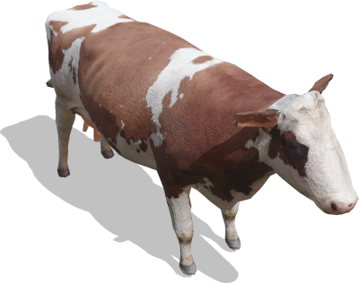
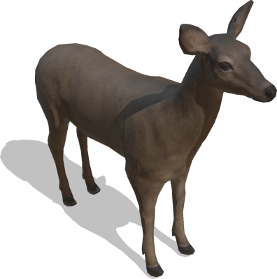
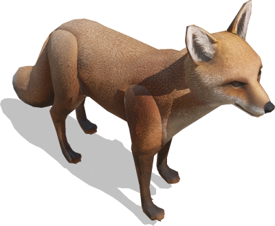
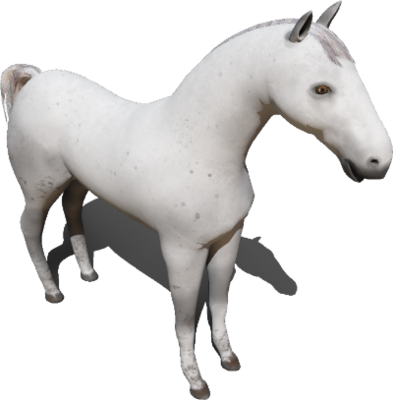
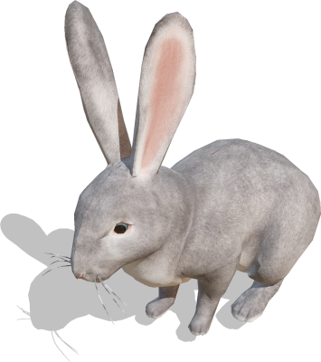

# Animals

## Cat

A static cat.

%figure



%end

Derived from [Solid](../reference/solid.md).

```
Cat {
  SFVec3f    translation  0 0 0
  SFRotation rotation     0 0 1 0
  SFFloat    scale        1
  SFString   name         "cat"
  SFColor    color        1 1 1
}
```

> **File location**: "[WEBOTS\_HOME/projects/objects/animals/protos/Cat.proto]({{ url.github_tree }}/projects/objects/animals/protos/Cat.proto)"

> **License**: Copyright Cyberbotics Ltd. Licensed for use only with Webots.
[More information.](https://cyberbotics.com/webots_assets_license)

### Cat Field Summary

- `scale`: Defines the global scaling factor.

- `color`: Defines the color of the cat.

## Cow

A static brown and white cow.

%figure



%end

Derived from [Solid](../reference/solid.md).

```
Cow {
  SFVec3f    translation  0 0 0
  SFRotation rotation     0 0 1 0
  SFFloat    scale        1
  SFString   name         "cow"
  SFColor    color        1 1 1
  SFString   patchColor   "braun"
}
```

> **File location**: "[WEBOTS\_HOME/projects/objects/animals/protos/Cow.proto]({{ url.github_tree }}/projects/objects/animals/protos/Cow.proto)"

> **License**: Copyright Cyberbotics Ltd. Licensed for use only with Webots.
[More information.](https://cyberbotics.com/webots_assets_license)

### Cow Field Summary

- `scale`: Defines the global scaling factor.

- `color`: Defines the color of the cow.

- `patchColor`: Define the cow type. This field accepts the following values: `"braun"` and `"black"`.

## Deer

A static female deer.
Based on the model of Nyilonelycompany ([https://sketchfab.com/Nyilonelycompany](https://sketchfab.com/Nyilonelycompany)).

%figure



%end

Derived from [Solid](../reference/solid.md).

```
Deer {
  SFVec3f    translation 0 0 0
  SFRotation rotation    0 0 1 0
  SFFloat    scale       1
  SFString   name        "deer"
  SFColor    color        1 1 1
}
```

> **File location**: "[WEBOTS\_HOME/projects/objects/animals/protos/Deer.proto]({{ url.github_tree }}/projects/objects/animals/protos/Deer.proto)"

> **License**: Copyright Cyberbotics Ltd. Licensed for use only with Webots.
[More information.](https://cyberbotics.com/webots_assets_license)

### Deer Field Summary

- `scale`: Defines the global scaling factor.

- `color`: Defines the color of the deer.

## Dog

A static dog.

%figure


%end

Derived from [Solid](../reference/solid.md).

```
Dog {
  SFVec3f    translation 0 0 0
  SFRotation rotation    0 0 1 0
  SFFloat    scale       1
  SFString   name        "dog"
  SFColor    color        1 1 1
}
```

> **File location**: "[WEBOTS\_HOME/projects/objects/animals/protos/Dog.proto]({{ url.github_tree }}/projects/objects/animals/protos/Dog.proto)"

> **License**: Copyright Cyberbotics Ltd. Licensed for use only with Webots.
[More information.](https://cyberbotics.com/webots_assets_license)

### Dog Field Summary

- `scale`: Defines the global scaling factor.

- `color`: Defines the color of the dog.

## Fox

A static fox.
Based on the model of AIUM2 ([https://sketchfab.com/alfredonicolas](https://sketchfab.com/alfredonicolas)).

%figure



%end

Derived from [Solid](../reference/solid.md).

```
Fox {
  SFVec3f    translation 0 0 0
  SFRotation rotation    0 0 1 0
  SFFloat    scale       1
  SFString   name        "fox"
  SFColor    color        1 1 1
}
```

> **File location**: "[WEBOTS\_HOME/projects/objects/animals/protos/Fox.proto]({{ url.github_tree }}/projects/objects/animals/protos/Fox.proto)"

> **License**: Copyright Cyberbotics Ltd. Licensed for use only with Webots.
[More information.](https://cyberbotics.com/webots_assets_license)

### Fox Field Summary

- `scale`: Defines the global scaling factor.

- `color`: Defines the color of the fox.

## Horse

A static brown horse.
Based on the model of BlueMesh ([https://sketchfab.com/VapTor](https://sketchfab.com/VapTor)).

%figure



%end

Derived from [Solid](../reference/solid.md).

```
Horse {
  SFVec3f    translation 0 0 0
  SFRotation rotation    0 0 1 0
  SFFloat    scale       1
  SFString   name        "horse"
  SFColor    colorBody   1 1 1
  SFColor    colorHair   1 1 1
}
```

> **File location**: "[WEBOTS\_HOME/projects/objects/animals/protos/Horse.proto]({{ url.github_tree }}/projects/objects/animals/protos/Horse.proto)"

> **License**: Copyright Cyberbotics Ltd. Licensed for use only with Webots.
[More information.](https://cyberbotics.com/webots_assets_license)

### Horse Field Summary

- `scale`: Defines the global scaling factor.

- `colorBody`: Defines the color of the body of the horse.

- `colorHair`: Defines the color of the hair of the horse.

## Rabbit

A static rabbit.
Based on the model of Nyilonelycompany ([https://sketchfab.com/Nyilonelycompany](https://sketchfab.com/Nyilonelycompany)).

%figure



%end

Derived from [Solid](../reference/solid.md).

```
Rabbit {
  SFVec3f    translation 0 0 0
  SFRotation rotation    0 0 1 0
  SFFloat    scale       1
  SFString   name        "rabbit"
  SFColor    color       1 1 1
}
```

> **File location**: "[WEBOTS\_HOME/projects/objects/animals/protos/Rabbit.proto]({{ url.github_tree }}/projects/objects/animals/protos/Rabbit.proto)"

> **License**: Copyright Cyberbotics Ltd. Licensed for use only with Webots.
[More information.](https://cyberbotics.com/webots_assets_license)

### Rabbit Field Summary

- `scale`: Defines the global scaling factor.

- `color`: Defines the color of the rabbit.

## Sheep

A static white sheep.
Based on the model of hendrikReyneke ([https://sketchfab.com/hendrikReyneke](https://sketchfab.com/hendrikReyneke)).

%figure


%end

Derived from [Solid](../reference/solid.md).

```
Sheep {
  SFVec3f    translation 0 0 0
  SFRotation rotation    0 0 1 0
  SFFloat    scale       1
  SFString   name        "sheep"
  SFColor    color       1 1 1
}
```

> **File location**: "[WEBOTS\_HOME/projects/objects/animals/protos/Sheep.proto]({{ url.github_tree }}/projects/objects/animals/protos/Sheep.proto)"

> **License**: Copyright Cyberbotics Ltd. Licensed for use only with Webots.
[More information.](https://cyberbotics.com/webots_assets_license)

### Sheep Field Summary

- `scale`: Defines the global scaling factor.

- `color`: Defines the color of the sheep.

