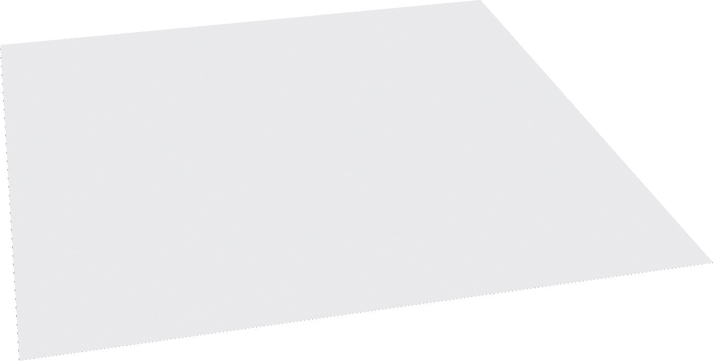
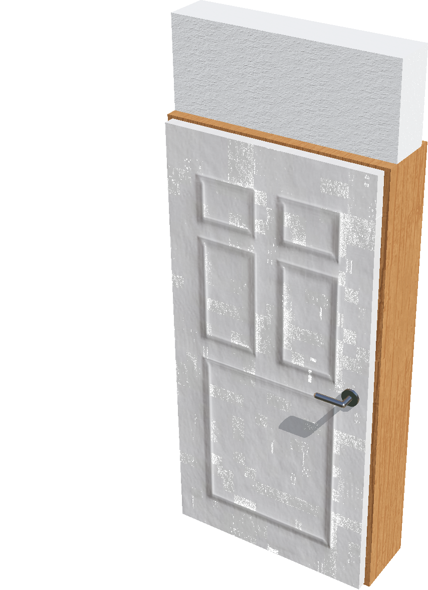
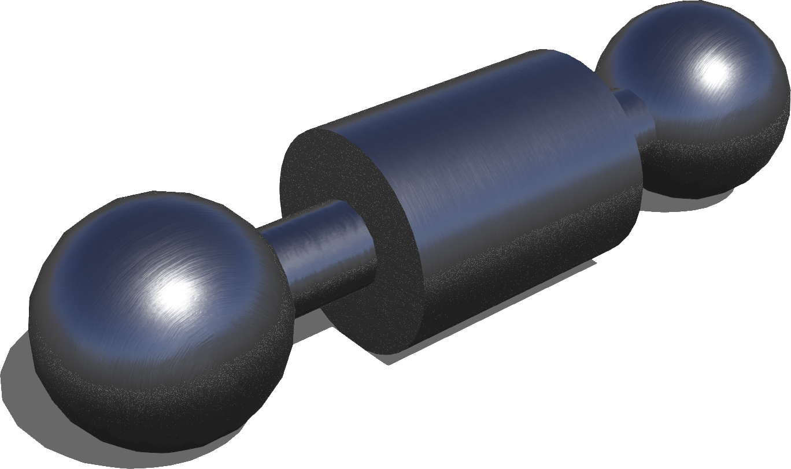
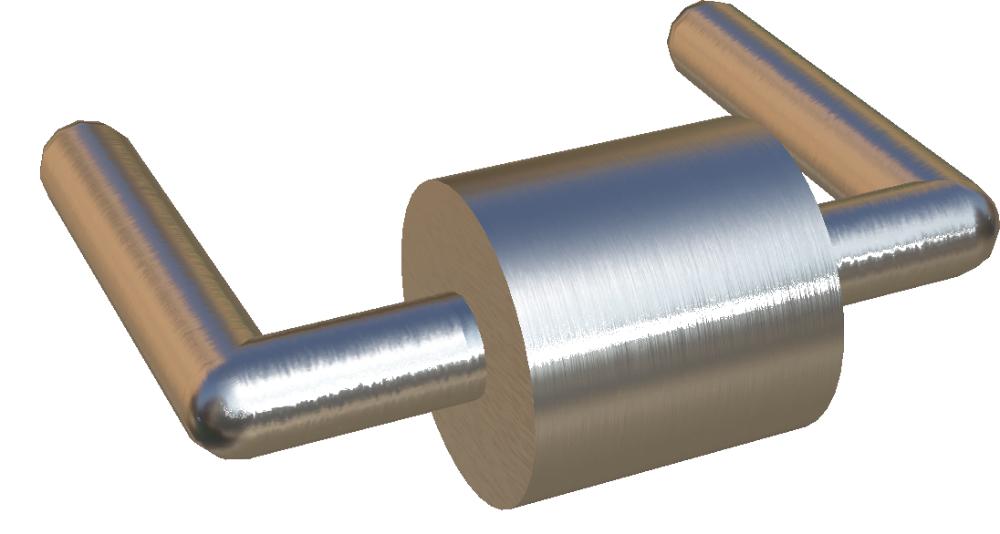
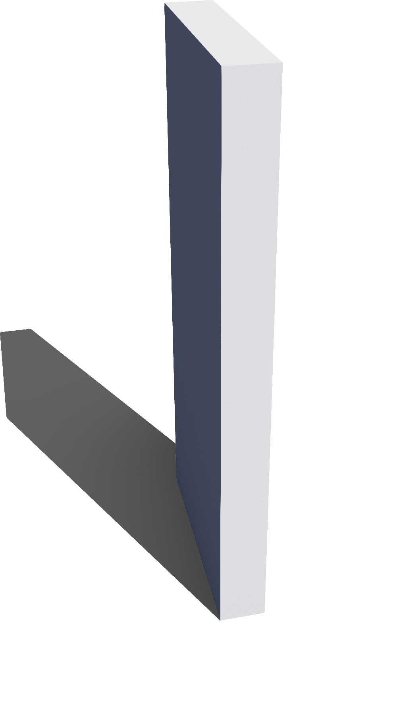
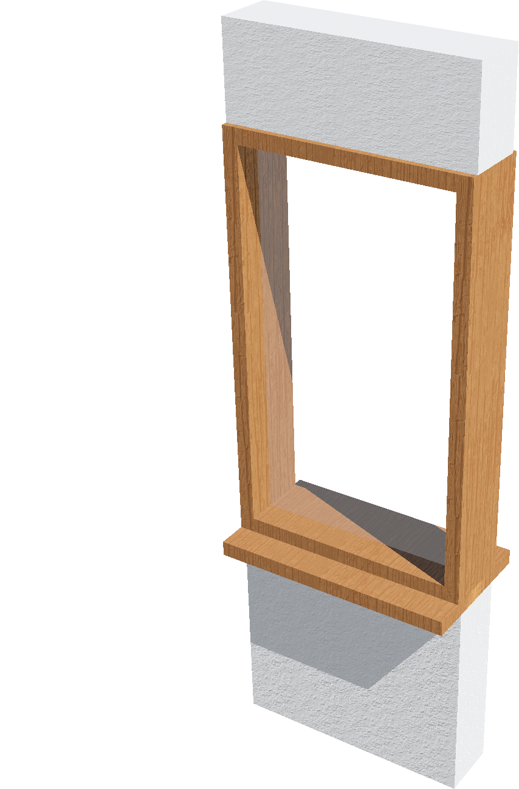

# Apartment Structure

## Ceiling

A configurable standard ceiling.

%figure



%end

Derived from [Solid](../reference/solid.md).

```
Ceiling {
  SFVec3f    translation      0 2.4 0
  SFRotation rotation         1 0 0 3.14159
  SFString   name             "ceiling"
  SFString   contactMaterial  "default"
  SFVec2f    size             10 10
  SFVec2f    scale            5 5
  MFString   texture          "textures/roughcast.jpg"
  SFInt32    filtering        4
  SFBool     locked           TRUE
}
```

> **File location**: "WEBOTS\_HOME/projects/objects/apartment_structure/protos/Ceiling.proto"

> **License**: Copyright Cyberbotics Ltd. Licensed for use only with Webots.
[More information.](https://cyberbotics.com/webots_assets_license)

### Ceiling Field Summary

- `size`: Defines the size of the ceiling.

- `scale`: Defines the scale of the texture used for the ceiling.

- `texture`: Defines the texture used for the ceiling.

- `filtering`: Defines the filtering level for the texture used for the ceiling.

## Door

A cutomizable openable door.
'wallTextureUrl', 'wallTileSize' and 'wallTextureTranslation' fields allows to specify the appearance of the wall.
'topWallColor' field value specifies the uniform color that will be applied to the top and bottom faces of the wall.

%figure



%end

Derived from [Solid](../reference/solid.md).

```
Door {
  SFVec3f    translation            0 0 0
  SFRotation rotation               0 1 0 0
  SFString   name                   "door"
  SFVec3f    size                   1 2.4 0.2
  SFBool     canBeOpen              TRUE
  SFBool     jointAtLeft            TRUE
  SFBool     selfClosing            FALSE
  SFFloat    doorThickness          0.05
  SFFloat    frameHeight            2.0
  SFVec3f    frameSize              0.05 0.05 0.05
  SFFloat    mainMaterialDensity    200
  MFString   doorTextureUrl         "textures/door.jpg"
  MFString   wallTextureUrl         "textures/roughcast.jpg"
  SFVec2f    wallTileSize           0.5 0.5
  SFVec2f    wallTextureTranslation 0 0
  SFColor    topWallColor           0.8 0.8 0.8
  MFString   frameTextureUrl        "textures/metal.jpg"
  SFNode     doorHandle             DoorLever {}
}
```

> **File location**: "WEBOTS\_HOME/projects/objects/apartment_structure/protos/Door.proto"

> **License**: Copyright Cyberbotics Ltd. Licensed for use only with Webots.
[More information.](https://cyberbotics.com/webots_assets_license)

### Door Field Summary

- `size`: Defines the width, height and thickness of the door wall frame.

- `canBeOpen`: Defines whether the door is connected to the frame throught a hinge-joint.

- `jointAtLeft`: Defines on which side the door is connected to the frame.

- `selfClosing`: Defines whether the door as a spring effect that makes it closing on itself.

- `doorThickness`: Defines the thickness of the door.

- `frameHeight`: Defines the height of the door frame. It should be must be less than or equal to `size.y`.

- `frameSize`: Defines the size of the door frame.

- `mainMaterialDensity`: Defines the density of the door.

- `doorTextureUrl`: Defines the door texture.

- `wallTextureUrl`: Defines the wall texture.

- `wallTileSize`: Defines the wall texture size.

- `wallTextureTranslation`: Defines the wall texture translation.

- `topWallColor`: Defines the color of the wall above the door.

- `frameTextureUrl`: Defines the color of the door frame.

- `doorHandle`: Defines an optional door handle.

## DoorKnob

A door knob.
This object can be used in the 'doorHandle' field of the Door object.

%figure



%end

Derived from [Slot](../reference/slot.md).

```
DoorKnob {
  SFVec3f    translation      0 0 0
  SFRotation rotation         0 1 0 0
  SFString   name             "door knob"
  SFFloat    doorThickness    0.05
  SFFloat    handleRadius     0.03
  SFFloat    distanceFromDoor 0.065
  SFNode     appearance       Appearance { material Material {} }
  SFFloat    mass             0.7
}
```

> **File location**: "WEBOTS\_HOME/projects/objects/apartment_structure/protos/DoorKnob.proto"

> **License**: Copyright Cyberbotics Ltd. Licensed for use only with Webots.
[More information.](https://cyberbotics.com/webots_assets_license)

### DoorKnob Field Summary

- `doorThickness`: Defines the thickness of the door.

- `handleRadius`: Defines the radius of the handle.

- `distanceFromDoor`: Defines the distance between the handle and the door.

- `appearance`: Defines the appearance of the handle.

- `mass`: Defines the mass of the handle.

## DoorLever

A door lever.
This object can be used in the 'doorHandle' field of the Door object.

%figure



%end

Derived from [Slot](../reference/slot.md).

```
DoorLever {
  SFVec3f    translation      0 0 0
  SFRotation rotation         0 1 0 0
  SFString   name             "door lever"
  SFBool     canTurn          FALSE
  SFBool     jointAtLeft      TRUE
  SFFloat    doorThickness    0.05
  SFFloat    handleThickness  0.0125
  SFFloat    handleLength     0.12
  SFFloat    distanceFromDoor 0.065
  SFNode     appearance       Appearance { material Material {} }
  SFFloat    mass             0.7
  SFBool     hasStaticParent  FALSE
}
```

> **File location**: "WEBOTS\_HOME/projects/objects/apartment_structure/protos/DoorLever.proto"

> **License**: Copyright Cyberbotics Ltd. Licensed for use only with Webots.
[More information.](https://cyberbotics.com/webots_assets_license)

### DoorLever Field Summary

- `canTurn`: Defines whether the lever is connected to the door using a hinge-joint.

- `jointAtLeft`: Defines on which side is the lever.

- `doorThickness`: Defines the thickness of the door.

- `handleThickness`: Defines the thickness of the handle.

- `handleLength`: Defines the length of the handle.

- `distanceFromDoor`: Defines the distance between the handle and the door.

- `appearance`: Defines the appearance of the lever.

- `mass`: Defines the mass of the lever.

- `hasStaticParent`: Defines whether the parent door has physics or not.

## Wall

A customizable wall.
'wallTextureUrl', 'wallTileSize' and 'wallTextureTranslation' fields allows to specify the appearance of the wall.
'topWallColor' field value specifies the uniform color that will be applied to the top and bottom faces of the wall.

%figure



%end

Derived from [Solid](../reference/solid.md).

```
Wall {
  SFVec3f    translation            0 0 0
  SFRotation rotation               0 1 0 0
  SFString   name                   "wall"
  SFVec3f    size                   1 2.4 0.2
  MFString   wallTextureUrl         "textures/roughcast.jpg"
  SFVec2f    wallTileSize           0.5 0.5
  SFVec2f    wallTextureTranslation 0 0
  SFColor    topWallColor           0.8 0.8 0.8
}
```

> **File location**: "WEBOTS\_HOME/projects/objects/apartment_structure/protos/Wall.proto"

> **License**: Copyright Cyberbotics Ltd. Licensed for use only with Webots.
[More information.](https://cyberbotics.com/webots_assets_license)

### Wall Field Summary

- `size`: Defines the size of the wall.

- `wallTextureUrl`: Defines the texture used for the wall.

- `wallTileSize`: Defines the size of the texture used for the wall.

- `wallTextureTranslation`: Defines the translation of the texture used for the wall.

- `topWallColor`: Defines the color of the top face of the wall.

## Window

A customizable window including walls above and below.
'wallTextureUrl', 'wallTileSize' and 'wallTextureTranslation' fields allows to specify the appearance of the wall.
'topWallColor' field value specifies the uniform color that will be applied to the top and bottom faces of the wall.

%figure



%end

Derived from [Solid](../reference/solid.md).

```
Window {
  SFVec3f    translation            0 0 0
  SFRotation rotation               0 1 0 0
  SFString   name                   "window"
  SFVec3f    size                   0.8 2.4 0.2
  SFFloat    windowThickness        0.05
  SFFloat    bottomWallHeight       0.7
  SFFloat    windowHeight           1.4
  SFVec3f    frameSize              0.05 0.05 0.02
  SFVec2f    windowSillSize         0.1 0.05
  MFString   wallTextureUrl         "textures/roughcast.jpg"
  SFVec2f    wallTileSize           0.5 0.5
  SFVec2f    wallTextureTranslation 0 0
  SFColor    topWallColor           0.8 0.8 0.8
  MFString   frameTextureUrl        "textures/metal.jpg"
}
```

> **File location**: "WEBOTS\_HOME/projects/objects/apartment_structure/protos/Window.proto"

> **License**: Copyright Cyberbotics Ltd. Licensed for use only with Webots.
[More information.](https://cyberbotics.com/webots_assets_license)

### Window Field Summary

- `size`: Defines the size of the window.

- `windowThickness`: Defines the thickness of the window.

- `bottomWallHeight`: Defines the height of the top wall.

- `windowHeight`: Defines the height of the window.

- `frameSize`: Defines the size of the window frame.

- `windowSillSize`: Defines the size of the sill below the window.

- `wallTextureUrl`: Defines the textures used for the wall.

- `wallTileSize`: Defines the size of textures used for the wall.

- `wallTextureTranslation`: Defines the translation of textures used for the wall.

- `topWallColor`: Defines the color of the top wall.

- `frameTextureUrl`: Defines the texture of the window frame.

