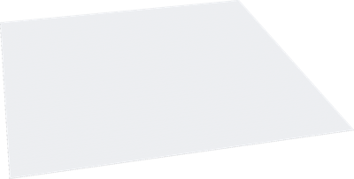
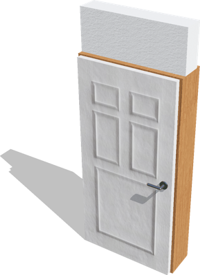
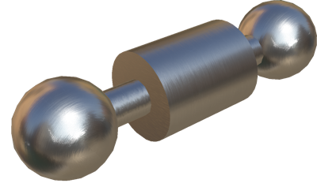
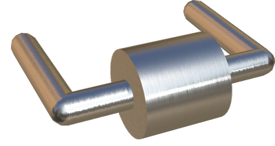
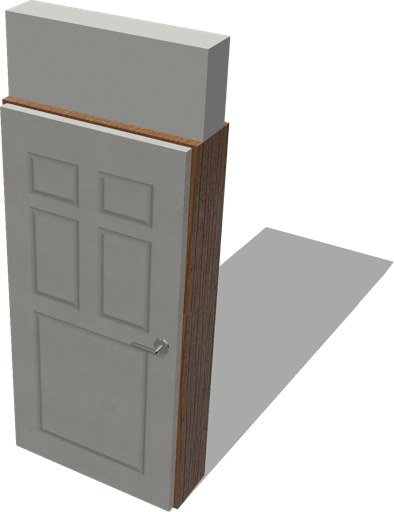
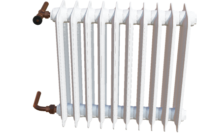
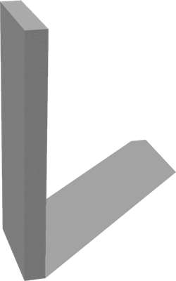
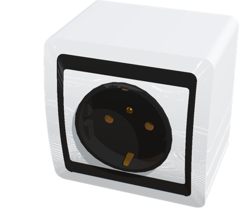

# Apartment Structure

## Ceiling

A configurable standard ceiling.

%figure



%end

Derived from [Solid](../reference/solid.md).

```
Ceiling {
  SFVec3f    translation      0 2.4 0
  SFRotation rotation         1 0 0 3.14159
  SFString   name             "ceiling"
  SFString   contactMaterial  "default"
  SFVec2f    size             10 10
  SFNode     appearance       Roughcast { textureTransform TextureTransform { scale 10 10 } }
  SFBool     locked           TRUE
  SFBool     castShadows      TRUE
  MFColor    recognitionColors []
}
```

> **File location**: "[WEBOTS\_HOME/projects/objects/apartment\_structure/protos/Ceiling.proto]({{ url.github_tree }}/projects/objects/apartment_structure/protos/Ceiling.proto)"

> **License**: Copyright Cyberbotics Ltd. Licensed for use only with Webots.
[More information.](https://cyberbotics.com/webots_assets_license)

### Ceiling Field Summary

- `size`: Defines the size of the ceiling.

- `appearance`: Defines the appearance of the ceiling.

- `castShadows`: Defines whether this object should cast shadows.

## Door

A cutomizable openable door.

%figure



%end

Derived from [Solid](../reference/solid.md).

```
Door {
  SFVec3f    translation            0 0 0
  SFRotation rotation               0 1 0 0
  SFString   name                   "door"
  SFVec3f    size                   1 2.4 0.2
  SFBool     canBeOpen              TRUE
  SFFloat    position               0
  SFBool     jointAtLeft            TRUE
  SFBool     selfClosing            FALSE
  SFFloat    doorThickness          0.05
  SFFloat    frameHeight            2.0
  SFVec3f    frameSize              0.05 0.05 0.05
  SFFloat    mainMaterialDensity    200
  SFNode     doorAppearance         GenericDoorAppearance {}
  SFNode     wallAppearance         Roughcast {}
  SFNode     frameAppearance        VarnishedPine {}
  SFNode     doorHandle             DoorLever {}
  MFNode     doorSlot               []
  SFBool     castShadows            TRUE
  MFColor    recognitionColors      []
}
```

> **File location**: "[WEBOTS\_HOME/projects/objects/apartment\_structure/protos/Door.proto]({{ url.github_tree }}/projects/objects/apartment_structure/protos/Door.proto)"

> **License**: Copyright Cyberbotics Ltd. Licensed for use only with Webots.
[More information.](https://cyberbotics.com/webots_assets_license)

### Door Field Summary

- `size`: Defines the width, height and thickness of the door wall frame.

- `canBeOpen`: Defines whether the door is connected to the frame throught a hinge-joint.

- `position`: Defines the position (aperture) of the door.

- `jointAtLeft`: Defines on which side the door is connected to the frame.

- `selfClosing`: Defines whether the door as a spring effect that makes it closing on itself.

- `doorThickness`: Defines the thickness of the door.

- `frameHeight`: Defines the height of the door frame. It should be must be less than or equal to `size.y`.

- `frameSize`: Defines the size of the door frame.

- `mainMaterialDensity`: Defines the density of the door.

- `doorAppearance`: Defines the door's appearance.

- `wallAppearance`: Defines the wall's appearance.

- `frameAppearance`: Defines the frame's appearance.

- `doorHandle`: Defines an optional door handle.

- `doorSlot`: Extends the door with new nodes.

- `castShadows`: Defines whether this object should cast shadows.

## DoorKnob

A door knob.
This object can be used in the 'doorHandle' field of the Door object.

%figure



%end

Derived from [Slot](../reference/slot.md).

```
DoorKnob {
  SFVec3f    translation      0 0 0
  SFRotation rotation         0 1 0 0
  SFString   name             "door knob"
  SFFloat    doorThickness    0.05
  SFFloat    handleRadius     0.03
  SFFloat    distanceFromDoor 0.065
  SFNode     appearance       BrushedAluminium {}
  SFFloat    mass             0.7
  SFBool     castShadows      TRUE
}
```

> **File location**: "[WEBOTS\_HOME/projects/objects/apartment\_structure/protos/DoorKnob.proto]({{ url.github_tree }}/projects/objects/apartment_structure/protos/DoorKnob.proto)"

> **License**: Copyright Cyberbotics Ltd. Licensed for use only with Webots.
[More information.](https://cyberbotics.com/webots_assets_license)

### DoorKnob Field Summary

- `doorThickness`: Defines the thickness of the door.

- `handleRadius`: Defines the radius of the handle.

- `distanceFromDoor`: Defines the distance between the handle and the door.

- `appearance`: Defines the appearance of the handle.

- `mass`: Defines the mass of the handle.

- `castShadows`: Defines whether this object should cast shadows.

## DoorLever

A door lever.
This object can be used in the 'doorHandle' field of the Door object.

%figure



%end

Derived from [Slot](../reference/slot.md).

```
DoorLever {
  SFVec3f    translation      0 0 0
  SFRotation rotation         0 1 0 0
  SFString   name             "door lever"
  SFBool     canTurn          FALSE
  SFBool     jointAtLeft      TRUE
  SFFloat    doorThickness    0.05
  SFFloat    handleThickness  0.0125
  SFFloat    handleLength     0.12
  SFFloat    distanceFromDoor 0.065
  SFNode     appearance       BrushedAluminium {}
  SFFloat    mass             0.7
  SFBool     hasStaticParent  FALSE
  SFBool     castShadows      TRUE
}
```

> **File location**: "[WEBOTS\_HOME/projects/objects/apartment\_structure/protos/DoorLever.proto]({{ url.github_tree }}/projects/objects/apartment_structure/protos/DoorLever.proto)"

> **License**: Copyright Cyberbotics Ltd. Licensed for use only with Webots.
[More information.](https://cyberbotics.com/webots_assets_license)

### DoorLever Field Summary

- `canTurn`: Defines whether the lever is connected to the door using a hinge-joint.

- `jointAtLeft`: Defines on which side is the lever.

- `doorThickness`: Defines the thickness of the door.

- `handleThickness`: Defines the thickness of the handle.

- `handleLength`: Defines the length of the handle.

- `distanceFromDoor`: Defines the distance between the handle and the door.

- `appearance`: Defines the appearance of the lever.

- `mass`: Defines the mass of the lever.

- `hasStaticParent`: Defines whether the parent door has physics or not.

- `castShadows`: Defines whether this object should cast shadows.

## GenericDoorAppearance

A generic varnished, painted wooden door's appearance.

%figure



%end

Derived from [PBRAppearance](../reference/pbrappearance.md).

```
GenericDoorAppearance {
  SFColor colorOverride  1 1 1
}
```

> **File location**: "[WEBOTS\_HOME/projects/objects/apartment\_structure/protos/GenericDoorAppearance.proto]({{ url.github_tree }}/projects/objects/apartment_structure/protos/GenericDoorAppearance.proto)"

> **License**: Copyright Cyberbotics Ltd. Licensed for use only with Webots.
[More information.](https://cyberbotics.com/webots_assets_license)

### GenericDoorAppearance Field Summary

- `colorOverride`: Defines the default color multiplied with the texture color.

## Radiator

A radiator with a variable number of fins and optional bounding object.

%figure



%end

Derived from [Solid](../reference/solid.md).

```
Radiator {
  SFVec3f    translation           0 0 0
  SFRotation rotation              0 1 0 0
  SFString   name                  "radiator"
  SFInt32    numberOfFins          10
  SFNode     finAppearance         Roughcast { textureTransform TextureTransform { scale 3 3 } }
  SFNode     tubeAppearance        HammeredCopper { }
  SFBool     enableBoundingObject  TRUE
  MFColor    recognitionColors     []
}
```

> **File location**: "[WEBOTS\_HOME/projects/objects/apartment\_structure/protos/Radiator.proto]({{ url.github_tree }}/projects/objects/apartment_structure/protos/Radiator.proto)"

> **License**: Copyright Cyberbotics Ltd. Licensed for use only with Webots.
[More information.](https://cyberbotics.com/webots_assets_license)

### Radiator Field Summary

- `finAppearance`: Defines the appearance of the fins.

- `tubeAppearance`: Defines the appearance of the input and ouput tubes.

- `enableBoundingObject`: Defines whether the radiator should have a bounding object.

## Wall

A customizable wall.

%figure



%end

Derived from [Solid](../reference/solid.md).

```
Wall {
  SFVec3f    translation 0 0 0
  SFRotation rotation    0 1 0 0
  SFString   name        "wall"
  SFVec3f    size        1 2.4 0.2
  SFNode     appearance  Roughcast { textureTransform TextureTransform { scale 1 2.4 } }
  MFColor    recognitionColors []
}
```

> **File location**: "[WEBOTS\_HOME/projects/objects/apartment\_structure/protos/Wall.proto]({{ url.github_tree }}/projects/objects/apartment_structure/protos/Wall.proto)"

> **License**: Copyright Cyberbotics Ltd. Licensed for use only with Webots.
[More information.](https://cyberbotics.com/webots_assets_license)

### Wall Field Summary

- `size`: Defines the size of the wall.

- `appearance`: Defines the appearance of the wall.

## WallPlug

An electrical wall plug with optional bounding object.

%figure



%end

Derived from [Solid](../reference/solid.md).

```
WallPlug {
  SFVec3f    translation            0 0 0
  SFRotation rotation               0 1 0 0
  SFString   name                   "wall plug"
  SFColor    mainColor              1 1 1
  SFColor    secondaryColor         0 0 0
  SFBool     enableBoundingObject   TRUE
  MFColor    recognitionColors      []
}
```

> **File location**: "[WEBOTS\_HOME/projects/objects/apartment\_structure/protos/WallPlug.proto]({{ url.github_tree }}/projects/objects/apartment_structure/protos/WallPlug.proto)"

> **License**: Copyright Cyberbotics Ltd. Licensed for use only with Webots.
[More information.](https://cyberbotics.com/webots_assets_license)

### WallPlug Field Summary

- `mainColor`: Defines the main color of the plug.

- `secondaryColor`: Defines the secondary color of the plug.

- `enableBoundingObject`: Defines whether the plug should have a bounding object.

## Window

A customizable window including walls above and below.

%figure


%end

Derived from [Solid](../reference/solid.md).

```
Window {
  SFVec3f    translation            0 0 0
  SFRotation rotation               0 1 0 0
  SFString   name                   "window"
  SFVec3f    size                   0.8 2.4 0.2
  SFFloat    windowThickness        0.05
  SFFloat    bottomWallHeight       0.7
  SFFloat    windowHeight           1.4
  SFVec3f    frameSize              0.05 0.05 0.02
  SFVec2f    windowSillSize         0.1 0.05
  SFNode     wallAppearance         Roughcast {}
  SFNode     frameAppearance        VarnishedPine {}
  SFBool     castShadows            TRUE
  MFColor    recognitionColors      []
}
```

> **File location**: "[WEBOTS\_HOME/projects/objects/apartment\_structure/protos/Window.proto]({{ url.github_tree }}/projects/objects/apartment_structure/protos/Window.proto)"

> **License**: Copyright Cyberbotics Ltd. Licensed for use only with Webots.
[More information.](https://cyberbotics.com/webots_assets_license)

### Window Field Summary

- `size`: Defines the size of the window.

- `windowThickness`: Defines the thickness of the window.

- `bottomWallHeight`: Defines the height of the top wall.

- `windowHeight`: Defines the height of the window.

- `frameSize`: Defines the size of the window frame.

- `windowSillSize`: Defines the size of the sill below the window.

- `wallAppearance`: Defines the appearance of the wall.

- `frameAppearance`: Defines the appearance of the frame.

- `castShadows`: Defines whether this object should cast shadows.

