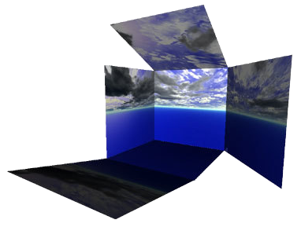
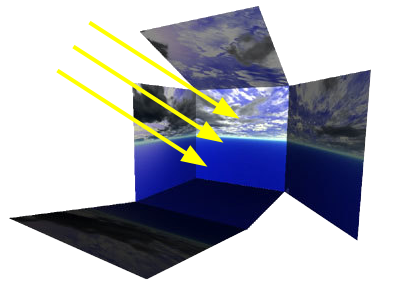

# Backgrounds

## TexturedBackground

TexturedBackground provides a set of background textures, and applies them to the background skybox and to the reflections on the 3D objects.
It is designed to be used together with the TexturedBackgroundLight PROTO.

Supported values for the `texture` field:

- dusk
- empty\_office
- entrance\_hall
- factory
- mars
- noon\_building\_overcast
- noon\_cloudy\_countryside
- noon\_park\_empty
- mountains
- stadium

Deprecated backgrounds:

- dawn\_cloudy\_empty
- morning\_cloudy\_empty
- noon\_cloudy\_empty
- noon\_cloudy\_mountains
- noon\_stormy\_empty
- noon\_sunny\_empty
- noon\_sunny\_garden
- twilight\_cloudy\_empty

%figure



%end

Derived from [Background](../reference/background.md).

```
TexturedBackground {
  SFString texture      "mountains"
  SFFloat  luminosity   1
  SFBool   skybox       TRUE
  SFBool   reflections  TRUE
  MFColor  skyColor     [0 0 0]
}
```

> **File location**: "[WEBOTS\_HOME/projects/objects/backgrounds/protos/TexturedBackground.proto](https://github.com/cyberbotics/webots/tree/master/projects/objects/backgrounds/protos/TexturedBackground.proto)"

> **License**: Copyright Cyberbotics Ltd. Licensed for use only with Webots.
[More information.](https://cyberbotics.com/webots_assets_license)

### TexturedBackground Field Summary

- `texture`: Defines the texture of the background. This field accepts the following values: `"dawn_cloudy_empty"`, `"dusk"`, `"empty_office"`, `"entrance_hall"`, `"factory"`, `"mars"`, `"morning_cloudy_empty"`, `"mountains"`, `"noon_building_overcast"`, `"noon_cloudy_countryside"`, `"noon_cloudy_empty"`, `"noon_cloudy_mountains"`, `"noon_park_empty"`, `"noon_stormy_empty"`, `"noon_sunny_empty"`, `"noon_sunny_garden"`, `"stadium"` and `"twilight_cloudy_empty"`.

- `skybox`: Specifies if the `texture` field is used to define the skybox shown in the scene background.

- `reflections`: Specifies if the `texture` field is used in the reflections of the [PBRAppearance](../reference/pbrappearance.md) nodes.

- `skyColor`: Defines the background color in case the `skybox` field is `FALSE`.

## TexturedBackgroundLight

Light designed to match the skyboxes in the TexturedBackground PROTO.

Supported values for the `texture` field:

- dusk
- empty\_office
- entrance\_hall
- factory
- mars
- noon\_building\_overcast
- noon\_cloudy\_countryside
- noon\_park\_empty
- mountains
- stadium

Deprecated backgrounds:

- dawn\_cloudy\_empty
- morning\_cloudy\_empty
- noon\_cloudy\_empty
- noon\_cloudy\_mountains
- noon\_stormy\_empty
- noon\_sunny\_empty
- noon\_sunny\_garden
- twilight\_cloudy\_empty

%figure



%end

Derived from [DirectionalLight](../reference/directionallight.md).

```
TexturedBackgroundLight {
  SFString texture        "mountains"
  SFFloat  luminosity     1
  SFBool   castShadows    TRUE
}
```

> **File location**: "[WEBOTS\_HOME/projects/objects/backgrounds/protos/TexturedBackgroundLight.proto](https://github.com/cyberbotics/webots/tree/master/projects/objects/backgrounds/protos/TexturedBackgroundLight.proto)"

> **License**: Copyright Cyberbotics Ltd. Licensed for use only with Webots.
[More information.](https://cyberbotics.com/webots_assets_license)

### TexturedBackgroundLight Field Summary

- `texture`: Should be equivalent to the 'texture' field of the TexturedBackground. This field accepts the following values: `"dawn_cloudy_empty"`, `"dusk"`, `"empty_office"`, `"entrance_hall"`, `"factory"`, `"mars"`, `"morning_cloudy_empty"`, `"mountains"`, `"noon_building_overcast"`, `"noon_cloudy_countryside"`, `"noon_cloudy_empty"`, `"noon_cloudy_mountains"`, `"noon_park_empty"`, `"noon_stormy_empty"`, `"noon_sunny_empty"`, `"noon_sunny_garden"`, `"stadium"` and `"twilight_cloudy_empty"`.

- `luminosity`: Multiplies the `Light.intensity` field.

- `castShadows`: Defines whether the light should cast shadows.

