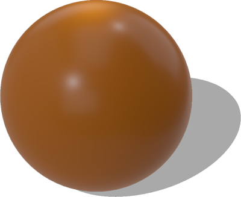
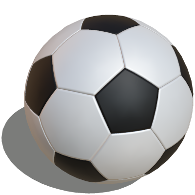
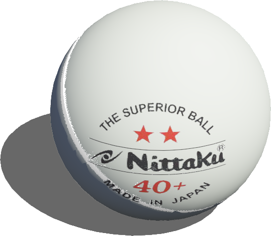
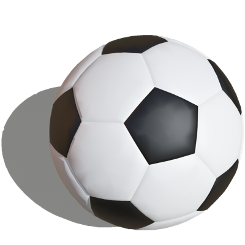

# Balls

## Ball

The Ball's size, mass and color correspond to the soccer ball used in the Robocup SPL.
You can change the centerOfMass to [0 0 0] to avoid the random rolling effect.

%figure



%end

Derived from [Solid](../reference/solid.md).

```
Ball {
  SFVec3f    translation     0 0 0
  SFRotation rotation        0 0 1 0
  SFString   name            "ball"
  SFColor    color           1.0 0.54 0.08
  SFFloat    radius          0.0325
  SFFloat    mass            0.055
  MFVec3f    centerOfMass    [0 0 -0.0001]
  SFFloat    linearDamping   0.17
  SFFloat    angularDamping  0.33
  SFString   contactMaterial "default"
}
```

> **File location**: "[WEBOTS\_HOME/projects/objects/balls/protos/Ball.proto]({{ url.github_tree }}/projects/objects/balls/protos/Ball.proto)"

> **License**: Copyright Cyberbotics Ltd. Licensed for use only with Webots.
[More information.](https://cyberbotics.com/webots_assets_license)

### Ball Field Summary

- `color`: Defines the color of the ball.

- `radius`: Defines the radius of the ball.

- `mass`: Defines the mass of the ball.

- `centerOfMass`: Defines the center of mass of the ball.

- `linearDamping`: Defines the linear damping of the ball.

- `angularDamping`: Defines the angular damping of the ball.

## FifaSoccerBall

A black and white FIFA soccer ball with customizable size.
This object is physics-enabled so it will roll or bounce when hit.

%figure



%end

Derived from [Solid](../reference/solid.md).

```
FifaSoccerBall {
  SFVec3f     translation 0 0 0
  SFRotation  rotation    0 0 1 0
  SFString    name        "fifa soccer ball"
  SFInt32     size        5
}
```

> **File location**: "[WEBOTS\_HOME/projects/objects/balls/protos/FifaSoccerBall.proto]({{ url.github_tree }}/projects/objects/balls/protos/FifaSoccerBall.proto)"

> **License**: Apache License 2.0
[More information.](http://www.apache.org/licenses/LICENSE-2.0)

### FifaSoccerBall Field Summary

- `size`: Defines the ball size and mass according to FIFA standards. This field accepts the following values: `1`, `2`, `3`, `4`, and `5`.

## PingPongBall

A ping pong ball.

%figure



%end

Derived from [Solid](../reference/solid.md).

```
PingPongBall {
  SFVec3f    translation         0 0 0
  SFRotation rotation            0 0 1 0
  SFString   name                "ping pong ball"
  MFNode     immersionProperties []
  MFString   textureUrl          "textures/pingpong_logo.jpg"
}
```

> **File location**: "[WEBOTS\_HOME/projects/objects/balls/protos/PingPongBall.proto]({{ url.github_tree }}/projects/objects/balls/protos/PingPongBall.proto)"

> **License**: Copyright Cyberbotics Ltd. Licensed for use only with Webots.
[More information.](https://cyberbotics.com/webots_assets_license)

### PingPongBall Field Summary

- `textureUrl`: Defines the texture used for the ball.

## RobocupSoccerBall

A black and white soccer ball with customizable radius and mass.
This object is physics-enabled so it will roll or bounce when hit.

%figure



%end

Derived from [Solid](../reference/solid.md).

```
RobocupSoccerBall {
  SFVec3f    translation  0 0 0
  SFRotation rotation     0 0 1 0
  SFString   name         "robocup soccer ball"
  SFInt32                 size 1
}
```

> **File location**: "[WEBOTS\_HOME/projects/objects/balls/protos/RobocupSoccerBall.proto]({{ url.github_tree }}/projects/objects/balls/protos/RobocupSoccerBall.proto)"

> **License**: Copyright Cyberbotics Ltd. Licensed for use only with Webots.
[More information.](https://cyberbotics.com/webots_assets_license)

### RobocupSoccerBall Field Summary

- `size`: Defines the ball size and mass according to FIFA standards. This field accepts the following values: `1`, `2`, `3`, `4`, and `5`.

## SoccerBall

A black and white soccer ball with customizable radius and mass.
This object is physics-enabled so it will roll or bounce when hit.

%figure


%end

Derived from [Solid](../reference/solid.md).

```
SoccerBall {
  SFVec3f    translation 0 0 0
  SFRotation rotation    0 0 1 0
  SFString   name        "soccer ball"
  SFFloat    radius      0.113
  SFFloat    mass        0.6
}
```

> **File location**: "[WEBOTS\_HOME/projects/objects/balls/protos/SoccerBall.proto]({{ url.github_tree }}/projects/objects/balls/protos/SoccerBall.proto)"

> **License**: Copyright Cyberbotics Ltd. Licensed for use only with Webots.
[More information.](https://cyberbotics.com/webots_assets_license)

### SoccerBall Field Summary

- `radius`: Defines the radius of the ball.

- `mass`: Defines the mass of the ball.

