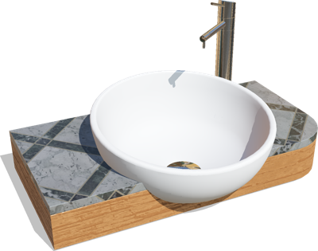
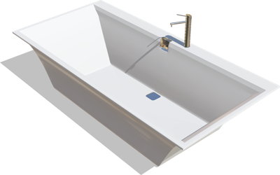
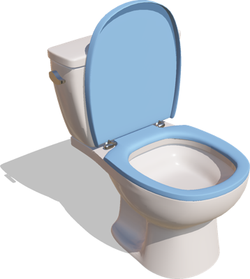
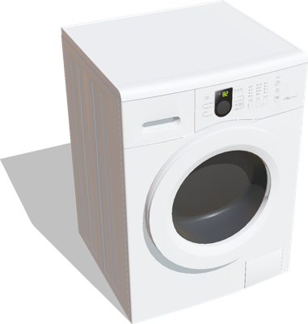

# Bathroom

## BathroomSink

A small sink for bathrooms.

%figure



%end

Derived from [Solid](../reference/solid.md).

```
BathroomSink {
  SFVec3f    translation       0 0 0
  SFRotation rotation          0 0.7 0.7 3.141593
  SFString   name              "sink"
  SFNode     upperAppearance   VarnishedPine { }
  SFNode     bottomAppearance  MarbleTiles { }
  MFColor    recognitionColors []
}
```

> **File location**: "[WEBOTS\_HOME/projects/objects/bathroom/protos/BathroomSink.proto]({{ url.github_tree }}/projects/objects/bathroom/protos/BathroomSink.proto)"

> **License**: Copyright Cyberbotics Ltd. Licensed for use only with Webots.
[More information.](https://cyberbotics.com/webots_assets_license)

### BathroomSink Field Summary

- `upperAppearance`: Defines the appearance of the upper plate.

- `bottomAppearance`: Defines the appearance of the upper plate.

## Bathtube

A bathtube.

%figure



%end

Derived from [Solid](../reference/solid.md).

```
Bathtube {
  SFVec3f    translation      0 0 0
  SFRotation rotation         0 0.7 0.7 3.141593
  SFString   name             "bathtube"
  MFColor    recognitionColors []
}
```

> **File location**: "[WEBOTS\_HOME/projects/objects/bathroom/protos/Bathtube.proto]({{ url.github_tree }}/projects/objects/bathroom/protos/Bathtube.proto)"

> **License**: Copyright Cyberbotics Ltd. Licensed for use only with Webots.
[More information.](https://cyberbotics.com/webots_assets_license)

## Toilet

A toilet.

%figure



%end

Derived from [Solid](../reference/solid.md).

```
Toilet {
  SFVec3f    translation    0 0 0
  SFRotation rotation       0 1 0 0
  SFString   name           "toilet"
  SFColor    lidColor       0.45 0.62 0.81
  MFColor    recognitionColors []
}
```

> **File location**: "[WEBOTS\_HOME/projects/objects/bathroom/protos/Toilet.proto]({{ url.github_tree }}/projects/objects/bathroom/protos/Toilet.proto)"

> **License**: Copyright Cyberbotics Ltd. Licensed for use only with Webots.
[More information.](https://cyberbotics.com/webots_assets_license)

### Toilet Field Summary

- `lidColor`: Defines the color fo the lid.

## WashingMachine

A washing machine.

%figure



%end

Derived from [Solid](../reference/solid.md).

```
WashingMachine {
  SFVec3f    translation    0 0 0
  SFRotation rotation       0 0.7 0.7 3.141593
  SFString   name           "whashing machine"
  MFColor    recognitionColors []
}
```

> **File location**: "[WEBOTS\_HOME/projects/objects/bathroom/protos/WashingMachine.proto]({{ url.github_tree }}/projects/objects/bathroom/protos/WashingMachine.proto)"

> **License**: Copyright Cyberbotics Ltd. Licensed for use only with Webots.
[More information.](https://cyberbotics.com/webots_assets_license)

