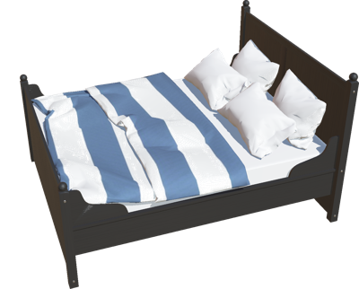

# Bedroom

## Bed

Customizable bed with feet and one or 2 pillows.

%figure



%end

Derived from [Solid](../reference/solid.md).

```
Bed {
  SFVec3f    translation        0 0 0
  SFRotation rotation           0 0 1 0
  SFString   name               "bed"
  SFNode     frameAppearance    PaintedWood { colorOverride 0.11 0.11 0.11 }
  SFNode     mattressAppearance PBRAppearance { roughness 1 metalness 0 }
  SFNode     pillowAppearance   PBRAppearance { roughness 1 metalness 0 }
  SFNode     blanketAppearance  PBRAppearance { baseColorMap ImageTexture { url "Bed/textures/duvet.jpg" } roughness 1 metalness 0 }
}
```

> **File location**: "[WEBOTS\_HOME/projects/objects/bedroom/protos/Bed.proto]({{ url.github_tree }}/projects/objects/bedroom/protos/Bed.proto)"

> **License**: Copyright Cyberbotics Ltd. Licensed for use only with Webots.
[More information.](https://cyberbotics.com/webots_assets_license)

### Bed Field Summary

- `frameAppearance`: Defines the appearance of the frame.

- `mattressAppearance`: Defines the appearance of the mattress.

- `pillowAppearance`: Defines the appearance of the pillows.

- `blanketAppearance`: Defines the appearance of the blanket.

## PhotoFrame

A photo frame with a customizable picture.

%figure


%end

Derived from [Solid](../reference/solid.md).

```
PhotoFrame {
  SFVec3f    translation        0 0 0
  SFRotation rotation           0 0 1 0
  SFString   name               "photo frame"
  MFString   pictureUrl         "PhotoFrame/textures/child_picture.jpg"
  SFNode     frameAppearance    VarnishedPine { colorOverride 0.333333 0.341176 0.32549 textureTransform TextureTransform { rotation 1 } }
  SFNode     physics            NULL
}
```

> **File location**: "[WEBOTS\_HOME/projects/objects/bedroom/protos/PhotoFrame.proto]({{ url.github_tree }}/projects/objects/bedroom/protos/PhotoFrame.proto)"

> **License**: Copyright Cyberbotics Ltd. Licensed for use only with Webots.
[More information.](https://cyberbotics.com/webots_assets_license)

### PhotoFrame Field Summary

- `pictureUrl`: Url of the photo.

- `frameAppearance`: Define the appearance of the frame.

