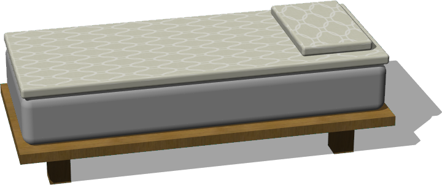

# Bedroom

## Bed

Customizable bed with feet and one or 2 pillows.

%figure



%end

Derived from [Solid](../reference/solid.md).

```
Bed {
  SFVec3f    translation         0 0 0
  SFRotation rotation            0 1 0 0
  SFString   name                "bed"
  SFVec3f    size                0.8 0.5 1.8
  SFBool     doubleBed           FALSE
  SFVec3f    feetSize            0.1 0.2 0.1
  SFFloat    feetPadding         0.1
  SFFloat    frameThickness      0.05
  MFString   fabricTextureUrl    "textures/fabric_with_motif.jpg"
  SFVec2f    fabricTileSize      0.5 0.5
  MFString   frameTextureUrl     "textures/wood.jpg"
  SFVec2f    frameTileSize       0.5 0.5
}
```

> **File location**: "WEBOTS\_HOME/projects/objects/bedroom/protos/Bed.proto"

> **License**: Copyright Cyberbotics Ltd. Licensed for use only with Webots.
[More information.](https://cyberbotics.com/webots_assets_license)

### Bed Field Summary

- `size`: Defines the size of the bed.

- `doubleBed`: Defines whether it is a single or double bed.

- `feetSize`: Defines the size of the feet.

- `feetPadding`: Defines the padding of the feet.

- `frameThickness`: Defines the thickness of the frame.

- `fabricTextureUrl`: Defines the texture used for the fabric.

- `fabricTileSize`: Defines the size of the texture used for the fabric.

- `frameTextureUrl`: Defines the texture used for the frame.

- `frameTileSize`: Defines the size of texture used for the frame.

