# Buildings

## Auditorium

A classic auditoruim.

%figure

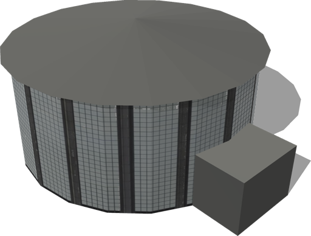

%end

Derived from [Solid](../reference/solid.md).

```
Auditorium {
  SFVec3f    translation 0 0 0
  SFRotation rotation    0 1 0 0
  SFString   name        "auditorium"
}
```

> **File location**: "[WEBOTS\_HOME/projects/objects/buildings/protos/Auditorium.proto]({{ url.github_tree }}/projects/objects/buildings/protos/Auditorium.proto)"

> **License**: Copyright Cyberbotics Ltd. Licensed for use only with Webots.
[More information.](https://cyberbotics.com/webots_assets_license)

## BigGlassTower

A big glass tower.

%figure

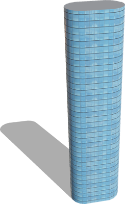

%end

Derived from [Solid](../reference/solid.md).

```
BigGlassTower {
  SFVec3f    translation 0 0 0
  SFRotation rotation    0 1 0 0
  SFString   name        "big glass tower"
}
```

> **File location**: "[WEBOTS\_HOME/projects/objects/buildings/protos/BigGlassTower.proto]({{ url.github_tree }}/projects/objects/buildings/protos/BigGlassTower.proto)"

> **License**: Copyright Cyberbotics Ltd. Licensed for use only with Webots.
[More information.](https://cyberbotics.com/webots_assets_license)

## Building

A customizable building, the size, appearance and geometry can fully be defined.

%figure

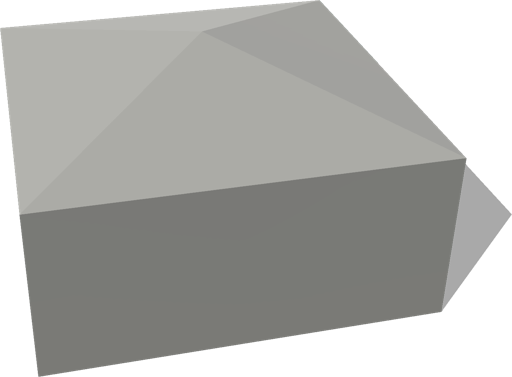

%end

Derived from [Solid](../reference/solid.md).

```
Building {
  SFVec3f     translation            0 0 0
  SFRotation  rotation               0 1 0 0
  SFString    name                   "building"
  SFFloat     floorHeight            3
  SFInt32     floorNumber            3
  SFInt32     startingFloor          0
  MFVec2f     corners                [10 10, 10 -10, -10 -10, -10 10 ]
  SFNode      wallAppearance         PBRAppearance { metalness 0 roughness 1 }
  MFString    groundFloor            []
  MFFloat     groundFloorScale       []
  MFFloat     groundFloorTranslation []
  SFNode      roofAppearance         PBRAppearance { metalness 0 roughness 1 }
  SFString    roofShape              "pyramidal roof"
  SFFloat     roofHeight             3
  SFBool      enableBoundingObject   TRUE
  SFBool      bottom                 FALSE
  SFString    model                  "building"
  MFColor     recognitionColors      []
}
```

> **File location**: "[WEBOTS\_HOME/projects/objects/buildings/protos/Building.proto]({{ url.github_tree }}/projects/objects/buildings/protos/Building.proto)"

> **License**: Copyright Cyberbotics Ltd. Licensed for use only with Webots.
[More information.](https://cyberbotics.com/webots_assets_license)

### Building Field Summary

- `name`: Defines the name of the building.

- `floorHeight`: Defines the height of one floor.

- `floorNumber`: Defines the number of floors (excluding roof).

- `startingFloor`: Defines the floor number for the "ground floor" of the building, as not all buildings start at the ground floor.

- `corners`: Defines the 2D geometry of the building (2D ground footprint of the building).

- `wallAppearance`: Defines the appearance used for the walls of the building.

- `groundFloor`: Defines the texture to be used for the first floor (optional).

- `groundFloorScale`: Defines the horizontal scale of the ground texture.

- `groundFloorTranslation`: Defines the translation of the ground floor textures.

- `roofAppearance`: Defines the appearance used for the roof of the building.

- `roofShape`: Defines the geometry of the roof. This field accepts the following values: `"flat roof"`, `"pyramidal roof"`, `"gabled roof"`, and `"hipped roof"`.

- `roofHeight`: Defines the height of the roof (used only in the case of pyramidal roof).

- `enableBoundingObject`: Defines whether the building should have a bounding object.

- `bottom`: Defines whether the bottom face of the building should be displayed.

## BuildingUnderConstruction

Building under construction with scaffolding.

%figure

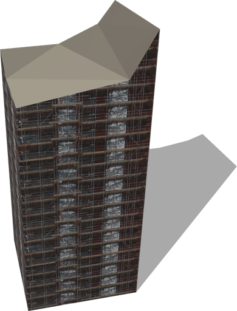

%end

Derived from [Solid](../reference/solid.md).

```
BuildingUnderConstruction {
  SFVec3f    translation 0 0 0
  SFRotation rotation    0 1 0 0
  SFString   name        "building under construction"
}
```

> **File location**: "[WEBOTS\_HOME/projects/objects/buildings/protos/BuildingUnderConstruction.proto]({{ url.github_tree }}/projects/objects/buildings/protos/BuildingUnderConstruction.proto)"

> **License**: Copyright Cyberbotics Ltd. Licensed for use only with Webots.
[More information.](https://cyberbotics.com/webots_assets_license)

## BungalowStyleHouse

A configurable bungalow style house.
The original blender model was made by noenmaster ([http://www.blendswap.com/blends/view/66305](http://www.blendswap.com/blends/view/66305)).
This model was sponsored by the CTI project RO2IVSim ([http://transport.epfl.ch/simulator-for-mobile-robots-and-intelligent-vehicles](http://transport.epfl.ch/simulator-for-mobile-robots-and-intelligent-vehicles)).

%figure

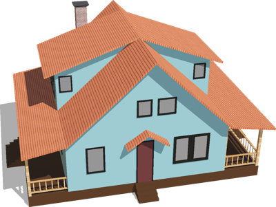

%end

Derived from [Solid](../reference/solid.md).

```
BungalowStyleHouse {
  SFVec3f translation         0 0 0
  SFRotation rotation         0 1 0 0
  SFString name               "bungalow style house"
  SFBool fence                TRUE
  SFBool floor                TRUE
  SFBool chimney              TRUE
  SFBool enableBoundingObject TRUE
  SFNode appearance           PBRAppearance { baseColor 0.52 0.73 0.76 roughness 1 metalness 0 }
  SFNode floorAppearance      PBRAppearance { baseColor 0.27 0.14 0.03 roughness 1 metalness 0 }
  SFNode fenceAppearance      RoughPine { textureTransform TextureTransform { scale 10 10 } }
}
```

> **File location**: "[WEBOTS\_HOME/projects/objects/buildings/protos/BungalowStyleHouse.proto]({{ url.github_tree }}/projects/objects/buildings/protos/BungalowStyleHouse.proto)"

> **License**: Copyright Cyberbotics Ltd. Licensed for use only with Webots.
[More information.](https://cyberbotics.com/webots_assets_license)

### BungalowStyleHouse Field Summary

- `fence`: Defines whether the house has a fence or not.

- `floor`: Defines whether the house is built on a wooden base layer or not.

- `chimney`: Defines whether the house has a chimney or not.

- `enableBoundingObject`: Defines whether to enable the bounding object or not.

- `appearance`: Defines the appearance of the wall.

- `floorAppearance`: Defines the appearance of the floor.

- `fenceAppearance`: Defines the appearance of the fence.

## Carwash

A carwash with optional boundingObject.

%figure

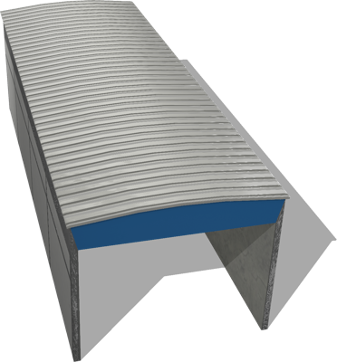

%end

Derived from [Solid](../reference/solid.md).

```
Carwash {
  SFVec3f    translation           0 0 0
  SFRotation rotation              0 1 0 0
  SFString   name                  "carwash"
  SFBool     enableBoundingObject  TRUE
}
```

> **File location**: "[WEBOTS\_HOME/projects/objects/buildings/protos/Carwash.proto]({{ url.github_tree }}/projects/objects/buildings/protos/Carwash.proto)"

> **License**: Creative Commons Attribution 4.0 International License.
[More information.](https://creativecommons.org/licenses/by/4.0/legalcode)

### Carwash Field Summary

- `enableBoundingObject`: Defines whether the carwash should have a bounding object.

## Church

A church with optional boundingObject.

%figure

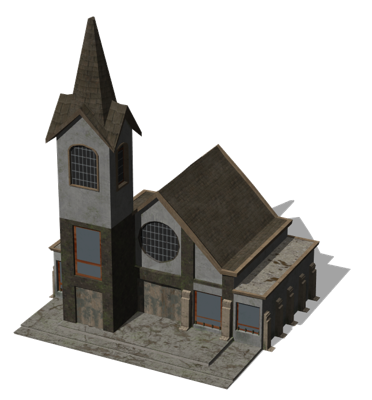

%end

Derived from [Solid](../reference/solid.md).

```
Church {
  SFVec3f    translation           0 0 0
  SFRotation rotation              0 1 0 0
  SFString   name                  "church"
  SFBool     enableBoundingObject  TRUE
}
```

> **File location**: "[WEBOTS\_HOME/projects/objects/buildings/protos/Church.proto]({{ url.github_tree }}/projects/objects/buildings/protos/Church.proto)"

> **License**: Creative Commons Attribution 4.0 International License.
[More information.](https://creativecommons.org/licenses/by/4.0/legalcode)

### Church Field Summary

- `enableBoundingObject`: Defines whether the church should have a bounding object.

## CommercialBuilding

A commercial building.

%figure

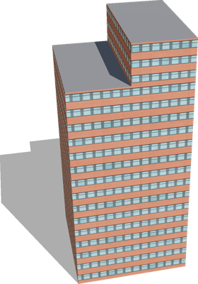

%end

Derived from [Solid](../reference/solid.md).

```
CommercialBuilding {
  SFVec3f    translation 0 0 0
  SFRotation rotation    0 1 0 0
  SFString   name        "commercial building"
}
```

> **File location**: "[WEBOTS\_HOME/projects/objects/buildings/protos/CommercialBuilding.proto]({{ url.github_tree }}/projects/objects/buildings/protos/CommercialBuilding.proto)"

> **License**: Copyright Cyberbotics Ltd. Licensed for use only with Webots.
[More information.](https://cyberbotics.com/webots_assets_license)

## ComposedHouse

A house composed of several parts with optional boundingObject.

%figure

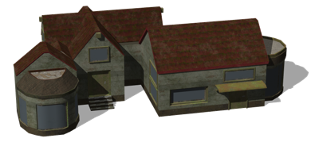

%end

Derived from [Solid](../reference/solid.md).

```
ComposedHouse {
  SFVec3f    translation           0 0 0
  SFRotation rotation              0 1 0 0
  SFString   name                  "composed house"
  SFBool     enableBoundingObject  TRUE
}
```

> **File location**: "[WEBOTS\_HOME/projects/objects/buildings/protos/ComposedHouse.proto]({{ url.github_tree }}/projects/objects/buildings/protos/ComposedHouse.proto)"

> **License**: Creative Commons Attribution 4.0 International License.
[More information.](https://creativecommons.org/licenses/by/4.0/legalcode)

### ComposedHouse Field Summary

- `enableBoundingObject`: Defines whether the house should have a bounding object.

## CyberboticsTower

The Cyberbotics tower.

%figure

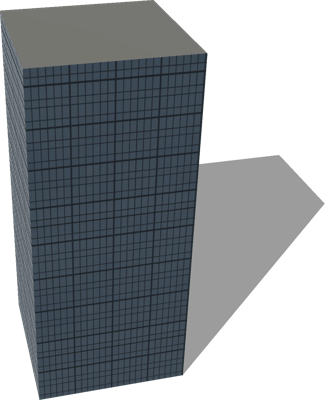

%end

Derived from [Solid](../reference/solid.md).

```
CyberboticsTower {
  SFVec3f    translation 0 0 0
  SFRotation rotation    0 1 0 0
  SFString   name        "Cyberbotics tower"
}
```

> **File location**: "[WEBOTS\_HOME/projects/objects/buildings/protos/CyberboticsTower.proto]({{ url.github_tree }}/projects/objects/buildings/protos/CyberboticsTower.proto)"

> **License**: Copyright Cyberbotics Ltd. Licensed for use only with Webots.
[More information.](https://cyberbotics.com/webots_assets_license)

## FastFoodRestaurant

A customizable fast food restaurant.

%figure

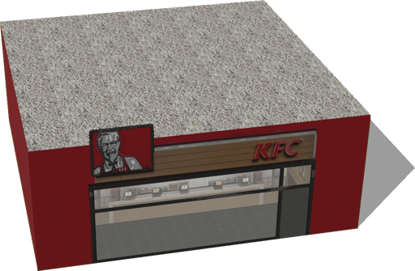

%end

Derived from [Solid](../reference/solid.md).

```
FastFoodRestaurant {
  SFVec3f     translation   0 0 0
  SFRotation  rotation      0 1 0 0
  SFString    name          "fast food restaurant"
  SFFloat     height        4
  SFFloat     length        10
  SFFloat     width         10
  SFString    brand         "KFC"
  SFInt32     numberOfSides 1
}
```

> **File location**: "[WEBOTS\_HOME/projects/objects/buildings/protos/FastFoodRestaurant.proto]({{ url.github_tree }}/projects/objects/buildings/protos/FastFoodRestaurant.proto)"

> **License**: Copyright Cyberbotics Ltd. Licensed for use only with Webots.
[More information.](https://cyberbotics.com/webots_assets_license)

### FastFoodRestaurant Field Summary

- `height`: Defines the height of the building.

- `length`: Defines the length of the building.

- `width`: Defines the width of the building.

- `brand`: Defines the brand of the restaurant. This field accepts the following values: `"KFC"`, `"FFC"`, `"subway"`, and `"momo"`.

- `numberOfSides`: Defines whether it is a two sided restaurant. This field accepts the following values: `1` and `2`.

## GasStation

A gas station with optional boundingObject.

%figure

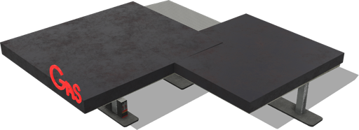

%end

Derived from [Solid](../reference/solid.md).

```
GasStation {
  SFVec3f    translation           0 0 0
  SFRotation rotation              0 1 0 0
  SFString   name                  "gas station"
  SFBool     enableBoundingObject  TRUE
}
```

> **File location**: "[WEBOTS\_HOME/projects/objects/buildings/protos/GasStation.proto]({{ url.github_tree }}/projects/objects/buildings/protos/GasStation.proto)"

> **License**: Creative Commons Attribution 4.0 International License.
[More information.](https://creativecommons.org/licenses/by/4.0/legalcode)

### GasStation Field Summary

- `enableBoundingObject`: Defines whether the gas station should have a bounding object.

## HollowBuilding

A hollow building.

%figure

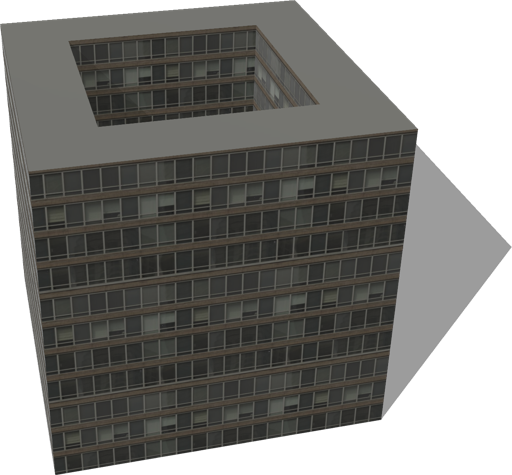

%end

Derived from [Solid](../reference/solid.md).

```
HollowBuilding {
  SFVec3f    translation 0 0 0
  SFRotation rotation    0 1 0 0
  SFString   name        "hollow building"
}
```

> **File location**: "[WEBOTS\_HOME/projects/objects/buildings/protos/HollowBuilding.proto]({{ url.github_tree }}/projects/objects/buildings/protos/HollowBuilding.proto)"

> **License**: Copyright Cyberbotics Ltd. Licensed for use only with Webots.
[More information.](https://cyberbotics.com/webots_assets_license)

## Hotel

A big hotel.

%figure

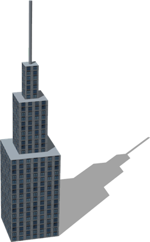

%end

Derived from [Solid](../reference/solid.md).

```
Hotel {
  SFVec3f    translation 0 0 0
  SFRotation rotation    0 1 0 0
  SFString   name        "hotel"
}
```

> **File location**: "[WEBOTS\_HOME/projects/objects/buildings/protos/Hotel.proto]({{ url.github_tree }}/projects/objects/buildings/protos/Hotel.proto)"

> **License**: Copyright Cyberbotics Ltd. Licensed for use only with Webots.
[More information.](https://cyberbotics.com/webots_assets_license)

## HouseWithGarage

A house with a garage and optional boundingObject.

%figure

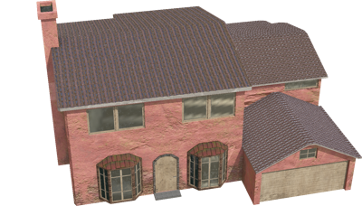

%end

Derived from [Solid](../reference/solid.md).

```
HouseWithGarage {
  SFVec3f    translation           0 0 0
  SFRotation rotation              0 1 0 0
  SFString   name                  "house with garage"
  SFBool     enableBoundingObject  TRUE
}
```

> **File location**: "[WEBOTS\_HOME/projects/objects/buildings/protos/HouseWithGarage.proto]({{ url.github_tree }}/projects/objects/buildings/protos/HouseWithGarage.proto)"

> **License**: Creative Commons Attribution 4.0 International License.
[More information.](https://creativecommons.org/licenses/by/4.0/legalcode)

### HouseWithGarage Field Summary

- `enableBoundingObject`: Defines whether the house should have a bounding object.

## LargeResidentialTower

A large residential tower with variable number of floors and optional boundingObject.

%figure

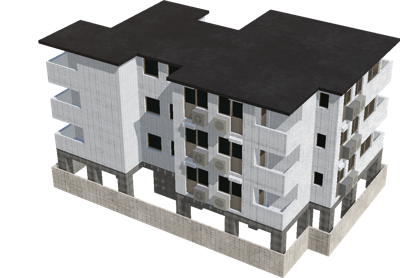

%end

Derived from [Solid](../reference/solid.md).

```
LargeResidentialTower {
  SFVec3f    translation            0 0 0
  SFRotation rotation               0 1 0 0
  SFString   name                   "residential tower"
  SFInt32    numberOfFloors         4
  SFBool     groundSurroundingWall  TRUE
  SFBool     enableBoundingObject   TRUE
}
```

> **File location**: "[WEBOTS\_HOME/projects/objects/buildings/protos/LargeResidentialTower.proto]({{ url.github_tree }}/projects/objects/buildings/protos/LargeResidentialTower.proto)"

> **License**: Creative Commons Attribution 4.0 International License.
[More information.](https://creativecommons.org/licenses/by/4.0/legalcode)

### LargeResidentialTower Field Summary

- `numberOfFloors`: Defines the number of floors of the tower.

- `groundSurroundingWall`: Defines whether to include a surrounding wall at the ground floor.

- `enableBoundingObject`: Defines whether the tower should have a bounding object.

## ModernHouse

A simple modern house.
The original blender model was made by andreschneider ([http://www.blendswap.com/blends/view/65734](http://www.blendswap.com/blends/view/65734)).
This model was sponsored by the CTI project RO2IVSim ([http://transport.epfl.ch/simulator-for-mobile-robots-and-intelligent-vehicles](http://transport.epfl.ch/simulator-for-mobile-robots-and-intelligent-vehicles)).

%figure

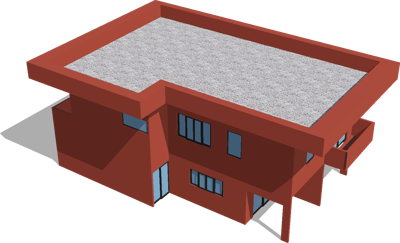

%end

Derived from [Solid](../reference/solid.md).

```
ModernHouse {
  SFVec3f    translation          0 0 0
  SFRotation rotation             0 1 0 0
  SFString   name                 "modern house"
  SFBool     enableBoundingObject TRUE
  SFNode     appearance           PBRAppearance { baseColor 0.56 0.18 0.12 metalness 0 roughness 1 }
  SFNode     windowAppearance     PBRAppearance { baseColor 0.38 0.55 0.69 metalness 0 roughness 0.2 }
}
```

> **File location**: "[WEBOTS\_HOME/projects/objects/buildings/protos/ModernHouse.proto]({{ url.github_tree }}/projects/objects/buildings/protos/ModernHouse.proto)"

> **License**: Copyright Cyberbotics Ltd. Licensed for use only with Webots.
[More information.](https://cyberbotics.com/webots_assets_license)

### ModernHouse Field Summary

- `enableBoundingObject`: Defines whether to enable the bounding object or not.

- `appearance`: Defines the wall appearance.

- `windowAppearance`: Defines the windows appearance.

## ModernSuburbanHouse

A modern suburban house with optional boundingObject.

%figure

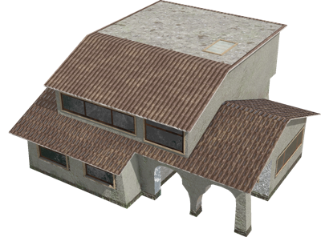

%end

Derived from [Solid](../reference/solid.md).

```
ModernSuburbanHouse {
  SFVec3f    translation           0 0 0
  SFRotation rotation              0 1 0 0
  SFString   name                  "suburban house"
  SFBool     enableBoundingObject  TRUE
}
```

> **File location**: "[WEBOTS\_HOME/projects/objects/buildings/protos/ModernSuburbanHouse.proto]({{ url.github_tree }}/projects/objects/buildings/protos/ModernSuburbanHouse.proto)"

> **License**: Creative Commons Attribution 4.0 International License.
[More information.](https://creativecommons.org/licenses/by/4.0/legalcode)

### ModernSuburbanHouse Field Summary

- `enableBoundingObject`: Defines whether the house should have a bounding object.

## MotelReception

A motel reception with optional boundingObject.

%figure

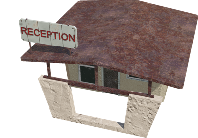

%end

Derived from [Solid](../reference/solid.md).

```
MotelReception {
  SFVec3f    translation           0 0 0
  SFRotation rotation              0 1 0 0
  SFString   name                  "motel reception"
  SFBool     enableBoundingObject  TRUE
}
```

> **File location**: "[WEBOTS\_HOME/projects/objects/buildings/protos/MotelReception.proto]({{ url.github_tree }}/projects/objects/buildings/protos/MotelReception.proto)"

> **License**: Creative Commons Attribution 4.0 International License.
[More information.](https://creativecommons.org/licenses/by/4.0/legalcode)

### MotelReception Field Summary

- `enableBoundingObject`: Defines whether the motel reception should have a bounding object.

## Museum

An old museum.

%figure

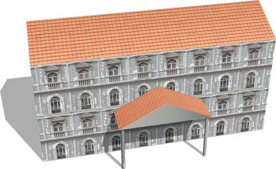

%end

Derived from [Solid](../reference/solid.md).

```
Museum {
  SFVec3f    translation 0 0 0
  SFRotation rotation    0 1 0 0
  SFString   name        "museum"
}
```

> **File location**: "[WEBOTS\_HOME/projects/objects/buildings/protos/Museum.proto]({{ url.github_tree }}/projects/objects/buildings/protos/Museum.proto)"

> **License**: Copyright Cyberbotics Ltd. Licensed for use only with Webots.
[More information.](https://cyberbotics.com/webots_assets_license)

## OldResidentialBuilding

An old residential building with optional boundingObject.

%figure

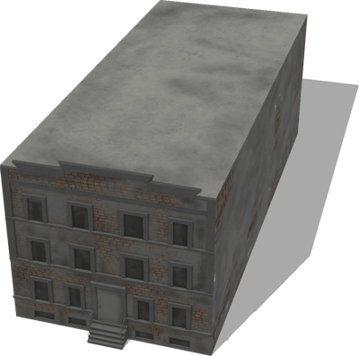

%end

Derived from [Solid](../reference/solid.md).

```
OldResidentialBuilding {
  SFVec3f    translation           0 0 0
  SFRotation rotation              0 1 0 0
  SFString   name                  "residential building"
  SFString   type                  "braun"
  SFBool     enableBoundingObject  TRUE
}
```

> **File location**: "[WEBOTS\_HOME/projects/objects/buildings/protos/OldResidentialBuilding.proto]({{ url.github_tree }}/projects/objects/buildings/protos/OldResidentialBuilding.proto)"

> **License**: Creative Commons Attribution 4.0 International License.
[More information.](https://creativecommons.org/licenses/by/4.0/legalcode)

### OldResidentialBuilding Field Summary

- `type`: Defines the type which has a direct influence on the building texture. This field accepts the following values: `"red grey"`, `"dark grey"`, `"light grey"`, `"red"`, and `"braun"`.

- `enableBoundingObject`: Defines whether the building should have a bounding object.

## RandomBuilding

A customizable building, the size and geometry can fully be defined.
The texture of the wall is selected randomly.
The roof shape can be either 'flat' or 'pyramidal' (in case of pyramidal roof it is possible to define the height).

%figure

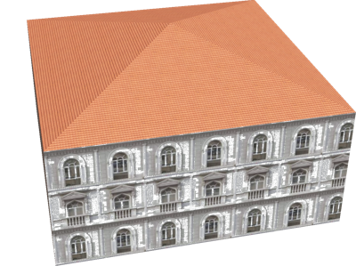

%end

Derived from [Solid](../reference/solid.md).

```
RandomBuilding {
  SFVec3f     translation            0 0 0
  SFRotation  rotation               0 1 0 0
  SFString    name                   "building"
  SFFloat     floorHeight            3
  SFInt32     floorNumber            3
  SFInt32     startingFloor          0
  MFVec2f     corners                [10 10, 10 -10, -10 -10, -10 10 ]
  MFString    groundFloor            []
  MFFloat     groundFloorScale       []
  MFFloat     groundFloorTranslation []
  SFString    roofType               "tiled"
  MFColor     roofColor              [ ]
  SFString    roofShape              "pyramidal roof"
  SFBool      snowOnRoof             FALSE
  SFFloat     roofHeight             3
  SFBool      enableBoundingObject   TRUE
  SFBool      bottom                 FALSE
}
```

> **File location**: "[WEBOTS\_HOME/projects/objects/buildings/protos/RandomBuilding.proto]({{ url.github_tree }}/projects/objects/buildings/protos/RandomBuilding.proto)"

> **License**: Copyright Cyberbotics Ltd. Licensed for use only with Webots.
[More information.](https://cyberbotics.com/webots_assets_license)

### RandomBuilding Field Summary

- `floorHeight`: Defines the height of one floor.

- `floorNumber`: Defines the number of floors (excluding roof).

- `startingFloor`: Defines the floor number for the "ground floor" of the building, as not all buildings start at the ground floor.

- `corners`: Defines the geometry of the building.

- `groundFloor`: Defines the texture to be used for the first floor (optional).

- `groundFloorScale`: Defines the horizontal scale of the ground texture.

- `groundFloorTranslation`: Defines the translation of the ground floor textures.

- `roofType`: Defines the texture to be used for the roof. This field accepts the following values: `"tiled"`, `"gravel"`, `"slate"`, `"old tiles"`, `"sheet metal"`, `"metal tiles"`, and `"bitumen"`.

- `roofColor`: Defines the color to be used for the roof.

- `roofShape`: Defines the geometry of the roof. This field accepts the following values: `"flat roof"`, `"pyramidal roof"`, `"gabled roof"`, and `"hipped roof"`.

- `snowOnRoof`: Defines whether the texture with or without snow should be used.

- `roofHeight`: Defines the height of the roof (used only in the case of pyramidal roof).

- `enableBoundingObject`: Defines whether the building should have a bounding object or not.

- `bottom`: Defines whether the building should have a floor (visible from below) or not.

## ResidentialBuilding

A residential building.

%figure

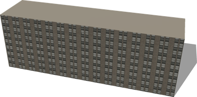

%end

Derived from [Solid](../reference/solid.md).

```
ResidentialBuilding {
  SFVec3f    translation 0 0 0
  SFRotation rotation    0 1 0 0
  SFString   name        "residential building"
}
```

> **File location**: "[WEBOTS\_HOME/projects/objects/buildings/protos/ResidentialBuilding.proto]({{ url.github_tree }}/projects/objects/buildings/protos/ResidentialBuilding.proto)"

> **License**: Copyright Cyberbotics Ltd. Licensed for use only with Webots.
[More information.](https://cyberbotics.com/webots_assets_license)

## ResidentialBuildingWithRoundFront

A residential building with a rounded front face and optional boundingObject.

%figure

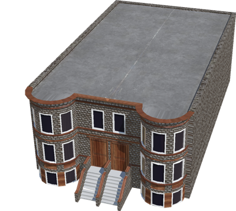

%end

Derived from [Solid](../reference/solid.md).

```
ResidentialBuildingWithRoundFront {
  SFVec3f    translation           0 0 0
  SFRotation rotation              0 1 0 0
  SFString   name                  "residential building"
  SFString   type                  "dark braun"
  SFBool     enableBoundingObject  TRUE
}
```

> **File location**: "[WEBOTS\_HOME/projects/objects/buildings/protos/ResidentialBuildingWithRoundFront.proto]({{ url.github_tree }}/projects/objects/buildings/protos/ResidentialBuildingWithRoundFront.proto)"

> **License**: Creative Commons Attribution 4.0 International License.
[More information.](https://creativecommons.org/licenses/by/4.0/legalcode)

### ResidentialBuildingWithRoundFront Field Summary

- `type`: Defines the type which has a direct influence on the building texture. This field accepts the following values: `"dark grey"`, `"orange"`, `"green"`, `"dark braun"`, `"light grey"`, and `"light braun"`.

- `enableBoundingObject`: Defines whether the building should have a bounding object.

## ResidentialTower

A residential tower with variable number of floor and optional boundingObject.

%figure

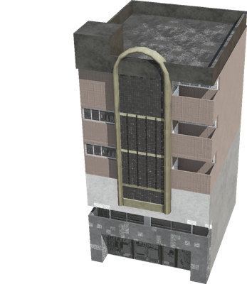

%end

Derived from [Solid](../reference/solid.md).

```
ResidentialTower {
  SFVec3f    translation           0 0 0
  SFRotation rotation              0 1 0 0
  SFString   name                  "residential tower"
  SFInt32    numberOfFloors        3
  SFBool     enableBoundingObject  TRUE
}
```

> **File location**: "[WEBOTS\_HOME/projects/objects/buildings/protos/ResidentialTower.proto]({{ url.github_tree }}/projects/objects/buildings/protos/ResidentialTower.proto)"

> **License**: Creative Commons Attribution 4.0 International License.
[More information.](https://creativecommons.org/licenses/by/4.0/legalcode)

### ResidentialTower Field Summary

- `numberOfFloors`: Defines the number of floors of the tower.

- `enableBoundingObject`: Defines whether the towwer should have a bounding object.

## SimpleBuilding

A customizable building, the size and geometry can fully be defined.
The texture of the wall and roof can be selected using the fields 'wallType' and 'roofType'.

%figure

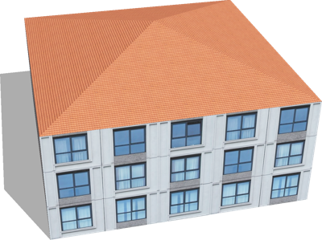

%end

Derived from [Solid](../reference/solid.md).

```
SimpleBuilding {
  SFVec3f     translation            0 0 0
  SFRotation  rotation               0 1 0 0
  SFString    name                   "building"
  SFFloat     floorHeight            3
  SFInt32     floorNumber            3
  SFInt32     startingFloor          0
  MFVec2f     corners                [10 10, 10 -10, -10 -10, -10 10 ]
  SFString    wallType               "windowed building"
  MFColor     wallColor              []
  MFString    groundFloor            []
  MFFloat     groundFloorScale       []
  MFFloat     groundFloorTranslation []
  SFString    roofType               "tiled"
  MFColor     roofColor              []
  SFString    roofShape              "pyramidal roof"
  SFBool      snowOnRoof             FALSE
  SFFloat     roofHeight             3
  SFBool      enableBoundingObject   TRUE
  SFBool      bottom                 FALSE
}
```

> **File location**: "[WEBOTS\_HOME/projects/objects/buildings/protos/SimpleBuilding.proto]({{ url.github_tree }}/projects/objects/buildings/protos/SimpleBuilding.proto)"

> **License**: Copyright Cyberbotics Ltd. Licensed for use only with Webots.
[More information.](https://cyberbotics.com/webots_assets_license)

### SimpleBuilding Field Summary

- `floorHeight`: Defines the height of one floor.

- `floorNumber`: Defines the number of floors (excluding roof).

- `startingFloor`: Defines the floor number for the "ground floor" of the building, as not all buildings start at the ground floor.

- `corners`: Defines the 2D geometry of the building (2D ground footprint of the building).

- `wallType`: Defines the wall type. This field accepts the following values: `"glass building"`, `"classic building"`, `"orange building"`, `"gray glass building"`, `"blue glass building"`, `"arcade-style building"`, `"transparent highrise"`, `"windowed building"`, `"old brick building"`, `"red and white building"`, `"construction building"`, `"stone brick"`, `"stone wall"`, `"glass highrise"`, `"old house"`, `"old building"`, `"highrise"`, `"brick building"`, `"residential building"`, `"old office building"`, `"factory building"`, `"tall house"`, `"office building"`, and `"concrete building"`.

- `wallColor`: Defines the wall color.

- `groundFloor`: Defines the texture to be used for the first floor (optional).

- `groundFloorScale`: Defines the horizontal scale of the ground texture.

- `groundFloorTranslation`: Defines the translation of the ground floor textures.

- `roofType`: Defines roof type. This field accepts the following values: `"tiled"`, `"gravel"`, `"slate"`, `"old tiles"`, `"sheet metal"`, `"metal tiles"`, and `"bitumen"`.

- `roofColor`: Defines the roof color.

- `roofShape`: Defines the geometry of the roof. This field accepts the following values: `"flat roof"`, `"pyramidal roof"`, `"gabled roof"`, and `"hipped roof"`.

- `snowOnRoof`: Defines whether the texture with or without snow should be used.

- `roofHeight`: Defines the height of the roof.

- `enableBoundingObject`: Defines whether the building should have a bounding object or not.

- `bottom`: Defines whether the bottom face of the building should be displayed.

## SimpleTwoFloorsHouse

A simple house with two floors.
The original blender model was made by andreschneider ([http://www.blendswap.com/blends/view/59482](http://www.blendswap.com/blends/view/59482)).
This model was sponsored by the CTI project RO2IVSim ([http://transport.epfl.ch/simulator-for-mobile-robots-and-intelligent-vehicles](http://transport.epfl.ch/simulator-for-mobile-robots-and-intelligent-vehicles)).

%figure

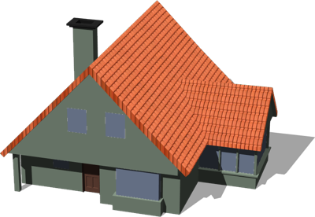

%end

Derived from [Solid](../reference/solid.md).

```
SimpleTwoFloorsHouse {
  SFVec3f    translation           0 0 0
  SFRotation rotation              0 1 0 0
  SFString   name                  "simple two-storey house"
  SFBool     enableBoundingObject  TRUE
  SFNode     appearance            PBRAppearance { baseColor 0.63 0.71 0.63 metalness 0 roughness 1 }
}
```

> **File location**: "[WEBOTS\_HOME/projects/objects/buildings/protos/SimpleTwoFloorsHouse.proto]({{ url.github_tree }}/projects/objects/buildings/protos/SimpleTwoFloorsHouse.proto)"

> **License**: Copyright Cyberbotics Ltd. Licensed for use only with Webots.
[More information.](https://cyberbotics.com/webots_assets_license)

### SimpleTwoFloorsHouse Field Summary

- `enableBoundingObject`: Defines whether to enable the bounding object.

- `appearance`: Defines the house appearance.

## SmallManor

A small manor with optional boundingObject.

%figure

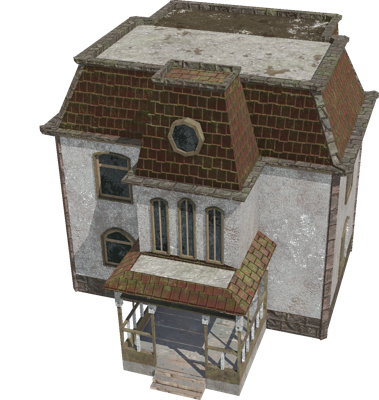

%end

Derived from [Solid](../reference/solid.md).

```
SmallManor {
  SFVec3f    translation           0 0 0
  SFRotation rotation              0 1 0 0
  SFString   name                  "small manor"
  SFBool     enableBoundingObject  TRUE
}
```

> **File location**: "[WEBOTS\_HOME/projects/objects/buildings/protos/SmallManor.proto]({{ url.github_tree }}/projects/objects/buildings/protos/SmallManor.proto)"

> **License**: Creative Commons Attribution 4.0 International License.
[More information.](https://creativecommons.org/licenses/by/4.0/legalcode)

### SmallManor Field Summary

- `enableBoundingObject`: Defines whether the manor should have a bounding object.

## SmallResidentialBuilding

A small residential building with optional boundingObject.

%figure

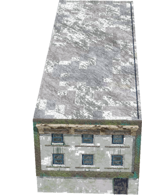

%end

Derived from [Solid](../reference/solid.md).

```
SmallResidentialBuilding {
  SFVec3f    translation           0 0 0
  SFRotation rotation              0 1 0 0
  SFString   name                  "residential building"
  SFString   type                  "braun black"
  SFBool     enableBoundingObject  TRUE
}
```

> **File location**: "[WEBOTS\_HOME/projects/objects/buildings/protos/SmallResidentialBuilding.proto]({{ url.github_tree }}/projects/objects/buildings/protos/SmallResidentialBuilding.proto)"

> **License**: Creative Commons Attribution 4.0 International License.
[More information.](https://creativecommons.org/licenses/by/4.0/legalcode)

### SmallResidentialBuilding Field Summary

- `type`: Defines the type which has a direct influence on the building texture. This field accepts the following values: `"white"`, `"braun black"`, and `"red"`.

- `enableBoundingObject`: Defines whether the building should have a bounding object.

## SmallResidentialTower

A small residential tower with variable number of floor and optional boundingObject.

%figure

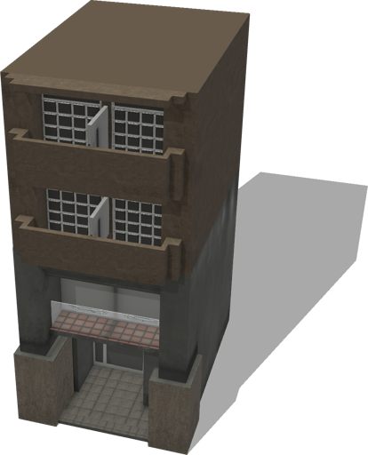

%end

Derived from [Solid](../reference/solid.md).

```
SmallResidentialTower {
  SFVec3f    translation           0 0 0
  SFRotation rotation              0 1 0 0
  SFString   name                  "residential tower"
  SFInt32    numberOfFloors        3
  SFBool     enableBoundingObject  TRUE
}
```

> **File location**: "[WEBOTS\_HOME/projects/objects/buildings/protos/SmallResidentialTower.proto]({{ url.github_tree }}/projects/objects/buildings/protos/SmallResidentialTower.proto)"

> **License**: Creative Commons Attribution 4.0 International License.
[More information.](https://creativecommons.org/licenses/by/4.0/legalcode)

### SmallResidentialTower Field Summary

- `numberOfFloors`: Defines the number of floors of the tower.

- `enableBoundingObject`: Defines whether the tower should have a bounding object.

## StripBuilding

A strip of buildings of variable length.

%figure

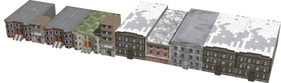

%end

Derived from [Solid](../reference/solid.md).

```
StripBuilding {
  SFVec3f    translation           0 0 0
  SFRotation rotation              0 1 0 0
  SFString   name                  "strip building"
  SFFloat    length                100
  SFInt32    randomSeed            1
  SFBool     enableBoundingObject  TRUE
}
```

> **File location**: "[WEBOTS\_HOME/projects/objects/buildings/protos/StripBuilding.proto]({{ url.github_tree }}/projects/objects/buildings/protos/StripBuilding.proto)"

> **License**: Copyright Cyberbotics Ltd. Licensed for use only with Webots.
[More information.](https://cyberbotics.com/webots_assets_license)

### StripBuilding Field Summary

- `length`: Defines the minimum length of the strip (actual length is slightly bigger because buildings are not cut).

- `randomSeed`: Defines the seed of the random number generator. A value smaller or equal to 0 sets a random seed.

- `enableBoundingObject`: Defines whether the buildings should have bounding objects.

## SuburbanHouse

A suburban house with optional boundingObject.

%figure

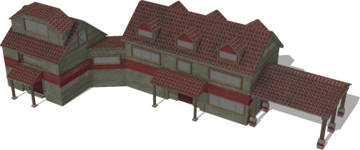

%end

Derived from [Solid](../reference/solid.md).

```
SuburbanHouse {
  SFVec3f    translation           0 0 0
  SFRotation rotation              0 1 0 0
  SFString   name                  "suburban house"
  SFBool     enableBoundingObject  TRUE
}
```

> **File location**: "[WEBOTS\_HOME/projects/objects/buildings/protos/SuburbanHouse.proto]({{ url.github_tree }}/projects/objects/buildings/protos/SuburbanHouse.proto)"

> **License**: Creative Commons Attribution 4.0 International License.
[More information.](https://creativecommons.org/licenses/by/4.0/legalcode)

### SuburbanHouse Field Summary

- `enableBoundingObject`: Defines whether the building should have a bounding object.

## TheThreeTowers

A group of three towers.

%figure

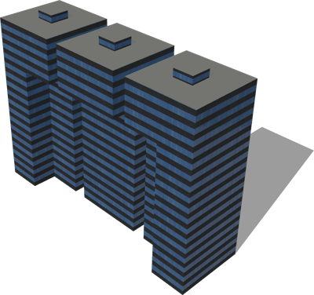

%end

Derived from [Solid](../reference/solid.md).

```
TheThreeTowers {
  SFVec3f    translation 0 0 0
  SFRotation rotation    0 1 0 0
  SFString   name        "three towers"
}
```

> **File location**: "[WEBOTS\_HOME/projects/objects/buildings/protos/TheThreeTowers.proto]({{ url.github_tree }}/projects/objects/buildings/protos/TheThreeTowers.proto)"

> **License**: Copyright Cyberbotics Ltd. Licensed for use only with Webots.
[More information.](https://cyberbotics.com/webots_assets_license)

## UBuilding

A building with a "U" form.

%figure

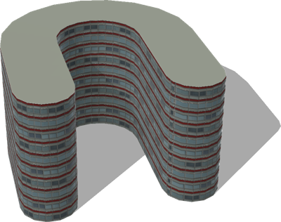

%end

Derived from [Solid](../reference/solid.md).

```
UBuilding {
  SFVec3f    translation 0 0 0
  SFRotation rotation    0 1 0 0
  SFString   name        "U building"
}
```

> **File location**: "[WEBOTS\_HOME/projects/objects/buildings/protos/UBuilding.proto]({{ url.github_tree }}/projects/objects/buildings/protos/UBuilding.proto)"

> **License**: Copyright Cyberbotics Ltd. Licensed for use only with Webots.
[More information.](https://cyberbotics.com/webots_assets_license)

## Warehouse

A warehouse with optional boundingObject.

%figure

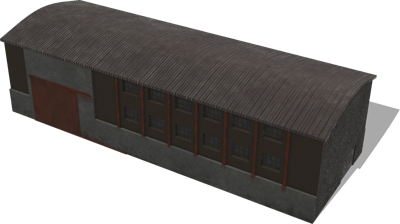

%end

Derived from [Solid](../reference/solid.md).

```
Warehouse {
  SFVec3f    translation           0 0 0
  SFRotation rotation              0 1 0 0
  SFString   name                  "warehouse"
  SFBool     enableBoundingObject  TRUE
}
```

> **File location**: "[WEBOTS\_HOME/projects/objects/buildings/protos/Warehouse.proto]({{ url.github_tree }}/projects/objects/buildings/protos/Warehouse.proto)"

> **License**: Creative Commons Attribution 4.0 International License.
[More information.](https://creativecommons.org/licenses/by/4.0/legalcode)

### Warehouse Field Summary

- `enableBoundingObject`: Defines whether the warehouse should have a bounding object.

## Windmill

A windmill with optional boundingObject.

%figure

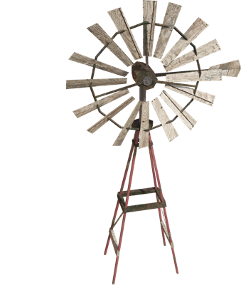

%end

Derived from [Solid](../reference/solid.md).

```
Windmill {
  SFVec3f    translation           0 0 0
  SFRotation rotation              0 1 0 0
  SFString   name                  "windmill"
  SFBool     enableBoundingObject  TRUE
}
```

> **File location**: "[WEBOTS\_HOME/projects/objects/buildings/protos/Windmill.proto]({{ url.github_tree }}/projects/objects/buildings/protos/Windmill.proto)"

> **License**: Creative Commons Attribution 4.0 International License.
[More information.](https://creativecommons.org/licenses/by/4.0/legalcode)

### Windmill Field Summary

- `enableBoundingObject`: Defines whether the windmill should have a bounding object.
