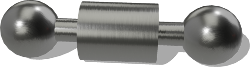

# Cabinet

## Cabinet PROTO

A customizable cabinet containing elements (shelves, dynamic doors, and drawers).
The internal cabinet layout is a grid in which the elements can be inserted.
The grid dimension (and so the cabinet size) is defined by the 'rowsHeights' and the 'columnsWidths' fields.
The `layout` field is defining the location and the dimension of the elements into the grid layout, according to the following syntax:
- `layout`: list("[RightSidedDoor|LeftSiderDoor|Drawer|Shelf] (x, y, column span, row span[, mass])"

The coordinate origin (1,1) of the grid layout is at the bottom left corner.

%figure


%end

Derived from [Solid](../reference/solid.md).

```
Cabinet {
  SFVec3f    translation    0 0 0
  SFRotation rotation       0 1 0 0
  SFString   name           "cabinet"
  SFFloat    depth          0.5
  SFFloat    innerThickness 0.02
  SFFloat    outerThickness 0.03
  MFFloat    rowsHeights [
    0.24
    0.2
    0.2
    0.4
    0.4
  ]
  MFFloat columnsWidths [
    0.4
    0.17
    0.17
  ]
  MFString layout [
    "RightSidedDoor (1, 4, 1, 2, 1.5)"
    "LeftSidedDoor (2, 4, 2, 2, 1.5)"
    "Drawer (3, 3, 1, 1, 1.5)"
    "Drawer (2, 2, 1, 1, 1.5)"
    "Drawer (3, 2, 1, 1, 1.5)"
    "Drawer (1, 1, 3, 1, 3.5)"
    "Shelf (1, 5, 3, 0)"
    "Shelf (1, 4, 3, 0)"
    "Shelf (1, 3, 3, 0)"
    "Shelf (1, 2, 3, 0)"
    "Shelf (1, 3, 0, 1)"
    "Shelf (2, 3, 0, 1)"
  ]
  SFNode   handle              CabinetHandle {}
  SFNode   primaryAppearance   PaintedWood {}
  SFNode   secondaryAppearance PaintedWood {}
  MFColor  recognitionColors   []
}
```

> **File location**: "[WEBOTS\_HOME/projects/objects/cabinet/protos/Cabinet.proto]({{ url.github_tree }}/projects/objects/cabinet/protos/Cabinet.proto)"

> **License**: Copyright Cyberbotics Ltd. Licensed for use only with Webots.
[More information.](https://cyberbotics.com/webots_assets_license)

### Cabinet Field Summary

- `depth`: Defines the depth of the cabinet.

- `innerThickness`: Defines the inner thickness of the cabinet frame.

- `outerThickness`: Defines the outer thickness of the cabinet frame.

- `rowsHeights`: Defines the height of the cabinet rows.

- `columnsWidths`: Defines the width of the cabinet columns.

- `layout`: Defines the layout of the cabinet.

- `handle`: Defines the handle of the cabinet.

- `primaryAppearance`: Defines the primary appearance.

- `secondaryAppearance`: Defines the secondary appearance.

## CabinetHandle

A handle for the Cabinet PROTO.

%figure



%end

Derived from [Slot](../reference/slot.md).

```
CabinetHandle {
  SFVec3f    translation   0 0 0
  SFRotation rotation     0 1 0 0
  SFString   name         "cabinet handle"
  SFFloat    handleLength 0.065
  SFFloat    handleRadius 0.0055
  SFColor    handleColor  0.74 0.74 0.74
  SFFloat    mass         0.3
}
```

> **File location**: "[WEBOTS\_HOME/projects/objects/cabinet/protos/CabinetHandle.proto]({{ url.github_tree }}/projects/objects/cabinet/protos/CabinetHandle.proto)"

> **License**: Copyright Cyberbotics Ltd. Licensed for use only with Webots.
[More information.](https://cyberbotics.com/webots_assets_license)

### CabinetHandle Field Summary

- `handleLength`: Defines the lenght of the handle.

- `handleRadius`: Defines the radius of the handle.

- `handleColor`: Defines the color of the handle.

- `mass`: Defines the mass of the handle.

