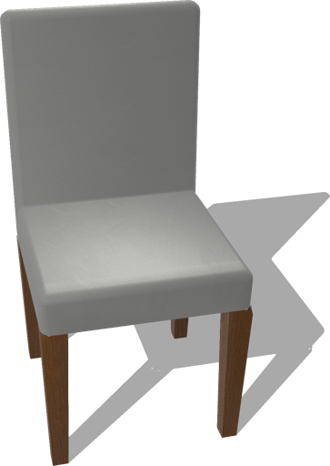
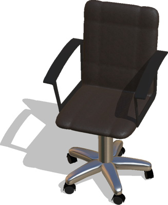
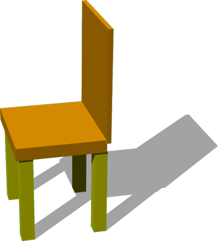
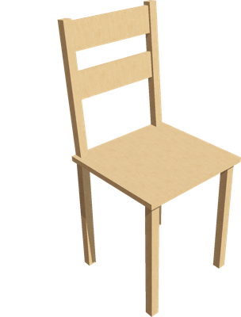

# Chairs

## Chair

A chair (0.5 x 1 x 0.5 m).

%figure



%end

Derived from [Solid](../reference/solid.md).

```
Chair {
  SFVec3f    translation 0 0 0
  SFRotation rotation    0 1 0 0
  SFString   name        "chair"
  SFColor    color       1 1 1
  SFNode     physics     NULL
}
```

> **File location**: "[WEBOTS\_HOME/projects/objects/chairs/protos/Chair.proto]({{ url.github_tree }}/projects/objects/chairs/protos/Chair.proto)"

> **License**: Copyright Cyberbotics Ltd. Licensed for use only with Webots.
[More information.](https://cyberbotics.com/webots_assets_license)

### Chair Field Summary

- `color`: Define the color of the chair.

- `physics`: Define the physcis of the chair.

## OfficeChair

A rotating office chair with customizable appearance.

%figure



%end

Derived from [Solid](../reference/solid.md).

```
OfficeChair {
  SFVec3f    translation     0 0 0
  SFRotation rotation        0 1 0 0
  SFString   name            "office chair"
  SFNode     legAppearance   BrushedAluminium { textureTransform TextureTransform { scale 5 5 } }
  SFNode     seatAppearance  Leather { textureTransform TextureTransform { scale 10 10 } }
  SFBool     enablePhysics   TRUE
  MFColor    recognitionColors []
}
```

> **File location**: "[WEBOTS\_HOME/projects/objects/chairs/protos/OfficeChair.proto]({{ url.github_tree }}/projects/objects/chairs/protos/OfficeChair.proto)"

> **License**: Copyright Cyberbotics Ltd. Licensed for use only with Webots.
[More information.](https://cyberbotics.com/webots_assets_license)

### OfficeChair Field Summary

- `legAppearance`: Defines the appearance of the legs of the chair.

- `seatAppearance`: Defines the appearance of the body of the chair.

- `enablePhysics`: Defines whether the chair should have physics.

## SimpleChair

A simple two-colors chair with a customizable mass, but a fixed height of 1.25 meter.
This object is physics-enabled so it can be pushed.

%figure



%end

Derived from [Solid](../reference/solid.md).

```
SimpleChair {
  SFVec3f    translation 0 0.91 0
  SFRotation rotation    0 1 0 0
  SFString   name        "simple chair"
  SFColor    legColor    1 1 0
  SFColor    seatColor   1 0.65 0
  SFFloat    mass        5
  MFColor    recognitionColors []
}
```

> **File location**: "[WEBOTS\_HOME/projects/objects/chairs/protos/SimpleChair.proto]({{ url.github_tree }}/projects/objects/chairs/protos/SimpleChair.proto)"

> **License**: Copyright Cyberbotics Ltd. Licensed for use only with Webots.
[More information.](https://cyberbotics.com/webots_assets_license)

### SimpleChair Field Summary

- `legColor`: Defines the color of the legs of the chair.

- `seatColor`: Defines the color of the body of the chair.

- `mass`: Defines the mass of the chair in kg.

## WoodenChair

A wooden chair (0.42 x 0.944 x 0.44 m).

%figure



%end

Derived from [Solid](../reference/solid.md).

```
WoodenChair {
  SFVec3f    translation 0 0 0
  SFRotation rotation    0 1 0 0
  SFString   name        "wooden chair"
  SFColor    color       1 1 1
  SFNode     physics     NULL
}
```

> **File location**: "[WEBOTS\_HOME/projects/objects/chairs/protos/WoodenChair.proto]({{ url.github_tree }}/projects/objects/chairs/protos/WoodenChair.proto)"

> **License**: Copyright Cyberbotics Ltd. Licensed for use only with Webots.
[More information.](https://cyberbotics.com/webots_assets_license)

### WoodenChair Field Summary

- `color`: Defines the color of the chair.

- `physics`: Defines the physics of the chair.

