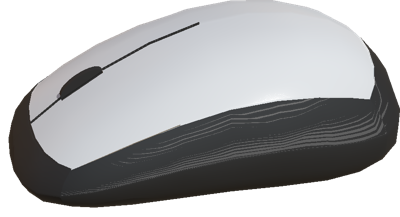
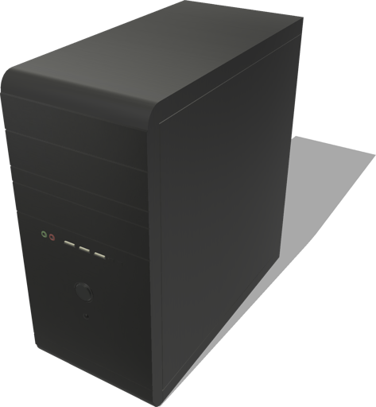
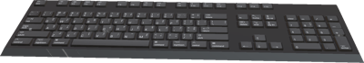
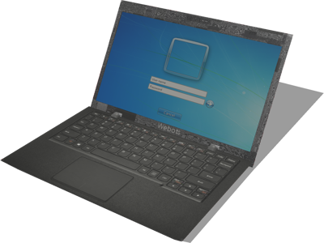
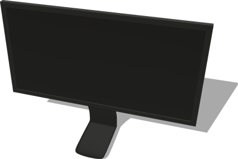

# Computers

## ComputerMouse

A computer mouse.

%figure



%end

Derived from [Solid](../reference/solid.md).

```
ComputerMouse {
  SFVec3f    translation 0 0 0
  SFRotation rotation    0 0 1 0
  SFString   name        "computer mouse"
  SFColor    topColor    0.71 0.71 0.71
  SFColor    bottomColor 0.056 0.056 0.056
  SFFloat    mass        0.1
}
```

> **File location**: "[WEBOTS\_HOME/projects/objects/computers/protos/ComputerMouse.proto]({{ url.github_tree }}/projects/objects/computers/protos/ComputerMouse.proto)"

> **License**: Copyright Cyberbotics Ltd. Licensed for use only with Webots.
[More information.](https://cyberbotics.com/webots_assets_license)

### ComputerMouse Field Summary

- `topColor`: Defines the color of the top part of the mouse.

- `bottomColor`: Defines the color of the bottom part of the mouse.

- `mass`: Defines the mass of the mouse in kg. A value smaller or equal to 0 removes the physics of the mouse.

## DesktopComputer

A computer tower.

%figure



%end

Derived from [Solid](../reference/solid.md).

```
DesktopComputer {
  SFVec3f    translation      0 0 0
  SFRotation rotation         0 0 1 0
  SFString   name             "desktop computer"
  SFColor    powerbuttonColor 0.252903 0.263813 0.266361
  SFFloat    mass             0
}
```

> **File location**: "[WEBOTS\_HOME/projects/objects/computers/protos/DesktopComputer.proto]({{ url.github_tree }}/projects/objects/computers/protos/DesktopComputer.proto)"

> **License**: Copyright Cyberbotics Ltd. Licensed for use only with Webots.
[More information.](https://cyberbotics.com/webots_assets_license)

### DesktopComputer Field Summary

- `powerbuttonColor`: Defines the color of the computer power button.

- `mass`: Defines the mass of the computer in kg. A value smaller or equal to 0 removes the physics of the computer.

## Keyboard

A computer keyboard.

%figure



%end

Derived from [Solid](../reference/solid.md).

```
Keyboard {
  SFVec3f    translation 0 0 0
  SFRotation rotation    0 0 1 0
  SFString   name        "keyboard"
  SFColor    color       0.1 0.1 0.1
  SFFloat    mass        0
}
```

> **File location**: "[WEBOTS\_HOME/projects/objects/computers/protos/Keyboard.proto]({{ url.github_tree }}/projects/objects/computers/protos/Keyboard.proto)"

> **License**: Copyright Cyberbotics Ltd. Licensed for use only with Webots.
[More information.](https://cyberbotics.com/webots_assets_license)

### Keyboard Field Summary

- `color`: Defines the color of the keyboard.

- `mass`: Defines the mass of the keyboard in kg. A value smaller or equal to 0 removes the physics of the keyboard.

## Laptop

A simple laptop.

%figure



%end

Derived from [Robot](../reference/robot.md).

```
Laptop {
  SFVec3f    translation 0 0 0
  SFRotation rotation    0 0 1 0
  SFString   name        "laptop"
  SFString   controller  "laptop_switch_on"
  SFString   window      "<none>"
  SFBool     supervisor  FALSE
}
```

> **File location**: "[WEBOTS\_HOME/projects/objects/computers/protos/Laptop.proto]({{ url.github_tree }}/projects/objects/computers/protos/Laptop.proto)"

> **License**: Copyright Cyberbotics Ltd. Licensed for use only with Webots.
[More information.](https://cyberbotics.com/webots_assets_license)

### Laptop Field Summary

- `controller`: Defines the controller of the laptop which can use the [Display](../reference/display.md) device to show images.

## Monitor

A computer monitor.

%figure



%end

Derived from [Solid](../reference/solid.md).

```
Monitor {
  SFVec3f    translation 0 0 0
  SFRotation rotation    0 0 1 0
  SFString   name        "monitor"
  SFColor    color       0.15 0.15 0.15
  SFFloat    mass        0
}
```

> **File location**: "[WEBOTS\_HOME/projects/objects/computers/protos/Monitor.proto]({{ url.github_tree }}/projects/objects/computers/protos/Monitor.proto)"

> **License**: Copyright Cyberbotics Ltd. Licensed for use only with Webots.
[More information.](https://cyberbotics.com/webots_assets_license)

### Monitor Field Summary

- `color`: Defines the color of the monitor.

- `mass`: Defines the mass of the monitor in kg. A value smaller or equal to 0 removes the physics of the monitor.

