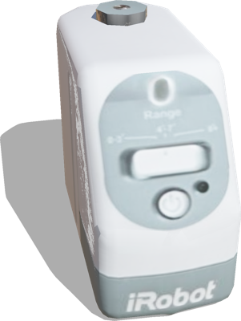

# Create Wall

## CreateWall

Virtual walls are an accessory of the IRobot Create allowing to inform the robot about areas typically for restricted access to a room.

%figure



%end

Derived from [Robot](../reference/robot.md).

```
CreateWall {
  SFVec3f    translation    0 0 0
  SFRotation rotation       0 0 1 0
  SFFloat    range          2.4384
  SFFloat    aperture       0.157
  SFString   controller     "create_wall_emit_signal"
  MFString   controllerArgs []
  SFString   window         "<none>"
  SFBool     supervisor     FALSE
  SFString   name           "iRobot wall"
}
```

> **File location**: "[WEBOTS\_HOME/projects/objects/create\_wall/protos/CreateWall.proto]({{ url.github_tree }}/projects/objects/create_wall/protos/CreateWall.proto)"

> **License**: Copyright Cyberbotics Ltd. Licensed for use only with Webots.
[More information.](https://cyberbotics.com/webots_assets_license)

### CreateWall Field Summary

- `range`: Defines the range of the infra-red emitter.

- `aperture`: Defines the aperture of the infra-red emitter.

- `controller`: Defines the controller which is used to emit infra-red messages.

