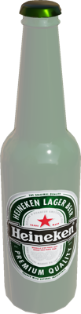
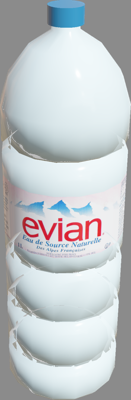

# Drinks

## BeerBottle

A beer bottle.

%figure



%end

Derived from [Solid](../reference/solid.md).

```
BeerBottle {
  SFVec3f    translation 0 0 0
  SFRotation rotation    0 0 1 0
  SFString   name        "beer bottle"
  SFFloat    mass        0.4
}
```

> **File location**: "[WEBOTS\_HOME/projects/objects/drinks/protos/BeerBottle.proto]({{ url.github_tree }}/projects/objects/drinks/protos/BeerBottle.proto)"

> **License**: Copyright Cyberbotics Ltd. Licensed for use only with Webots.
[More information.](https://cyberbotics.com/webots_assets_license)

## Can

A can (0.03175 x 0.03175 x 0.1222 m).

%figure


%end

Derived from [Solid](../reference/solid.md).

```
Can {
  SFVec3f translation 0 0 0.06
  SFRotation rotation 0 0 1 0
  SFString name "can"
  SFColor color 1 1 1
  MFString textureUrl "textures/can_base_color.jpg"
  SFFloat mass 0.35
}
```

> **File location**: "[WEBOTS\_HOME/projects/objects/drinks/protos/Can.proto]({{ url.github_tree }}/projects/objects/drinks/protos/Can.proto)"

> **License**: Copyright Cyberbotics Ltd. Licensed for use only with Webots.
[More information.](https://cyberbotics.com/webots_assets_license)

## WaterBottle

A water bottle.

%figure



%end

Derived from [Solid](../reference/solid.md).

```
WaterBottle {
  SFVec3f    translation 0 0 0
  SFRotation rotation    0 0 1 0
  SFString   name        "water bottle"
  MFString   textureUrl  "textures/evian.png"
  SFFloat    mass        1
}
```

> **File location**: "[WEBOTS\_HOME/projects/objects/drinks/protos/WaterBottle.proto]({{ url.github_tree }}/projects/objects/drinks/protos/WaterBottle.proto)"

> **License**: Copyright Cyberbotics Ltd. Licensed for use only with Webots.
[More information.](https://cyberbotics.com/webots_assets_license)

