# Factory

## Containers

### CardboardBox

A cardboard box.

%figure

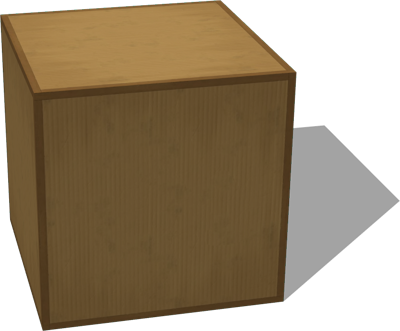

%end

Derived from [Solid](../reference/solid.md).

```
CardboardBox {
  SFVec3f    translation 0 0 0.3
  SFRotation rotation    0 0 1 0
  SFString   name        "cardboard box"
  SFVec3f    size        0.6 0.6 0.6
  SFFloat    mass        0
  SFBool     locked      FALSE
  SFFloat    lidAngle    0
}
```

> **File location**: "[WEBOTS\_HOME/projects/objects/factory/containers/protos/CardboardBox.proto]({{ url.github_tree }}/projects/objects/factory/containers/protos/CardboardBox.proto)"

> **License**: Copyright Cyberbotics Ltd. Licensed for use only with Webots.
[More information.](https://cyberbotics.com/webots_assets_license)

#### CardboardBox Field Summary

- `size`: Defines the size of the cardboard box.

- `mass`: Defines the mass of the cardboard box in kg. A value smaller or equal to 0 remove the physics of the cardboard box.

- `lidAngle`: Defines the opening of the cardboard box in radians. A value equal to 0 closes the box and uses a simple box for the bounding object, preventing it from containing objects.

### MetalStorageBox

A metal storage box.

%figure

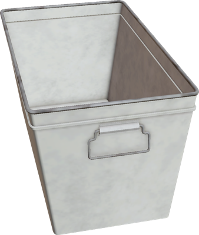

%end

Derived from [Solid](../reference/solid.md).

```
MetalStorageBox {
  SFString   name        "metal storage box"
  SFVec3f    translation 0 0 0
  SFRotation rotation    0 0 1 0
  SFFloat    mass        0
}
```

> **File location**: "[WEBOTS\_HOME/projects/objects/factory/containers/protos/MetalStorageBox.proto]({{ url.github_tree }}/projects/objects/factory/containers/protos/MetalStorageBox.proto)"

> **License**: Copyright Cyberbotics Ltd. Licensed for use only with Webots.
[More information.](https://cyberbotics.com/webots_assets_license)

### PlasticCrate

A plastic crate.

%figure

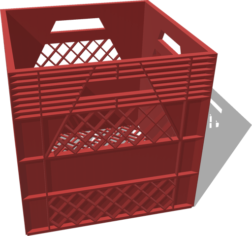

%end

Derived from [Solid](../reference/solid.md).

```
PlasticCrate {
  SFVec3f    translation 0 0 0
  SFRotation rotation    0 0 1 0
  SFString   name        "plastic crate"
  SFVec3f    size        0.6 0.6 0.6
  SFColor    color       0.9 0.2 0.2
  SFFloat    mass        0
}
```

> **File location**: "[WEBOTS\_HOME/projects/objects/factory/containers/protos/PlasticCrate.proto]({{ url.github_tree }}/projects/objects/factory/containers/protos/PlasticCrate.proto)"

> **License**: Copyright Cyberbotics Ltd. Licensed for use only with Webots.
[More information.](https://cyberbotics.com/webots_assets_license)

### PlasticFruitBox

A plastic box.

%figure

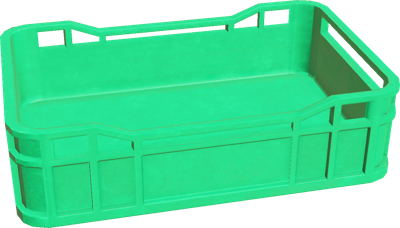

%end

Derived from [Solid](../reference/solid.md).

```
PlasticFruitBox {
  SFString   name        "plastic fruit box"
  SFVec3f    translation 0 0 0
  SFRotation rotation    0 0 1 0
  SFColor    color       0 1 0.5
  SFFloat    mass        0
}
```

> **File location**: "[WEBOTS\_HOME/projects/objects/factory/containers/protos/PlasticFruitBox.proto]({{ url.github_tree }}/projects/objects/factory/containers/protos/PlasticFruitBox.proto)"

> **License**: Copyright Cyberbotics Ltd. Licensed for use only with Webots.
[More information.](https://cyberbotics.com/webots_assets_license)

### WoodenBox

A wooden box.

%figure

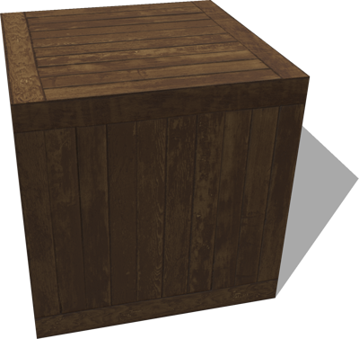

%end

Derived from [Solid](../reference/solid.md).

```
WoodenBox {
  SFVec3f    translation         0 0 0.3
  SFRotation rotation            0 0 1 0
  SFString   name                "wooden box"
  SFVec3f    size                0.6 0.6 0.6
  SFFloat    mass                0
  MFNode     immersionProperties []
  SFBool     locked              FALSE
}
```

> **File location**: "[WEBOTS\_HOME/projects/objects/factory/containers/protos/WoodenBox.proto]({{ url.github_tree }}/projects/objects/factory/containers/protos/WoodenBox.proto)"

> **License**: Copyright Cyberbotics Ltd. Licensed for use only with Webots.
[More information.](https://cyberbotics.com/webots_assets_license)

#### WoodenBox Field Summary

- `size`: Defines the size of the wooden box.

- `mass`: Defines the mass of the wooden box in kg. A value smaller or equal to 0 remove the physics of the wooden box.

## Conveyors

### ConveyorBelt

A customizable conveyor belt moving at a constant speed.

%figure

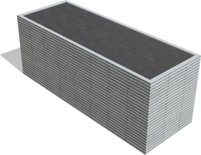

%end

Derived from [Robot](../reference/robot.md).

```
ConveyorBelt {
  SFVec3f    translation      0 0 0
  SFRotation rotation         0 0 1 0
  SFString   name             "conveyor belt"
  SFString   window           "<none>"
  SFVec3f    size             1.5 0.5 0.6
  SFNode     appearance       CorrugatedMetal { textureTransform TextureTransform { scale 2 2 } }
  SFFloat    borderThickness  0.03
  SFFloat    borderHeight     0.01
  SFFloat    speed            0.5
  SFFloat    acceleration     -1
  SFFloat    timer            0.0
}
```

> **File location**: "[WEBOTS\_HOME/projects/objects/factory/conveyors/protos/ConveyorBelt.proto]({{ url.github_tree }}/projects/objects/factory/conveyors/protos/ConveyorBelt.proto)"

> **License**: Copyright Cyberbotics Ltd. Licensed for use only with Webots.
[More information.](https://cyberbotics.com/webots_assets_license)

#### ConveyorBelt Field Summary

- `appearance`: Defines the appearance of the conveyor belt.

- `borderThickness`: Defines the thickness of the metal part around the conveyor belt.

- `borderHeight`: Defines the height of the border around the conveyor.

- `speed`: Defines the rubber band speed in meters per second.

- `acceleration`: Defines the acceleration of the conveyor belt.

- `timer`: Defines for how long the conveyor belt should move (it will move forever if set to 0).

### ConveyorPlatform

A controllable conveyor platform.
The default controller makes it move at a constant speed for a configurable amount of time.
The conveyor contains 3 controllable LEDs.

%figure

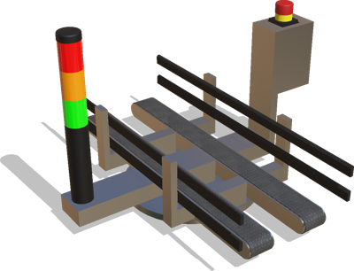

%end

Derived from [Robot](../reference/robot.md).

```
ConveyorPlatform {
   SFVec3f     translation      0 0 0.065
   SFRotation  rotation         0 0 1 0
   SFString    name             "Conveyor platform"
   SFString    model            "Conveyor platform"
   SFString    controller       "conveyor_belt"
   SFString    window           "<none>"
   SFFloat     speed            0.3
   SFFloat     acceleration     -1
   SFFloat     timer            0.0
   SFFloat     textureAnimation 0.5
}
```

> **File location**: "[WEBOTS\_HOME/projects/objects/factory/conveyors/protos/ConveyorPlatform.proto]({{ url.github_tree }}/projects/objects/factory/conveyors/protos/ConveyorPlatform.proto)"

> **License**: Copyright Cyberbotics Ltd. Licensed for use only with Webots.
[More information.](https://cyberbotics.com/webots_assets_license)

#### ConveyorPlatform Field Summary

- `speed`: Defines the rubber band speed in meters per second.

- `acceleration`: Defines the acceleration of the conveyor belt.

- `timer`: Defines for how long the conveyor belt should move (it will move forever if set to 0).

- `textureAnimation`: Defines the speed of the texture animation.

## Fire Extinguisher

### FireExtinguisher

A simple fire extinguisher with optional physics.

%figure

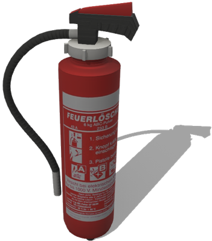

%end

Derived from [Solid](../reference/solid.md).

```
FireExtinguisher {
  SFVec3f    translation     0 0 0
  SFRotation rotation        0 0 1 0
  SFString   name            "fire extinguisher"
  SFBool     enablePhysics   TRUE
}
```

> **File location**: "[WEBOTS\_HOME/projects/objects/factory/fire\_extinguisher/protos/FireExtinguisher.proto]({{ url.github_tree }}/projects/objects/factory/fire_extinguisher/protos/FireExtinguisher.proto)"

> **License**: Attribution-NonCommercial 4.0 International (original model by 3DHaupt)
[More information.](https://creativecommons.org/licenses/by-nc/4.0)

#### FireExtinguisher Field Summary

- `enablePhysics`: Defines whether the fire extinguisher should have physics.

## Forklift

### Forklift PROTO

A simple forklift with optional physics.

%figure

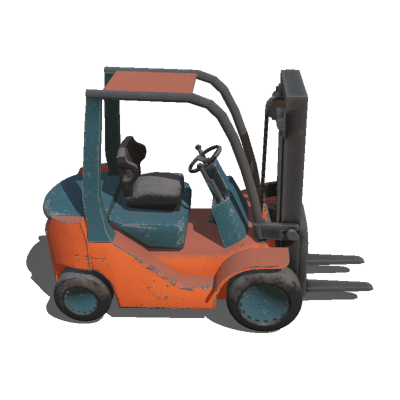

%end

Derived from [Solid](../reference/solid.md).

```
Forklift {
  SFVec3f    translation     0 0 0.81
  SFRotation rotation        0 0 1 0
  SFString   name            "forklift"
  SFBool     enablePhysics   TRUE
}
```

> **File location**: "[WEBOTS\_HOME/projects/objects/factory/forklift/protos/Forklift.proto]({{ url.github_tree }}/projects/objects/factory/forklift/protos/Forklift.proto)"

> **License**: Copyright Cyberbotics Ltd. Licensed for use only with Webots.
[More information.](https://cyberbotics.com/webots_assets_license)

#### Forklift Field Summary

- `enablePhysics`: Defines whether the forklift should have physics.

## Gas Canister

### GasCanister

A simple gas canister with optional physics.

%figure

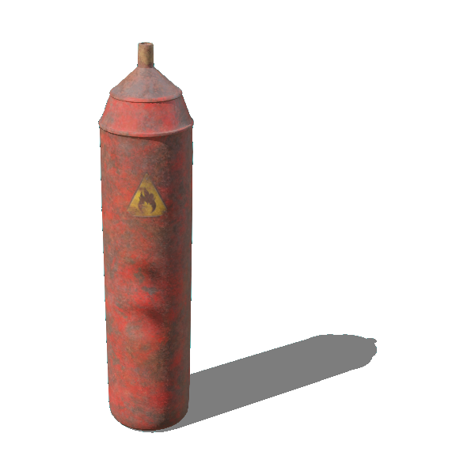

%end

Derived from [Solid](../reference/solid.md).

```
GasCanister {
  SFVec3f    translation     0 0 0
  SFRotation rotation        0 0 1 0
  SFString   name            "gas canister"
  SFBool     enablePhysics   TRUE
}
```

> **File location**: "[WEBOTS\_HOME/projects/objects/factory/gas\_canister/protos/GasCanister.proto]({{ url.github_tree }}/projects/objects/factory/gas_canister/protos/GasCanister.proto)"

> **License**: Copyright Cyberbotics Ltd. Licensed for use only with Webots.
[More information.](https://cyberbotics.com/webots_assets_license)

#### GasCanister Field Summary

- `enablePhysics`: Defines whether the fire extinguisher should have physics.

## Manhole

### SquareManhole

A simple square manhole.

%figure

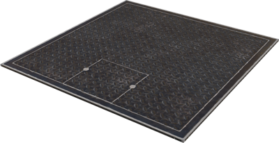

%end

Derived from [Solid](../reference/solid.md).

```
SquareManhole {
  SFVec3f    translation           0 0 0
  SFRotation rotation              0 0 1 0
  SFString   name                  "manhole"
  SFVec3f    size                  1 1 0.1
  SFBool     enableBoundingObject  TRUE
}
```

> **File location**: "[WEBOTS\_HOME/projects/objects/factory/manhole/protos/SquareManhole.proto]({{ url.github_tree }}/projects/objects/factory/manhole/protos/SquareManhole.proto)"

> **License**: Copyright Cyberbotics Ltd. Licensed for use only with Webots.
[More information.](https://cyberbotics.com/webots_assets_license)

#### SquareManhole Field Summary

- `size`: Defines the size of the manhole.

- `enableBoundingObject`: Defines whether the manhole should have a bounding object.

## Pallet

### WoodenPallet

Simple and configurable wooden pallet.

%figure

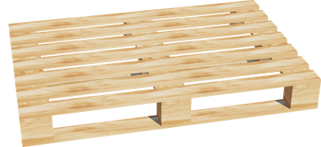

%end

Derived from [Solid](../reference/solid.md).

```
WoodenPallet {
  SFVec3f    translation    0 0 0
  SFRotation rotation       0 0 1 0
  SFString   name           "wooden pallet"
  SFVec3f    size           1.2 0.8 0.14
  SFInt32    lathNumber     6
  SFFloat    lathWidth      0.08
  SFFloat    mass           0
  SFBool     boundingObject TRUE
  SFBool     locked         FALSE
}
```

> **File location**: "[WEBOTS\_HOME/projects/objects/factory/pallet/protos/WoodenPallet.proto]({{ url.github_tree }}/projects/objects/factory/pallet/protos/WoodenPallet.proto)"

> **License**: Copyright Cyberbotics Ltd. Licensed for use only with Webots.
[More information.](https://cyberbotics.com/webots_assets_license)

#### WoodenPallet Field Summary

- `size`: Defines the size of the pallet.

- `lathNumber`: Defines the number of lath of the pallet.

- `lathWidth`: Defines the width of one lath.

- `mass`: Defines the mass of the pallet in kg. A value smaller or equal to 0 remove the physics of the pallet.

- `boundingObject`: Defines whether the bounding object should be enabled.

### WoodenPalletStack

Simple and configurable wooden pallet stack.

%figure

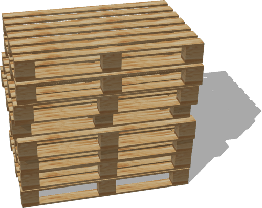

%end

Derived from [Solid](../reference/solid.md).

```
WoodenPalletStack {
  SFVec3f    translation              0 0 0
  SFRotation rotation                 0 0 1 0
  SFString   name                     "wooden pallet stack"
  SFInt32    palletNumber             8
  SFVec3f    palletSize               1.2 0.8 0.14
  SFInt32    palletLathNumber         6
  SFFloat    palletLathWidth          0.08
  SFFloat    lateralMisalignment      0.1
  SFFloat    longitudinalMisalignment 0.05
  SFFloat    palletMass               0
  SFBool     boundingObject           TRUE
  SFBool     locked                   FALSE
}
```

> **File location**: "[WEBOTS\_HOME/projects/objects/factory/pallet/protos/WoodenPalletStack.proto]({{ url.github_tree }}/projects/objects/factory/pallet/protos/WoodenPalletStack.proto)"

> **License**: Copyright Cyberbotics Ltd. Licensed for use only with Webots.
[More information.](https://cyberbotics.com/webots_assets_license)

#### WoodenPalletStack Field Summary

- `palletNumber`: Defines the number of pallet in the stack (vertically).

- `palletSize`: Defines the size of one pallet.

- `palletLathNumber`: Defines the number of lath of each pallets.

- `palletLathWidth`: Defines the width of the pallet laths.

- `lateralMisalignment`: Defines the maximum lateral misalignment between two pallets.

- `longitudinalMisalignment`: Defines the maximum longitudinal misalignment between two pallets.

- `palletMass`: Defines the mass of one pallet in kg. A value smaller or equal to 0 remove the physics of the stack.

- `boundingObject`: Defines whether the bounding object should be enabled.

## Pipes

### LJoint

90-degree L-joint for connecting pipes.

%figure

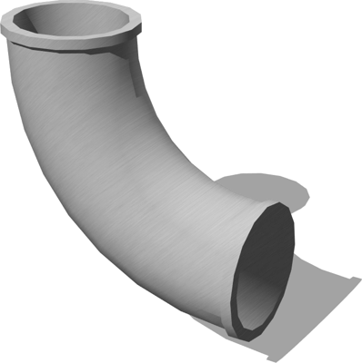

%end

Derived from [Solid](../reference/solid.md).

```
LJoint {
  SFVec3f    translation 0 0 0.08
  SFRotation rotation    0 0 1 0
  SFString   name        "L joint pipe"
  SFVec3f    scale       1 1 1
  SFNode     appearance  OldSteel { textureTransform TextureTransform { rotation 0.78 scale 2 2 } }
}
```

> **File location**: "[WEBOTS\_HOME/projects/objects/factory/pipes/protos/LJoint.proto]({{ url.github_tree }}/projects/objects/factory/pipes/protos/LJoint.proto)"

> **License**: Copyright Cyberbotics Ltd. Licensed for use only with Webots.
[More information.](https://cyberbotics.com/webots_assets_license)

#### LJoint Field Summary

- `appearance`: Defines the appearance of the pipe.

### PipeSection

A section of pipe.

%figure

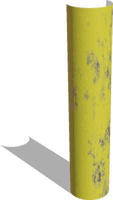

%end

Derived from [Solid](../reference/solid.md).

```
PipeSection {
  SFVec3f    translation   0 0 0.25
  SFRotation rotation      0 0 1 0
  SFString   name          "pipe section"
  SFFloat    height        0.5
  SFFloat    radius        0.03
  SFInt32    subdivision   24
  SFNode     appearance    MetalPipePaint { textureTransform TextureTransform { scale 1 1.5 } }
}
```

> **File location**: "[WEBOTS\_HOME/projects/objects/factory/pipes/protos/PipeSection.proto]({{ url.github_tree }}/projects/objects/factory/pipes/protos/PipeSection.proto)"

> **License**: Copyright Cyberbotics Ltd. Licensed for use only with Webots.
[More information.](https://cyberbotics.com/webots_assets_license)

#### PipeSection Field Summary

- `height`: Defines the height of the pipe.

- `radius`: Defines the radius of the pipe.

- `subdivision`: Defines the number of polygons used to represent the pipe cylinder and so its resolution.

- `appearance`: Defines the appearance of the pipe.

### TJoint

3-slot T-joint for connecting pipes.

%figure

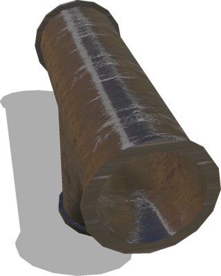

%end

Derived from [Solid](../reference/solid.md).

```
TJoint {
  SFVec3f    translation 0 0 0.07
  SFRotation rotation    0 0 1 0
  SFString   name        "T joint pipe"
  SFVec3f    scale       1 1 1
  SFNode     appearance  OldSteel { textureTransform TextureTransform { scale 3 3 } }
}
```

> **File location**: "[WEBOTS\_HOME/projects/objects/factory/pipes/protos/TJoint.proto]({{ url.github_tree }}/projects/objects/factory/pipes/protos/TJoint.proto)"

> **License**: Copyright Cyberbotics Ltd. Licensed for use only with Webots.
[More information.](https://cyberbotics.com/webots_assets_license)

#### TJoint Field Summary

- `appearance`: Defines the appearance of the pipe.

## Tools

### Bolt

A threaded bolt with variable radius and length.

%figure

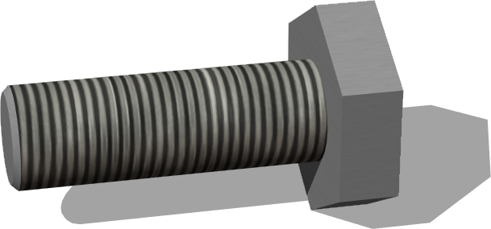

%end

Derived from [Solid](../reference/solid.md).

```
Bolt {
  SFVec3f    translation      0 0 0.013
  SFRotation rotation         0 0 1 0
  SFString   name             "bolt"
  SFNode     appearance       OldSteel {}
  SFFloat    screwRadius      0.0055
  SFFloat    screwLength      0.035
  SFString   contactMaterial  "default"
  SFBool     enablePhysics    TRUE
}
```

> **File location**: "[WEBOTS\_HOME/projects/objects/factory/tools/protos/Bolt.proto]({{ url.github_tree }}/projects/objects/factory/tools/protos/Bolt.proto)"

> **License**: Copyright Cyberbotics Ltd. Licensed for use only with Webots.
[More information.](https://cyberbotics.com/webots_assets_license)

#### Bolt Field Summary

- `appearance`: Defines the appearance of the bolt.

- `screwRadius`: Defines the radius of the screw.

- `screwLength`: Defines the length of the screw.

- `enablePhysics`: Defines whether the bolt should have physics.

### CapScrew

A cap screw with variable radius and length.

%figure

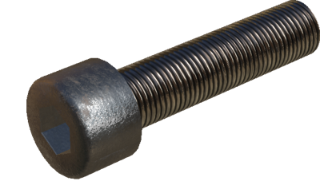

%end

Derived from [Solid](../reference/solid.md).

```
CapScrew {
  SFVec3f    translation           0 0 0.01
  SFRotation rotation              0 0 1 0
  SFString   name                  "cap screw"
  SFNode     appearance            OldSteel {}
  SFFloat    screwRadius           0.006
  SFFloat    screwLength           0.05
  SFString   contactMaterial       "default"
  SFBool     enablePhysics         TRUE
  SFBool     enableBoundingObject  TRUE
}
```

> **File location**: "[WEBOTS\_HOME/projects/objects/factory/tools/protos/CapScrew.proto]({{ url.github_tree }}/projects/objects/factory/tools/protos/CapScrew.proto)"

> **License**: Copyright Cyberbotics Ltd. Licensed for use only with Webots.
[More information.](https://cyberbotics.com/webots_assets_license)

#### CapScrew Field Summary

- `appearance`: Defines the appearance of the screw.

- `screwRadius`: Defines the radius of the screw.

- `screwLength`: Defines the length of the screw.

- `enablePhysics`: Defines whether the screw should have physics.

- `enableBoundingObject`: Defines whether the screw should have a bounding object.

### ElectricalPlug

An electrical plug with a cable of variable path.
The bounding object and physics are optional.

%figure

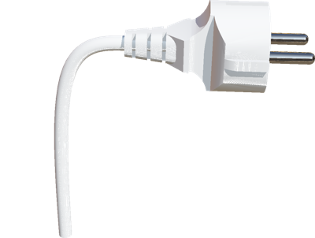

%end

Derived from [Solid](../reference/solid.md).

```
ElectricalPlug {
  SFVec3f    translation           0 0 0
  SFRotation rotation              0 0 1 0
  SFString   name                  "electrical plug"
  SFColor    color                 1 1 1
  MFVec3f    cablePath             [0 0 0, -0.03 0 0, -0.03 0 -0.1]
  SFBool     enablePhysics         TRUE
  SFBool     enableBoundingObject  TRUE
}
```

> **File location**: "[WEBOTS\_HOME/projects/objects/factory/tools/protos/ElectricalPlug.proto]({{ url.github_tree }}/projects/objects/factory/tools/protos/ElectricalPlug.proto)"

> **License**: Copyright Cyberbotics Ltd. Licensed for use only with Webots.
[More information.](https://cyberbotics.com/webots_assets_license)

#### ElectricalPlug Field Summary

- `color`: Defines the color of the plug.

- `cablePath`: Defines the path followed by the cable.

- `enablePhysics`: Defines whether the plug should have physics.

- `enableBoundingObject`: Defines whether the plug should have a bounding object.

### EmergencyButton

An emergency button with an optional position sensor.

%figure

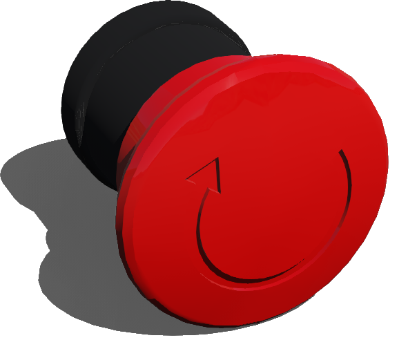

%end

Derived from [Solid](../reference/solid.md).

```
EmergencyButton {
  SFVec3f    translation            0 0 0
  SFRotation rotation               0 0 1 0
  SFString   name                   "emergency button"
  SFBool     includePositionSensor  FALSE
}
```

> **File location**: "[WEBOTS\_HOME/projects/objects/factory/tools/protos/EmergencyButton.proto]({{ url.github_tree }}/projects/objects/factory/tools/protos/EmergencyButton.proto)"

> **License**: Copyright Cyberbotics Ltd. Licensed for use only with Webots.
[More information.](https://cyberbotics.com/webots_assets_license)

#### EmergencyButton Field Summary

- `includePositionSensor`: Defines if a [PositionSensor](../reference/positionsensor.md) node should be included to retrieve the button position.

### EyeScrew

An eye screw with variable radius and length.

%figure

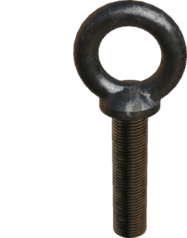

%end

Derived from [Solid](../reference/solid.md).

```
EyeScrew {
  SFVec3f    translation      0 0 0.01
  SFRotation rotation         0 0 1 0
  SFString   name             "eye screw"
  SFNode     appearance       OldSteel { colorOverride 0.73 0.74 0.71 }
  SFFloat    screwRadius      0.006
  SFFloat    screwLength      0.05
  SFString   contactMaterial  "default"
  SFBool     enablePhysics    TRUE
}
```

> **File location**: "[WEBOTS\_HOME/projects/objects/factory/tools/protos/EyeScrew.proto]({{ url.github_tree }}/projects/objects/factory/tools/protos/EyeScrew.proto)"

> **License**: Copyright Cyberbotics Ltd. Licensed for use only with Webots.
[More information.](https://cyberbotics.com/webots_assets_license)

#### EyeScrew Field Summary

- `appearance`: Defines the appearance of the screw.

- `screwRadius`: Defines the radius of the screw.

- `screwLength`: Defines the length of the screw.

- `enablePhysics`: Defines whether the eye screw should have physics.

### Hammer

A 25cm asymmetric club hammer.

%figure

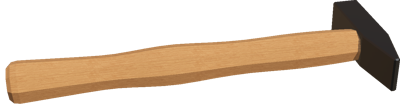

%end

Derived from [Solid](../reference/solid.md).

```
Hammer {
  SFVec3f    translation     0 0 0.014
  SFRotation rotation        0 0 1 0
  SFString   name            "hammer"
  SFString   contactMaterial "default"
}
```

> **File location**: "[WEBOTS\_HOME/projects/objects/factory/tools/protos/Hammer.proto]({{ url.github_tree }}/projects/objects/factory/tools/protos/Hammer.proto)"

> **License**: Copyright Cyberbotics Ltd. Licensed for use only with Webots.
[More information.](https://cyberbotics.com/webots_assets_license)

### Nut

A hexagonal nut.

%figure


%end

Derived from [Solid](../reference/solid.md).

```
Nut {
  SFVec3f    translation     0 0 0.012
  SFRotation rotation        0 0 1 0
  SFString   name            "nut"
  SFNode     appearance      OldSteel {}
  SFFloat    innerRadius     0.006
  SFFloat    thickness       0.007
  SFString   contactMaterial "default"
  SFBool     enablePhysics    TRUE
}
```

> **File location**: "[WEBOTS\_HOME/projects/objects/factory/tools/protos/Nut.proto]({{ url.github_tree }}/projects/objects/factory/tools/protos/Nut.proto)"

> **License**: Copyright Cyberbotics Ltd. Licensed for use only with Webots.
[More information.](https://cyberbotics.com/webots_assets_license)

#### Nut Field Summary

- `appearance`: Defines the appearance of the nut.

- `innerRadius`: Defines the inner radius of the nut.

- `thickness`: Defines the thickness of the nut.

- `enablePhysics`: Defines whether the nut should have physics.

### PaintBucket

A 4kg bucket of paint, with HingeJoint-based handle.

%figure

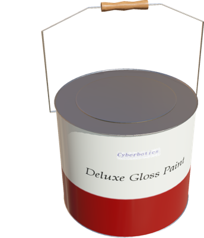

%end

Derived from [Solid](../reference/solid.md).

```
PaintBucket {
  SFVec3f    translation     0 0 0
  SFRotation rotation        0 0 1 0
  SFString   name            "paint bucket"
  SFString   contactMaterial "default"
}
```

> **File location**: "[WEBOTS\_HOME/projects/objects/factory/tools/protos/PaintBucket.proto]({{ url.github_tree }}/projects/objects/factory/tools/protos/PaintBucket.proto)"

> **License**: Copyright Cyberbotics Ltd. Licensed for use only with Webots.
[More information.](https://cyberbotics.com/webots_assets_license)

### PlatformCart

A platform cart with overall dimensions 90Lx50Wx85H cm.

%figure

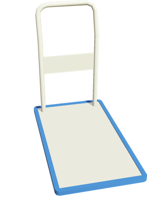

%end

Derived from [Solid](../reference/solid.md).

```
PlatformCart {
  SFVec3f    translation 0 0 0
  SFRotation rotation    0 0 1 0
  SFString   name        "platform cart"
  MFNode     slot        []
  SFNode     physics     Physics {}
}
```

> **File location**: "[WEBOTS\_HOME/projects/objects/factory/tools/protos/PlatformCart.proto]({{ url.github_tree }}/projects/objects/factory/tools/protos/PlatformCart.proto)"

> **License**: Copyright Cyberbotics Ltd. Licensed for use only with Webots.
[More information.](https://cyberbotics.com/webots_assets_license)

#### PlatformCart Field Summary

- `slot`: Extends the cart with new nodes in the slot.

### ScrewHole

A screw hole with variable radius and depth.

%figure

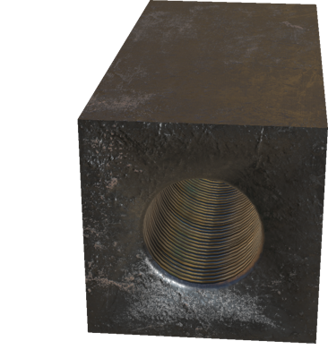

%end

Derived from [Transform](../reference/transform.md).

```
ScrewHole {
  SFVec3f    translation     0 0 0.2
  SFRotation rotation        0 0 1 0
  SFFloat    radius          0.06
  SFFloat    depth           0.1
  SFNode     appearance      OldSteel {}
}
```

> **File location**: "[WEBOTS\_HOME/projects/objects/factory/tools/protos/ScrewHole.proto]({{ url.github_tree }}/projects/objects/factory/tools/protos/ScrewHole.proto)"

> **License**: Copyright Cyberbotics Ltd. Licensed for use only with Webots.
[More information.](https://cyberbotics.com/webots_assets_license)

#### ScrewHole Field Summary

- `radius`: Defines the radius of the screw hole.

- `depth`: Defines the depth of the screw hole.

- `appearance`: Defines the appearance of the screw hole.

### Screwdriver

A Philips screwdriver. The blade and handle are balanced.

%figure

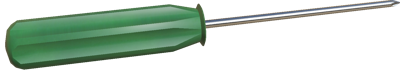

%end

Derived from [Solid](../reference/solid.md).

```
Screwdriver {
  SFVec3f    translation     0 0 0.012
  SFRotation rotation        0 0 1 0
  SFString   name            "screwdriver"
  SFString   contactMaterial "default"
}
```

> **File location**: "[WEBOTS\_HOME/projects/objects/factory/tools/protos/Screwdriver.proto]({{ url.github_tree }}/projects/objects/factory/tools/protos/Screwdriver.proto)"

> **License**: Copyright Cyberbotics Ltd. Licensed for use only with Webots.
[More information.](https://cyberbotics.com/webots_assets_license)

### Washer

A washer with variable radius and thickness.

%figure

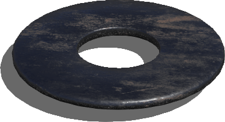

%end

Derived from [Solid](../reference/solid.md).

```
Washer {
  SFVec3f    translation     0 0 0.016
  SFRotation rotation        0 0 1 0
  SFString   name            "washer"
  SFNode     appearance       OldSteel {}
  SFFloat    innerRadius      0.006
  SFFloat    thickness        0.0017
  SFString   contactMaterial "default"
  SFBool     enablePhysics   TRUE
}
```

> **File location**: "[WEBOTS\_HOME/projects/objects/factory/tools/protos/Washer.proto]({{ url.github_tree }}/projects/objects/factory/tools/protos/Washer.proto)"

> **License**: Copyright Cyberbotics Ltd. Licensed for use only with Webots.
[More information.](https://cyberbotics.com/webots_assets_license)

#### Washer Field Summary

- `appearance`: Defines the appearance of the washer.

- `innerRadius`: Defines the inner radius of the washer.

- `thickness`: Defines the thickness of the washer.

- `enablePhysics`: Defines whether the washer should have physics.

### Wrench

A 15cm Open-End wrench.

%figure

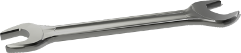

%end

Derived from [Solid](../reference/solid.md).

```
Wrench {
  SFVec3f    translation     0 0 0
  SFRotation rotation        0 0 1 0
  SFString   name            "wrench"
  SFNode     appearance       OldSteel {}
  SFString   contactMaterial "default"
}
```

> **File location**: "[WEBOTS\_HOME/projects/objects/factory/tools/protos/Wrench.proto]({{ url.github_tree }}/projects/objects/factory/tools/protos/Wrench.proto)"

> **License**: Copyright Cyberbotics Ltd. Licensed for use only with Webots.
[More information.](https://cyberbotics.com/webots_assets_license)

#### Wrench Field Summary

- `appearance`: Defines the appearance of the wrench.

## Valves

### LargeValve

Large Wheel-based valve. Handle can be moved in either direction by the angle (radians) in the "absolute stop" field.

%figure

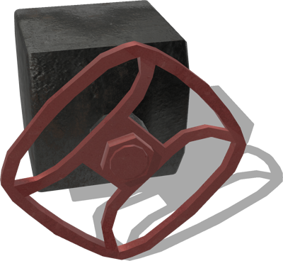

%end

Derived from [Robot](../reference/robot.md).

```
LargeValve {
  SFVec3f    translation     0 0 0.106
  SFRotation rotation        0 0 1 0
  SFString   name            "large valve"
  SFFloat    jointFriction   0.5
  SFString   controller      "valve_turner"
  SFString   window          "<none>"
  SFBool     supervisor      FALSE
  MFString   absoluteStop    "15.7079632679"
  SFString   contactMaterial "default"
}
```

> **File location**: "[WEBOTS\_HOME/projects/objects/factory/valves/protos/LargeValve.proto]({{ url.github_tree }}/projects/objects/factory/valves/protos/LargeValve.proto)"

> **License**: Copyright Cyberbotics Ltd. Licensed for use only with Webots.
[More information.](https://cyberbotics.com/webots_assets_license)

#### LargeValve Field Summary

- `jointFriction`: Defines the static friction of the valve joint.

- `controller`: Defines the controller of the valve which is used to limit its rotation.

- `absoluteStop`: Defines the maximum rotational angle in radians. This value is sent to the controller using the controllerArgs field.

### LeverValve

Lever-based valve. Handle can be moved in either direction (from up) of 45 degrees.

%figure

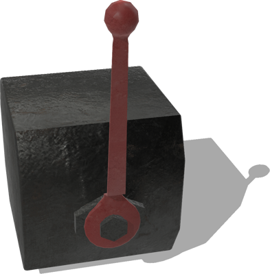

%end

Derived from [Solid](../reference/solid.md).

```
LeverValve {
  SFVec3f    translation   0 0 0.142
  SFRotation rotation      0 0 1 0
  SFString   name          "lever valve"
  SFFloat    jointFriction 1
  SFVec3f    scale         0.7 0.7 0.7
}
```

> **File location**: "[WEBOTS\_HOME/projects/objects/factory/valves/protos/LeverValve.proto]({{ url.github_tree }}/projects/objects/factory/valves/protos/LeverValve.proto)"

> **License**: Copyright Cyberbotics Ltd. Licensed for use only with Webots.
[More information.](https://cyberbotics.com/webots_assets_license)

#### LeverValve Field Summary

- `jointFriction`: Defines the static friction of the valve joint.

### SmallValve

Small Wheel-based valve. Handle can be moved in either direction by the angle (radians) in the "absolute stop" field.

%figure

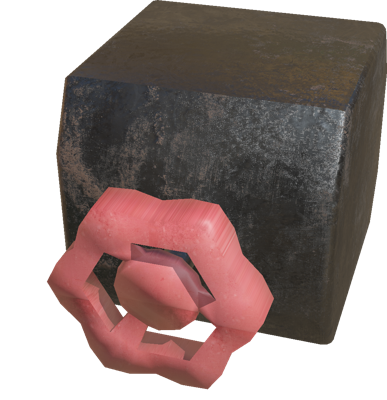

%end

Derived from [Robot](../reference/robot.md).

```
SmallValve {
  SFVec3f    translation   0 0 0.077
  SFRotation rotation      0 0 1 0
  SFString   name          "small valve"
  SFFloat    jointFriction 0.1
  SFString   controller    "valve_turner"
  SFString   window        "<none>"
  SFBool     supervisor    FALSE
  MFString   absoluteStop  "15.7079632679"
}
```

> **File location**: "[WEBOTS\_HOME/projects/objects/factory/valves/protos/SmallValve.proto]({{ url.github_tree }}/projects/objects/factory/valves/protos/SmallValve.proto)"

> **License**: Copyright Cyberbotics Ltd. Licensed for use only with Webots.
[More information.](https://cyberbotics.com/webots_assets_license)

#### SmallValve Field Summary

- `jointFriction`: Defines the static friction of the valve joint.

- `controller`: Defines the controller of the valve which is used to limit its rotation.

- `absoluteStop`: Defines the maximum rotational angle in radians. This value is sent to the controller using the controllerArgs field.

