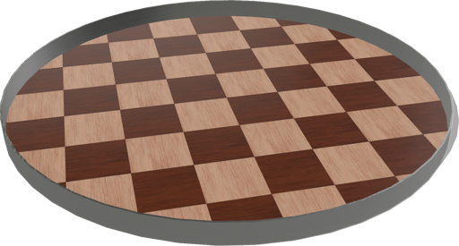
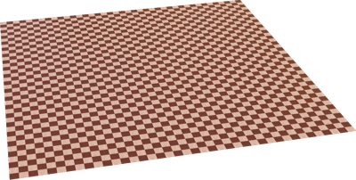
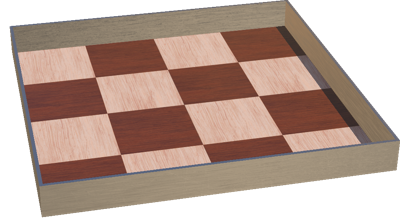
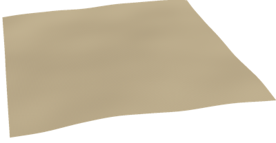

# Floors

## CircleArena

A configurable circle arena composed of floor surrounded by wall.

%figure



%end

Derived from [Solid](../reference/solid.md).

```
CircleArena {
  SFVec3f    translation     0 0 0
  SFRotation rotation        0 1 0 0
  SFString   name            "circle arena"
  SFFloat    radius          1.0
  SFString   contactMaterial "default"
  SFNode     floorAppearance Parquetry { type "chequered" }
  SFVec2f    floorTileSize   0.5 0.5
  SFFloat    wallThickness   0.01
  SFFloat    wallHeight      0.1
  SFNode     wallAppearance  BrushedAluminium {}
  SFInt32    subdivision     48
  MFColor    recognitionColors []
}
```

> **File location**: "[WEBOTS\_HOME/projects/objects/floors/protos/CircleArena.proto]({{ url.github_tree }}/projects/objects/floors/protos/CircleArena.proto)"

> **License**: Copyright Cyberbotics Ltd. Licensed for use only with Webots.
[More information.](https://cyberbotics.com/webots_assets_license)

### CircleArena Field Summary

- `radius`: Defines the radius of the arena.

- `floorAppearance`: Defines the appearance of the floor.

- `floorTileSize`: Defines the size of the texture used for the floor.

- `wallThickness`: Defines the thickness of the wall.

- `wallHeight`: Defines the height of the wall.

- `wallAppearance`: Defines the appearance of the wall.

- `subdivision`: Defines the subdivision of the wall cylinder.

## Floor

Configurable standard flat floor.

%figure



%end

Derived from [Solid](../reference/solid.md).

```
Floor {
  SFVec3f    translation     0 0 0
  SFRotation rotation        0 1 0 0
  SFString   name            "floor"
  SFString   contactMaterial "default"
  SFVec2f    size            10 10
  SFVec2f    tileSize        0.5 0.5
  SFNode     appearance      Parquetry { type "chequered" }
  MFColor    recognitionColors []
}
```

> **File location**: "[WEBOTS\_HOME/projects/objects/floors/protos/Floor.proto]({{ url.github_tree }}/projects/objects/floors/protos/Floor.proto)"

> **License**: Copyright Cyberbotics Ltd. Licensed for use only with Webots.
[More information.](https://cyberbotics.com/webots_assets_license)

### Floor Field Summary

- `size`: Defines the size of the floor.

- `tileSize`: Defines the size of texture used for the floor.

- `appearance`: Defines the appearance of the floor.

## RectangleArena

A configurable rectangle arena composed of a floor surrounded by walls.

%figure



%end

Derived from [Solid](../reference/solid.md).

```
RectangleArena {
  SFVec3f    translation     0 0 0
  SFRotation rotation        0 1 0 0
  SFString   name            "rectangle arena"
  SFString   contactMaterial "default"
  SFVec2f    floorSize       1 1
  SFVec2f    floorTileSize   0.5 0.5
  SFNode     floorAppearance Parquetry { type "chequered" }
  SFFloat    wallThickness   0.01
  SFFloat    wallHeight      0.1
  SFNode     wallAppearance  BrushedAluminium {}
  MFColor    recognitionColors []
}
```

> **File location**: "[WEBOTS\_HOME/projects/objects/floors/protos/RectangleArena.proto]({{ url.github_tree }}/projects/objects/floors/protos/RectangleArena.proto)"

> **License**: Copyright Cyberbotics Ltd. Licensed for use only with Webots.
[More information.](https://cyberbotics.com/webots_assets_license)

### RectangleArena Field Summary

- `floorSize`: Defines the size of the floor.

- `floorTileSize`: Defines the size of the texture used for the floor.

- `floorAppearance`: Defines the appearance of the floor.

- `wallThickness`: Defines the thickness of the walls.

- `wallHeight`: Defines the height of the walls.

- `wallAppearance`: Defines the appearance of the wall.

## UnevenTerrain

Randomly generated uneven terrain based on Perlin noise.

%figure



%end

Derived from [Solid](../reference/solid.md).

```
UnevenTerrain {
  SFVec3f    translation    0 0 0
  SFRotation rotation       0 1 0 0
  SFString   name           "uneven terrain"
  SFVec3f    size           50 5 50
  SFInt32    xDimension     50
  SFInt32    zDimension     50
  SFNode     appearance     SandyGround { textureTransform TextureTransform { scale 50 50 } }
  SFInt32    randomSeed     1
  SFBool     flatCenter     FALSE
  SFBool     flatBounds     FALSE
  SFInt32    perlinNOctaves 3
}
```

> **File location**: "[WEBOTS\_HOME/projects/objects/floors/protos/UnevenTerrain.proto]({{ url.github_tree }}/projects/objects/floors/protos/UnevenTerrain.proto)"

> **License**: Copyright Cyberbotics Ltd. Licensed for use only with Webots.
[More information.](https://cyberbotics.com/webots_assets_license)

### UnevenTerrain Field Summary

- `size`: Defines the size of the terrain.

- `xDimension`: Defines the number of points in the grid height array in the x direction.

- `zDimension`: Defines the number of points in the grid height array in the y direction.

- `appearance`: Defines the appearance of the terrain.

- `randomSeed`: Defines the seed of the random number generator. A value smaller or equal to 0 sets a random seed.

- `flatCenter`: Defines whether the center of the terrain should be flat.

- `flatBounds`: Defines whether the bounds of the terrain should be flat.

- `perlinNOctaves`: Defines the number of octaves of the perlin noise.

