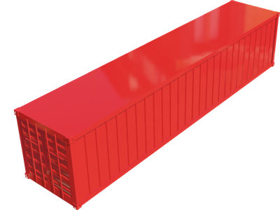
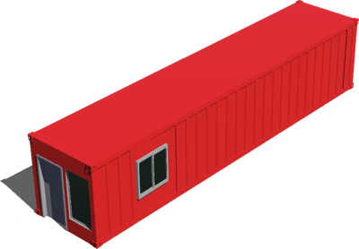

# Freight

## IntermodalContainer

An intermodal container is a large standardized shipping container, designed and built for intermodal freight transport, meaning these containers can be used across different modes of transport – from ship to rail to truck – without unloading and reloading their cargo.

%figure



%end

Derived from [Solid](../reference/solid.md).

```
IntermodalContainer {
  SFVec3f    translation  0 0 0
  SFRotation rotation     0 1 0 0
  SFString   name         "container"
  SFColor    color        0.9 0.1 0.1
  MFColor    recognitionColors []
}
```

> **File location**: "[WEBOTS\_HOME/projects/objects/freight/protos/IntermodalContainer.proto]({{ url.github_tree }}/projects/objects/freight/protos/IntermodalContainer.proto)"

> **License**: Copyright Cyberbotics Ltd. Licensed for use only with Webots.
[More information.](https://cyberbotics.com/webots_assets_license)

### IntermodalContainer Field Summary

- `color`: Defines the color.

## IntermodalOfficeContainer

An intermodal container is a large standardized shipping container, designed and built for intermodal freight transport, meaning these containers can be used across different modes of transport – from ship to rail to truck – without unloading and reloading their cargo.
An intermodal container with an office room.

%figure



%end

Derived from [Solid](../reference/solid.md).

```
IntermodalOfficeContainer {
  SFVec3f    translation    0 0 0
  SFRotation rotation       0 1 0 0
  SFString   name           "office"
  SFColor    primaryColor   0.9 0.1 0.1
  SFColor    secondaryColor 0.6 0.6 0.6
  MFColor    recognitionColors []
}
```

> **File location**: "[WEBOTS\_HOME/projects/objects/freight/protos/IntermodalOfficeContainer.proto]({{ url.github_tree }}/projects/objects/freight/protos/IntermodalOfficeContainer.proto)"

> **License**: Copyright Cyberbotics Ltd. Licensed for use only with Webots.
[More information.](https://cyberbotics.com/webots_assets_license)

### IntermodalOfficeContainer Field Summary

- `primaryColor`: Defines the primary color.

- `secondaryColor`: Defines the secondary color.

