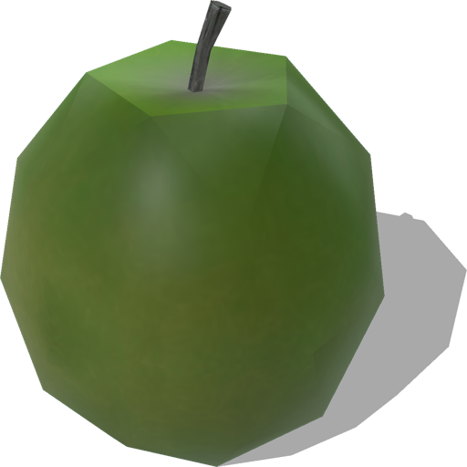
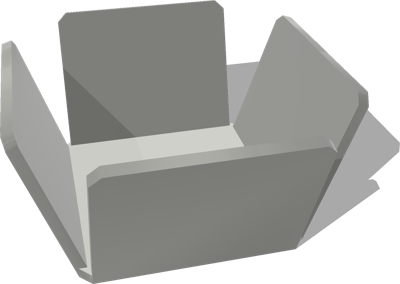
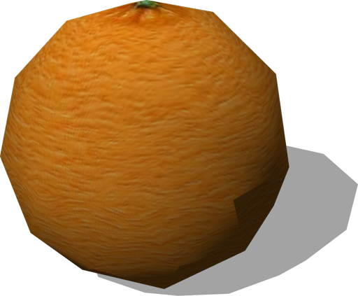

# Fruits

## Apple

An apple (0.05 x 0.05 x 0.05 m).

%figure



%end

Derived from [Solid](../reference/solid.md).

```
Apple {
  SFVec3f    translation         0 0.05 0
  SFRotation rotation            0 1 0 0
  SFString   name                "apple"
  SFFloat    mass                0.15
  MFNode     immersionProperties []
}
```

> **File location**: "[WEBOTS\_HOME/projects/objects/fruits/protos/Apple.proto](https://github.com/cyberbotics/webots/tree/master/projects/objects/fruits/protos/Apple.proto)"

> **License**: Copyright Cyberbotics Ltd. Licensed for use only with Webots.
[More information.](https://cyberbotics.com/webots_assets_license)

### Apple Field Summary

- `mass`: Defines the mass of the apple in kg.

## FruitBowl

A fruit bowl (0.146 x 0.146 x 0.146 m).

%figure



%end

Derived from [Solid](../reference/solid.md).

```
FruitBowl {
  SFVec3f    translation 0 0 0
  SFRotation rotation    0 1 0 0
  SFString   name        "fruit bowl"
  SFColor    color       1 1 1
  SFFloat    mass        0.5
}
```

> **File location**: "[WEBOTS\_HOME/projects/objects/fruits/protos/FruitBowl.proto](https://github.com/cyberbotics/webots/tree/master/projects/objects/fruits/protos/FruitBowl.proto)"

> **License**: Copyright Cyberbotics Ltd. Licensed for use only with Webots.
[More information.](https://cyberbotics.com/webots_assets_license)

### FruitBowl Field Summary

- `color`: Defines the color of the bowl.

- `mass`: Defines the mass of the bowl in kg.

## Orange

An orange (0.05 x 0.05 x 0.05 m).

%figure



%end

Derived from [Solid](../reference/solid.md).

```
Orange {
  SFVec3f    translation 0 0.05 0
  SFRotation rotation    0 1 0 0
  SFString   name        "orange"
  SFFloat    mass        0.15
}
```

> **File location**: "[WEBOTS\_HOME/projects/objects/fruits/protos/Orange.proto](https://github.com/cyberbotics/webots/tree/master/projects/objects/fruits/protos/Orange.proto)"

> **License**: Copyright Cyberbotics Ltd. Licensed for use only with Webots.
[More information.](https://cyberbotics.com/webots_assets_license)

### Orange Field Summary

- `mass`: Defines the mass of the orange in kg.

