# Garden

## Barbecue

A barbecue with optional physics.

%figure

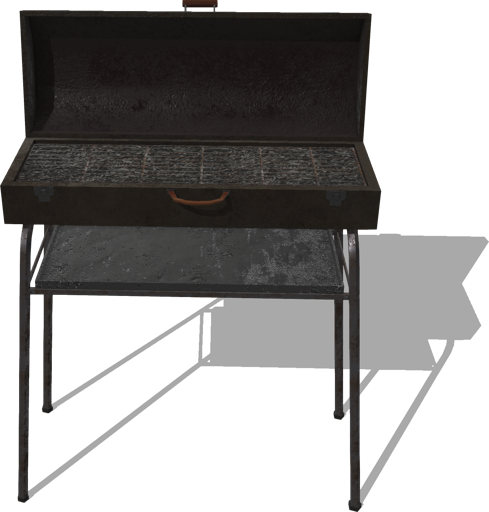

%end

Derived from [Solid](../reference/solid.md).

```
Barbecue {
  SFVec3f    translation     0 0 0
  SFRotation rotation        0 1 0 0
  SFString   name            "barbecue"
  SFBool     enablePhysics   FALSE
}
```

> **File location**: "[WEBOTS\_HOME/projects/objects/garden/protos/Barbecue.proto](https://github.com/cyberbotics/webots/tree/master/projects/objects/garden/protos/Barbecue.proto)"

> **License**: Creative Commons Attribution 4.0 International License.
[More information.](https://creativecommons.org/licenses/by/4.0/legalcode)

### Barbecue Field Summary

- `enablePhysics`: Defines whether the barbecue should have physics.

## DogHouse

A dog house.

%figure

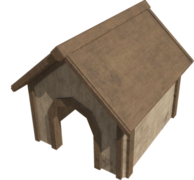

%end

Derived from [Solid](../reference/solid.md).

```
DogHouse {
  SFVec3f    translation 0 0 0
  SFRotation rotation    0 1 0 0
  SFString   name        "dog house"
}
```

> **File location**: "[WEBOTS\_HOME/projects/objects/garden/protos/DogHouse.proto](https://github.com/cyberbotics/webots/tree/master/projects/objects/garden/protos/DogHouse.proto)"

> **License**: Creative Commons Attribution 4.0 International License.
[More information.](https://creativecommons.org/licenses/by/4.0/legalcode)

## Gnome

A gnome with optional physics.

%figure

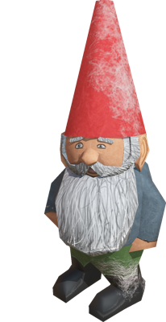

%end

Derived from [Solid](../reference/solid.md).

```
Gnome {
  SFVec3f    translation    0 0 0
  SFRotation rotation       0 1 0 0
  SFString   name           "gnome"
  SFBool     enablePhysics  FALSE
}
```

> **File location**: "[WEBOTS\_HOME/projects/objects/garden/protos/Gnome.proto](https://github.com/cyberbotics/webots/tree/master/projects/objects/garden/protos/Gnome.proto)"

> **License**: Creative Commons Attribution 4.0 International License.
[More information.](https://creativecommons.org/licenses/by/4.0/legalcode)

### Gnome Field Summary

- `enablePhysics`: Defines whether the gnome should have physics.

## Pergolas

A pergola.

%figure

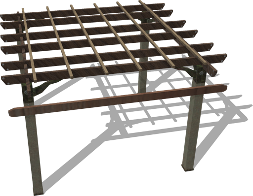

%end

Derived from [Solid](../reference/solid.md).

```
Pergolas {
  SFVec3f    translation 0 0 0
  SFRotation rotation    0 1 0 0
  SFString   name        "pergola"
}
```

> **File location**: "[WEBOTS\_HOME/projects/objects/garden/protos/Pergolas.proto](https://github.com/cyberbotics/webots/tree/master/projects/objects/garden/protos/Pergolas.proto)"

> **License**: Creative Commons Attribution 4.0 International License.
[More information.](https://creativecommons.org/licenses/by/4.0/legalcode)

## PicketFence

A picket fence made of several segments with optional boundingObject.
Each segment is made of 11 pickets.

%figure

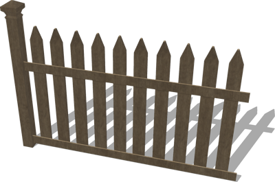

%end

Derived from [Solid](../reference/solid.md).

```
PicketFence {
  SFVec3f    translation            0 0 0
  SFRotation rotation               0 1 0 0
  SFString   name                   "picket fence"
  SFInt32    numberOfSegments       1
  SFBool     enableBoundingObject   TRUE
}
```

> **File location**: "[WEBOTS\_HOME/projects/objects/garden/protos/PicketFence.proto](https://github.com/cyberbotics/webots/tree/master/projects/objects/garden/protos/PicketFence.proto)"

> **License**: Creative Commons Attribution 4.0 International License.
[More information.](https://creativecommons.org/licenses/by/4.0/legalcode)

### PicketFence Field Summary

- `numberOfSegments`: Defines the number of consecutive segments, the width of one segment is 1.7 meters.

- `enableBoundingObject`: Defines whether the fence should have a bounding object.

## PicketFenceWithDoor

A picket fence with a door and optional boundingObject.

%figure

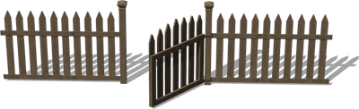

%end

Derived from [Solid](../reference/solid.md).

```
PicketFenceWithDoor {
  SFVec3f    translation           0 0 0
  SFRotation rotation              0 1 0 0
  SFString   name                  "picket fence with door"
  SFBool     enableBoundingObject  TRUE
}
```

> **File location**: "[WEBOTS\_HOME/projects/objects/garden/protos/PicketFenceWithDoor.proto](https://github.com/cyberbotics/webots/tree/master/projects/objects/garden/protos/PicketFenceWithDoor.proto)"

> **License**: Creative Commons Attribution 4.0 International License.
[More information.](https://creativecommons.org/licenses/by/4.0/legalcode)

### PicketFenceWithDoor Field Summary

- `enableBoundingObject`: Defines whether the fence should have a bounding object.

## Slide

A slide.

%figure

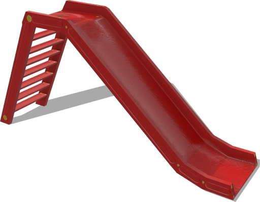

%end

Derived from [Solid](../reference/solid.md).

```
Slide {
  SFVec3f    translation 0 0 0
  SFRotation rotation    0 1 0 0
  SFString   name        "slide"
}
```

> **File location**: "[WEBOTS\_HOME/projects/objects/garden/protos/Slide.proto](https://github.com/cyberbotics/webots/tree/master/projects/objects/garden/protos/Slide.proto)"

> **License**: Creative Commons Attribution 4.0 International License.
[More information.](https://creativecommons.org/licenses/by/4.0/legalcode)

## Swing

A swing.

%figure

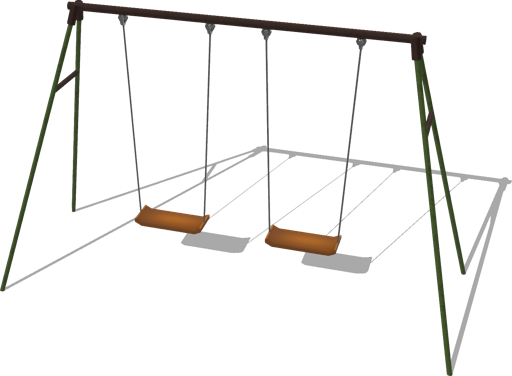

%end

Derived from [Solid](../reference/solid.md).

```
Swing {
  SFVec3f    translation 0 0 0
  SFRotation rotation    0 1 0 0
  SFString   name        "swing"
}
```

> **File location**: "[WEBOTS\_HOME/projects/objects/garden/protos/Swing.proto](https://github.com/cyberbotics/webots/tree/master/projects/objects/garden/protos/Swing.proto)"

> **License**: Creative Commons Attribution 4.0 International License.
[More information.](https://creativecommons.org/licenses/by/4.0/legalcode)

## SwingCouch

A swing couch.

%figure

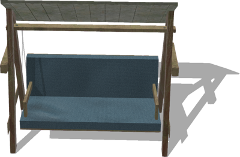

%end

Derived from [Solid](../reference/solid.md).

```
SwingCouch {
  SFVec3f    translation 0 0 0
  SFRotation rotation    0 1 0 0
  SFString   name        "swing couch"
}
```

> **File location**: "[WEBOTS\_HOME/projects/objects/garden/protos/SwingCouch.proto](https://github.com/cyberbotics/webots/tree/master/projects/objects/garden/protos/SwingCouch.proto)"

> **License**: Creative Commons Attribution 4.0 International License.
[More information.](https://creativecommons.org/licenses/by/4.0/legalcode)

## TableWithUmbrella

A table with a central umbrella and optional physics.

%figure

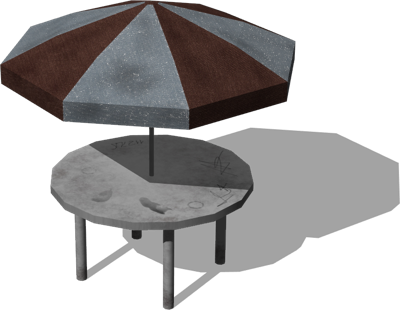

%end

Derived from [Solid](../reference/solid.md).

```
TableWithUmbrella {
  SFVec3f    translation   0 0 0
  SFRotation rotation      0 1 0 0
  SFString   name          "table with umbrella"
  SFBool     enablePhysics FALSE
}
```

> **File location**: "[WEBOTS\_HOME/projects/objects/garden/protos/TableWithUmbrella.proto](https://github.com/cyberbotics/webots/tree/master/projects/objects/garden/protos/TableWithUmbrella.proto)"

> **License**: Creative Commons Attribution 4.0 International License.
[More information.](https://creativecommons.org/licenses/by/4.0/legalcode)

### TableWithUmbrella Field Summary

- `enablePhysics`: Defines whether the table should have physics.

## WateringCan

A watering can with optional physics.

%figure

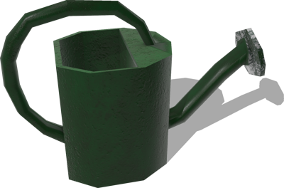

%end

Derived from [Solid](../reference/solid.md).

```
WateringCan {
  SFVec3f    translation    0 0 0
  SFRotation rotation       0 1 0 0
  SFString   name           "watering can"
  SFBool     enablePhysics  FALSE
}
```

> **File location**: "[WEBOTS\_HOME/projects/objects/garden/protos/WateringCan.proto](https://github.com/cyberbotics/webots/tree/master/projects/objects/garden/protos/WateringCan.proto)"

> **License**: Creative Commons Attribution 4.0 International License.
[More information.](https://creativecommons.org/licenses/by/4.0/legalcode)

### WateringCan Field Summary

- `enablePhysics`: Defines whether the watering can should have physics.

## Wheelbarrow

A wheelbarrow with optional physics.

%figure

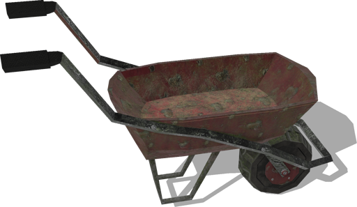

%end

Derived from [Solid](../reference/solid.md).

```
Wheelbarrow {
  SFVec3f    translation    0 0 0
  SFRotation rotation       0 1 0 0
  SFString   name           "wheelbarrow"
  SFBool     enablePhysics  FALSE
}
```

> **File location**: "[WEBOTS\_HOME/projects/objects/garden/protos/Wheelbarrow.proto](https://github.com/cyberbotics/webots/tree/master/projects/objects/garden/protos/Wheelbarrow.proto)"

> **License**: Creative Commons Attribution 4.0 International License.
[More information.](https://creativecommons.org/licenses/by/4.0/legalcode)

### Wheelbarrow Field Summary

- `enablePhysics`: Defines whether the wheelbarrow should have physics.

