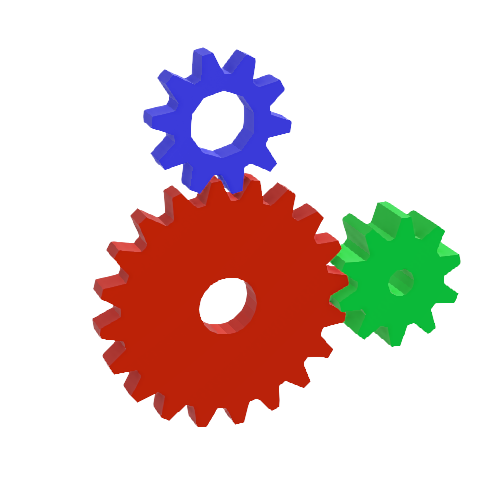

# Gear

## Gear PROTO

Generic gear generator, inspired by Brian Paul's glxgears demo.

%figure



%end

Derived from [Solid](../reference/solid.md).

```
Gear {
  SFVec3f     translation            0 0 0
  SFRotation  rotation               0 1 0 0
  SFNode      appearance             PBRAppearance{baseColor 0.533333, 0.541176, 0.521569, roughness 0.5}
  SFString    name                   "gear"
  SFInt32     teeth                  8
  SFFloat     width                  0.01
  SFFloat     innerRadius            0.01
  SFFloat     pitchRadius            0.04
  SFFloat     toothDepth             0.01
  SFFloat     density                0.001
  SFBool      bodyBoundingObject     TRUE
  SFBool      teethBoundingObject    FALSE
  MFColor     recognitionColors      []
}
```

> **File location**: "[WEBOTS\_HOME/projects/objects/gear/protos/Gear.proto]({{ url.github_tree }}/projects/objects/gear/protos/Gear.proto)"

> **License**: Copyright Cyberbotics Ltd. Licensed for use only with Webots.
[More information.](https://cyberbotics.com/webots_assets_license)

### Gear Field Summary

- `name`: Defines the solid's name.

- `teeth`: Defines number of teeth, [8, inf).

- `width`: Defines gear thickness, (0, inf).

- `innerRadius`: Defines the radius of the center hole.

- `pitchRadius`: Defines the radius at center of the teeth.

- `toothDepth`: Defines depth of tooth.

- `density`: Defines the density of the gear. If zero, physics is disabled.

- `bodyBoundingObject`: Enables gear body collision area (cylinder).

- `teethBoundingObject`: Enables a boundingObject on each tooth.

