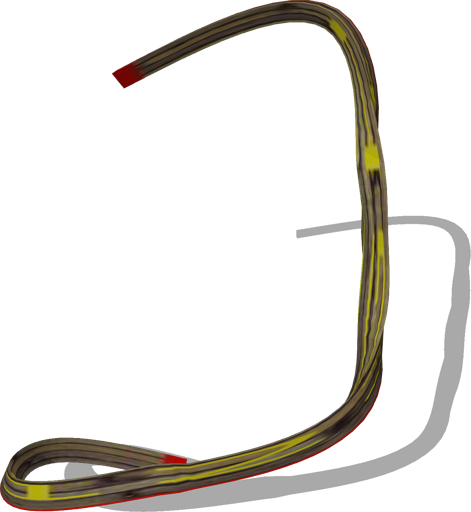
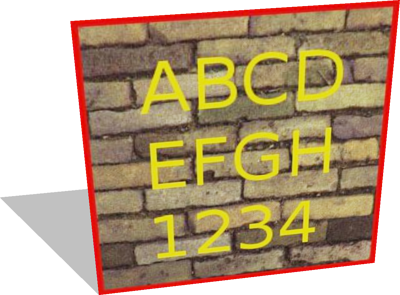
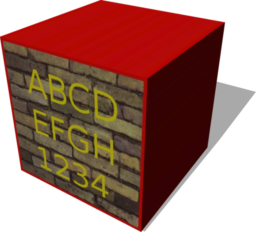
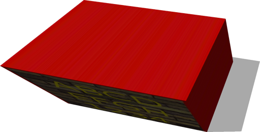

# Geometries

## Extrusion

Generic extrusion geometry.
The shape (defined by the 'crossSection' field) is extruded along the path defined by the field 'spine'.

%figure



%end

Derived from [IndexedFaceSet](../reference/indexedfaceset.md).

```
Extrusion {
  MFVec2f    crossSection              [1 1, 1 -1, -1 -1, -1 1, 1 1]
  MFVec3f    spine                     [0 0 0, 0 1 0]
  MFVec2f    scale                     [1.0 1.0]
  MFRotation orientation               [0 0 1 0]
  SFBool     beginCap                  TRUE
  SFBool     endCap                    TRUE
  SFBool     ccw                       TRUE
  SFBool     solid                     TRUE
  SFBool     convex                    TRUE
  SFFloat    creaseAngle               0.0
  SFInt32    splineSubdivision         4
}
```

> **File location**: "[WEBOTS\_HOME/projects/objects/geometries/protos/Extrusion.proto](https://github.com/cyberbotics/webots/tree/master/projects/objects/geometries/protos/Extrusion.proto)"

> **License**: Copyright Cyberbotics Ltd. Licensed for use only with Webots.
[More information.](https://cyberbotics.com/webots_assets_license)

### Extrusion Field Summary

- `crossSection`: Defines the 2D cross-section of the extrusion.

- `spine`: Defines the 3D extrusion path.

- `scale`: Defines the scale at each point of the spine.

- `orientation`: Defines the orientation of the cross-section at each point of the spine.

- `beginCap`: Defines whether the extrusion should have a cap at the begining.

- `endCap`: Defines whether the extrusion should have a cap at the end.

- `splineSubdivision`: If bigger than 1, defines the B-Spline subdivion of the extrusion along it's path.

## Rectangle

Single/double sided and adjustable rectangle shape.

%figure



%end

Derived from [IndexedFaceSet](../reference/indexedfaceset.md).

```
Rectangle {
  SFVec2f size        0.1 0.1
  SFBool  doubleSided TRUE
}
```

> **File location**: "[WEBOTS\_HOME/projects/objects/geometries/protos/Rectangle.proto](https://github.com/cyberbotics/webots/tree/master/projects/objects/geometries/protos/Rectangle.proto)"

> **License**: Apache License 2.0
[More information.](http://www.apache.org/licenses/LICENSE-2.0)

### Rectangle Field Summary

- `size`: Defines the size of the rectangle shape.

- `doubleSided`: Defines whether the shape has two sides or not.

## TexturedBox

Box with customizable texture mapping.
Available texture mappings:
- `cube` mapping: see texture at projects/samples/geometries/worlds/textures/cube\_mapping.jpg
- `compact` cube mapping: see texture at projects/samples/geometries/worlds/textures/compact\_mapping.jpg
- `flat` mapping: projecting the texture on the front face
- `metric` mapping: similar to default mapping but the texture is not deformed to match each face size
- `default` mapping: same texture on all the faces
- `none`: no texture mapping
If a boolean field (front, back, left, right, top, bottom) is FALSE, then the corresponding face is not drawn.
A demo of these mappings is available in projects/samples/geometries/worlds/textured\_boxes.wbt.

%figure



%end

Derived from [IndexedFaceSet](../reference/indexedfaceset.md).

```
TexturedBox {
  SFVec3f  size    0.1 0.1 0.1
  SFString mapping "flat"
  SFBool   front   TRUE
  SFBool   back    TRUE
  SFBool   left    TRUE
  SFBool   right   TRUE
  SFBool   top     TRUE
  SFBool   bottom  TRUE
}
```

> **File location**: "[WEBOTS\_HOME/projects/objects/geometries/protos/TexturedBox.proto](https://github.com/cyberbotics/webots/tree/master/projects/objects/geometries/protos/TexturedBox.proto)"

> **License**: Copyright Cyberbotics Ltd. Licensed for use only with Webots.
[More information.](https://cyberbotics.com/webots_assets_license)

### TexturedBox Field Summary

- `size`: Defines the size of the box.

- `mapping`: Defines the texture mapping. This field accepts the following values: `"cube"`, `"compact"`, `"flat"`, `"metric"`, `"default"` and `"none"`.

- `front`: Defines whether the front face should be included.

- `back`: Defines whether the back face should be included.

- `left`: Defines whether the left face should be included.

- `right`: Defines whether the right face should be included.

- `top`: Defines whether the top face should be included.

- `bottom`: Defines whether the bottom face should be included.

## TexturedParallelepiped

Customizable parallelepiped.
The `size` and `angles` fields specify the edges and angles of the parallelepiped:
- `angles.x`: angle between base and side edges of the parallelogram face
- `angles.y`: angle in y direction between front and back faces of the prism
- `angles.z`: angle in x direction between front and back faces of the prism
Available texture mappings:
- `cube` mapping: see texture at projects/samples/geometries/worlds/textures/cube\_mapping.jpg
- `compact` cube mapping: see texture at projects/samples/geometries/worlds/textures/compact\_mapping.jpg
- `flat` mapping: projecting the texture on the front face
- `metric` mapping: similar to default mapping but the texture is not deformed to match each face size
- `default` mapping: same texture on all the faces
- `none` no texture mapping
If a boolean field (front, back, left, right, top, bottom) is FALSE, then the corresponding face is not drawn.
A demo of these mappings is available in projects/samples/geometries/worlds/textured\_boxes.wbt.

%figure



%end

Derived from [IndexedFaceSet](../reference/indexedfaceset.md).

```
TexturedParallelepiped {
  SFVec3f  size    0.1 0.1 0.1
  SFVec3f  angles  0.7854 0.0 0.0
  SFString mapping "flat"
  SFBool   front   TRUE
  SFBool   back    TRUE
  SFBool   left    TRUE
  SFBool   right   TRUE
  SFBool   top     TRUE
  SFBool   bottom  TRUE
}
```

> **File location**: "[WEBOTS\_HOME/projects/objects/geometries/protos/TexturedParallelepiped.proto](https://github.com/cyberbotics/webots/tree/master/projects/objects/geometries/protos/TexturedParallelepiped.proto)"

> **License**: Copyright Cyberbotics Ltd. Licensed for use only with Webots.
[More information.](https://cyberbotics.com/webots_assets_license)

### TexturedParallelepiped Field Summary

- `size`: Defines the size of the parallelepiped.

- `angles`: Defines the angles of the parallelepiped.

- `mapping`: Defines the texture mapping. This field accepts the following values: `"cube"`, `"compact"`, `"flat"`, `"metric"`, `"default"` and `"none"`.

- `front`: Defines whether the front face should be included.

- `back`: Defines whether the back face should be included.

- `left`: Defines whether the left face should be included.

- `right`: Defines whether the right face should be included.

- `top`: Defines whether the top face should be included.

- `bottom`: Defines whether the bottom face should be included.

