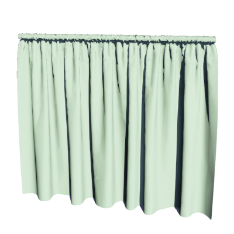
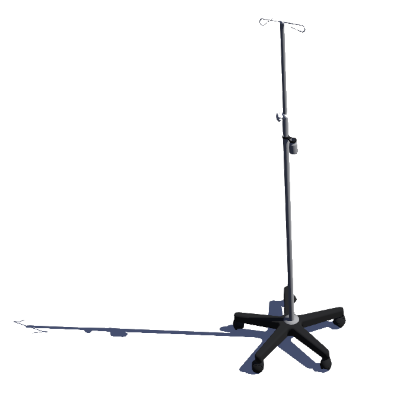
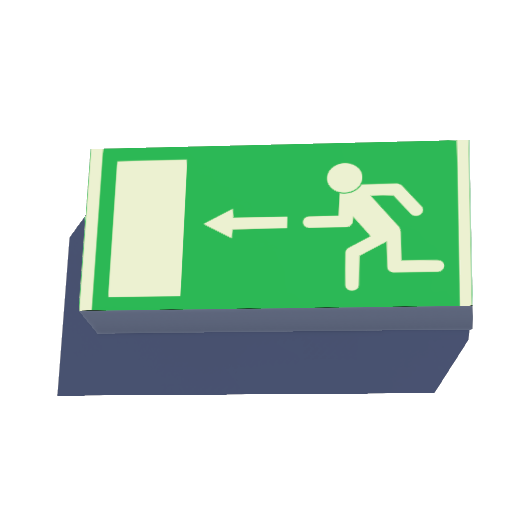
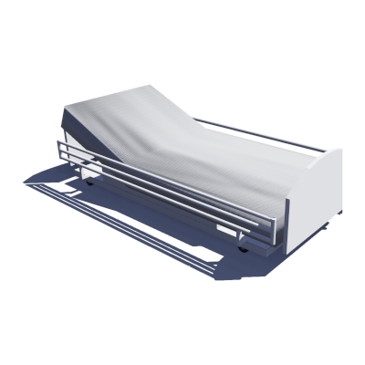
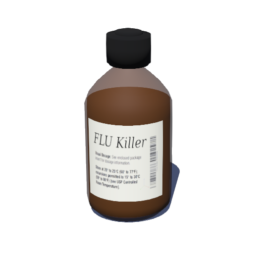

# Hospital

## Curtain

A curtain.

%figure



%end

Derived from [Solid](../reference/solid.md).

```
Curtain {
  SFVec3f    translation     0 0 0
  SFRotation rotation        0 0 1 0
  SFString   name            "curtain"
  SFColor    baseColor       0.672885 0.8 0.650323
}
```

> **File location**: "[WEBOTS\_HOME/projects/objects/hospital/protos/Curtain.proto]({{ url.github_tree }}/projects/objects/hospital/protos/Curtain.proto)"

> **License**: Copyright Cyberbotics Ltd. Licensed for use only with Webots.
[More information.](https://cyberbotics.com/webots_assets_license)

## DripStand

A drip stand.

%figure



%end

Derived from [Solid](../reference/solid.md).

```
DripStand {
  SFVec3f    translation     0 0 0
  SFRotation rotation        0 0 1 0
  SFString   name            "drip stand"
  SFNode     physics         NULL
}
```

> **File location**: "[WEBOTS\_HOME/projects/objects/hospital/protos/DripStand.proto]({{ url.github_tree }}/projects/objects/hospital/protos/DripStand.proto)"

> **License**: Copyright Cyberbotics Ltd. Licensed for use only with Webots.
[More information.](https://cyberbotics.com/webots_assets_license)

## EmergencyExitSign

An emergency exit sign.

%figure



%end

Derived from [Solid](../reference/solid.md).

```
EmergencyExitSign {
  SFVec3f    translation     0 0 0
  SFRotation rotation        0 0 1 0
  SFString   name            "emergency exit sign"
  SFNode     physics         NULL
}
```

> **File location**: "[WEBOTS\_HOME/projects/objects/hospital/protos/EmergencyExitSign.proto]({{ url.github_tree }}/projects/objects/hospital/protos/EmergencyExitSign.proto)"

> **License**: Copyright Cyberbotics Ltd. Licensed for use only with Webots.
[More information.](https://cyberbotics.com/webots_assets_license)

## HandSanitizer

A hand sanitizer bottle.

%figure


%end

Derived from [Solid](../reference/solid.md).

```
HandSanitizer {
  SFVec3f    translation     0 0 0
  SFRotation rotation        0 0 1 0
  SFString   name            "hand sanitizer"
  SFNode     physics         NULL
}
```

> **File location**: "[WEBOTS\_HOME/projects/objects/hospital/protos/HandSanitizer.proto]({{ url.github_tree }}/projects/objects/hospital/protos/HandSanitizer.proto)"

> **License**: Copyright Cyberbotics Ltd. Licensed for use only with Webots.
[More information.](https://cyberbotics.com/webots_assets_license)

## HospitalBed

An hospital bed.

%figure



%end

Derived from [Solid](../reference/solid.md).

```
HospitalBed {
  SFVec3f    translation     0 0 0
  SFRotation rotation        0 0 1 0
  SFString   name            "hospital bed"
  SFNode     physics         NULL
}
```

> **File location**: "[WEBOTS\_HOME/projects/objects/hospital/protos/HospitalBed.proto]({{ url.github_tree }}/projects/objects/hospital/protos/HospitalBed.proto)"

> **License**: Copyright Cyberbotics Ltd. Licensed for use only with Webots.
[More information.](https://cyberbotics.com/webots_assets_license)

## MedicineBottle

A bottle of medicine.

%figure



%end

Derived from [Solid](../reference/solid.md).

```
MedicineBottle {
  SFVec3f    translation     0 0 0
  SFRotation rotation        0 0 1 0
  SFString   name            "medicine bottle"
  SFNode     physics         NULL
}
```

> **File location**: "[WEBOTS\_HOME/projects/objects/hospital/protos/MedicineBottle.proto]({{ url.github_tree }}/projects/objects/hospital/protos/MedicineBottle.proto)"

> **License**: Copyright Cyberbotics Ltd. Licensed for use only with Webots.
[More information.](https://cyberbotics.com/webots_assets_license)

