# Kitchen

## Breakfast

### BiscuitBox

A customizable (size, texture, etc.) biscuit box.

%figure

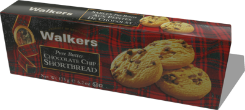

%end

Derived from [Solid](../reference/solid.md).

```
BiscuitBox {
  SFVec3f    translation 0 0 0
  SFRotation rotation    0 0 1 0
  SFString   name        "biscuit box"
  SFVec3f    size        0.08 0.24 0.04
  MFString   textureUrl  "textures/biscuit_box.jpg"
  SFFloat    mass        0.4
}
```

> **File location**: "[WEBOTS\_HOME/projects/objects/kitchen/breakfast/protos/BiscuitBox.proto]({{ url.github_tree }}/projects/objects/kitchen/breakfast/protos/BiscuitBox.proto)"

> **License**: Copyright Cyberbotics Ltd. Licensed for use only with Webots.
[More information.](https://cyberbotics.com/webots_assets_license)

#### BiscuitBox Field Summary

- `size`: Defines the size of the box.

- `textureUrl`: Defines the texture used for the box.

- `mass`: Defines the mass of the box in kg.

### CerealBox

A customizable (size, texture, etc.) cereal box.

%figure

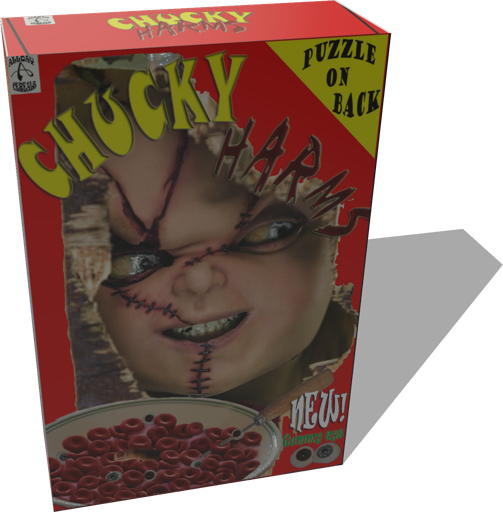

%end

Derived from [Solid](../reference/solid.md).

```
CerealBox {
  SFVec3f    translation 0 0 0
  SFRotation rotation    0 0 1 0
  SFString   name        "cereal box"
  SFVec3f    size        0.08 0.2 0.3
  MFString   textureUrl  "textures/cereal_box_2.jpg"
  SFFloat    mass        1
}
```

> **File location**: "[WEBOTS\_HOME/projects/objects/kitchen/breakfast/protos/CerealBox.proto]({{ url.github_tree }}/projects/objects/kitchen/breakfast/protos/CerealBox.proto)"

> **License**: Copyright Cyberbotics Ltd. Licensed for use only with Webots.
[More information.](https://cyberbotics.com/webots_assets_license)

#### CerealBox Field Summary

- `size`: Defines the size of the box.

- `textureUrl`: Defines the texture used for the box.

- `mass`: Defines the mass of the box in kg.

### HoneyJar

A honey jar.

%figure

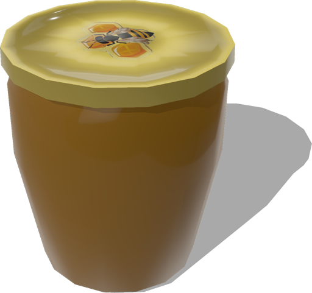

%end

Derived from [Solid](../reference/solid.md).

```
HoneyJar {
  SFVec3f    translation    0 0 0
  SFRotation rotation       0 0 1 0
  SFString   name           "honey jar"
  MFString   textureLidUrl  "textures/bee_lid.jpg"
  SFFloat    mass           0.5
  SFColor    color          0.839216 0.572549 0.105882
}
```

> **File location**: "[WEBOTS\_HOME/projects/objects/kitchen/breakfast/protos/HoneyJar.proto]({{ url.github_tree }}/projects/objects/kitchen/breakfast/protos/HoneyJar.proto)"

> **License**: Copyright Cyberbotics Ltd. Licensed for use only with Webots.
[More information.](https://cyberbotics.com/webots_assets_license)

#### HoneyJar Field Summary

- `textureLidUrl`: Defines the texture used for the lid of the jar.

- `mass`: Defines the mass of the jar in kg.

- `color`: Defines the color of the jar.

### JamJar

A jam jar.

%figure


%end

Derived from [Solid](../reference/solid.md).

```
JamJar {
  SFVec3f    translation   0 0 0
  SFRotation rotation      0 0 1 0
  SFString   name          "jam jar"
  MFString   textureLidUrl "textures/blue_jar_lid.jpg"
  SFFloat    mass          0.5
}
```

> **File location**: "[WEBOTS\_HOME/projects/objects/kitchen/breakfast/protos/JamJar.proto]({{ url.github_tree }}/projects/objects/kitchen/breakfast/protos/JamJar.proto)"

> **License**: Copyright Cyberbotics Ltd. Licensed for use only with Webots.
[More information.](https://cyberbotics.com/webots_assets_license)

#### JamJar Field Summary

- `textureLidUrl`: Defines the texture used for the lid of the jar.

- `mass`: Defines the mass of the jar in kg.

## Components

### HotPlate

An hot plate.

%figure

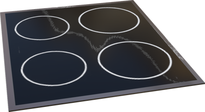

%end

Derived from [Solid](../reference/solid.md).

```
HotPlate {
  SFVec3f    translation 0 0 0.71
  SFRotation rotation    0 0 1 0
  SFString   name        "hot plate"
  MFString   textureUrl  "textures/components.jpg"
}
```

> **File location**: "[WEBOTS\_HOME/projects/objects/kitchen/components/protos/HotPlate.proto]({{ url.github_tree }}/projects/objects/kitchen/components/protos/HotPlate.proto)"

> **License**: Copyright Cyberbotics Ltd. Licensed for use only with Webots.
[More information.](https://cyberbotics.com/webots_assets_license)

#### HotPlate Field Summary

- `textureUrl`: Defines the texture used for the hot plate.

### Sink

A sink.

%figure

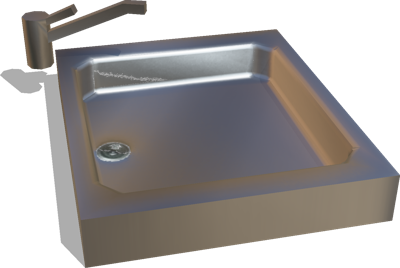

%end

Derived from [Solid](../reference/solid.md).

```
Sink {
  SFVec3f    translation 0 0 0.72
  SFRotation rotation    0 0 1 0
  SFString   name        "sink"
  MFString   textureUrl  "textures/components.jpg"
}
```

> **File location**: "[WEBOTS\_HOME/projects/objects/kitchen/components/protos/Sink.proto]({{ url.github_tree }}/projects/objects/kitchen/components/protos/Sink.proto)"

> **License**: Copyright Cyberbotics Ltd. Licensed for use only with Webots.
[More information.](https://cyberbotics.com/webots_assets_license)

#### Sink Field Summary

- `textureUrl`: Defines the texture used for the sink.

### Worktop

A customizable worktop.

%figure

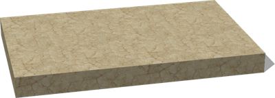

%end

Derived from [Solid](../reference/solid.md).

```
Worktop {
  SFVec3f    translation  0 0 0.71
  SFRotation rotation     0 0 1 0
  SFString   name         "worktop"
  SFVec3f    size         0.7 0.44 0.06
  SFNode     appearance   Marble { }
}
```

> **File location**: "[WEBOTS\_HOME/projects/objects/kitchen/components/protos/Worktop.proto]({{ url.github_tree }}/projects/objects/kitchen/components/protos/Worktop.proto)"

> **License**: Copyright Cyberbotics Ltd. Licensed for use only with Webots.
[More information.](https://cyberbotics.com/webots_assets_license)

#### Worktop Field Summary

- `size`: Defines the size of the worktop.

- `appearance`: Defines the appearance.

## Fridge

### Fridge PROTO

A fridge with 2 doors (0.7 x 0.7 x 1.8 m).

%figure

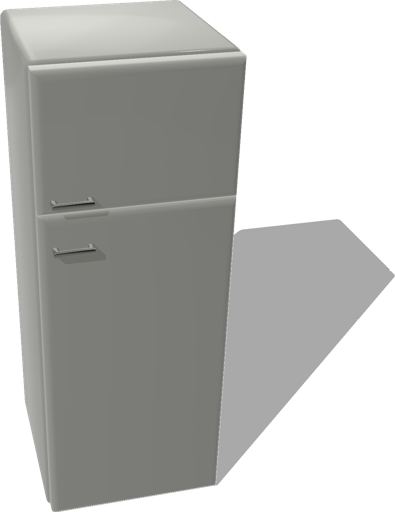

%end

Derived from [Solid](../reference/solid.md).

```
Fridge {
  SFVec3f    translation    0 0 0
  SFRotation rotation       0 0 1 0
  SFString   name           "fridge"
  SFColor    mainColor      1 1 1
}
```

> **File location**: "[WEBOTS\_HOME/projects/objects/kitchen/fridge/protos/Fridge.proto]({{ url.github_tree }}/projects/objects/kitchen/fridge/protos/Fridge.proto)"

> **License**: Copyright Cyberbotics Ltd. Licensed for use only with Webots.
[More information.](https://cyberbotics.com/webots_assets_license)

#### Fridge Field Summary

- `mainColor`: Defines the color of the fridge.

## Oven

### Oven PROTO

An oven (0.5 x 0.44 x 0.68 m) or a microwave (0.25 x 0.528 x 0.272 m).

%figure

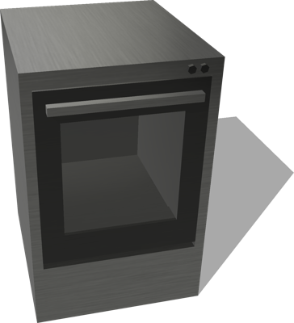

%end

Derived from [Solid](../reference/solid.md).

```
Oven {
  SFVec3f    translation    0 0 0
  SFRotation rotation       0 0 1 0
  SFString   name           "oven"
  SFColor    mainColor      1 1 1
  SFString   type           "oven"
}
```

> **File location**: "[WEBOTS\_HOME/projects/objects/kitchen/oven/protos/Oven.proto]({{ url.github_tree }}/projects/objects/kitchen/oven/protos/Oven.proto)"

> **License**: Copyright Cyberbotics Ltd. Licensed for use only with Webots.
[More information.](https://cyberbotics.com/webots_assets_license)

#### Oven Field Summary

- `mainColor`: Defines the color of the oven.

- `type`: Either "oven" or "microwave".

## Utensils

### Carafe

A carafe.

%figure

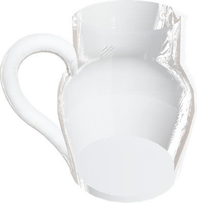

%end

Derived from [Solid](../reference/solid.md).

```
Carafe {
  SFVec3f    translation 0 0 0
  SFRotation rotation    0 0 1 0
  SFString   name        "carafe"
  SFFloat    mass        1
}
```

> **File location**: "[WEBOTS\_HOME/projects/objects/kitchen/utensils/protos/Carafe.proto]({{ url.github_tree }}/projects/objects/kitchen/utensils/protos/Carafe.proto)"

> **License**: Copyright Cyberbotics Ltd. Licensed for use only with Webots.
[More information.](https://cyberbotics.com/webots_assets_license)

#### Carafe Field Summary

- `mass`: Defines the mass of the carafe in kg.

### Cookware

A cookware.

%figure

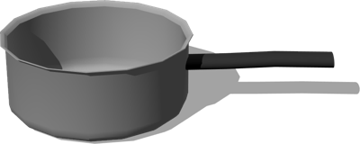

%end

Derived from [Solid](../reference/solid.md).

```
Cookware {
  SFVec3f    translation 0 0 0
  SFRotation rotation    0 0 1 0
  SFString   name       "cookware"
  SFColor    color      0.7 0.7 0.7
  SFFloat    mass       0.7
}
```

> **File location**: "[WEBOTS\_HOME/projects/objects/kitchen/utensils/protos/Cookware.proto]({{ url.github_tree }}/projects/objects/kitchen/utensils/protos/Cookware.proto)"

> **License**: Copyright Cyberbotics Ltd. Licensed for use only with Webots.
[More information.](https://cyberbotics.com/webots_assets_license)

#### Cookware Field Summary

- `color`: Defines the color of the cookware.

- `mass`: Defines the mass of the cookware in kg.

### Fork

A fork.

%figure

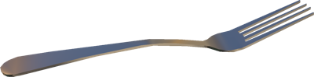

%end

Derived from [Solid](../reference/solid.md).

```
Fork {
  SFVec3f    translation 0 0 0
  SFRotation rotation    0 0 1 0
  SFString   name        "fork"
  SFColor    color       0.75 0.75 0.75
}
```

> **File location**: "[WEBOTS\_HOME/projects/objects/kitchen/utensils/protos/Fork.proto]({{ url.github_tree }}/projects/objects/kitchen/utensils/protos/Fork.proto)"

> **License**: Copyright Cyberbotics Ltd. Licensed for use only with Webots.
[More information.](https://cyberbotics.com/webots_assets_license)

#### Fork Field Summary

- `color`: Defines the color of the fork.

### Glass

A glass.

%figure

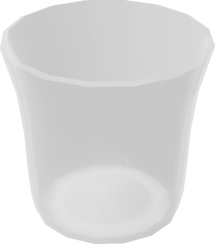

%end

Derived from [Solid](../reference/solid.md).

```
Glass {
  SFVec3f    translation 0 0 0
  SFRotation rotation    0 0 1 0
  SFString   name        "glass"
  SFFloat    mass        0.17
}
```

> **File location**: "[WEBOTS\_HOME/projects/objects/kitchen/utensils/protos/Glass.proto]({{ url.github_tree }}/projects/objects/kitchen/utensils/protos/Glass.proto)"

> **License**: Copyright Cyberbotics Ltd. Licensed for use only with Webots.
[More information.](https://cyberbotics.com/webots_assets_license)

#### Glass Field Summary

- `mass`: Defines the mass of the glass in kg.

### Knife

A knife.

%figure

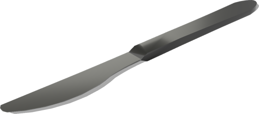

%end

Derived from [Solid](../reference/solid.md).

```
Knife {
  SFVec3f    translation 0 0 0
  SFRotation rotation    0 0 1 0
  SFString   name        "knife"
  SFColor    color       0.75 0.75 0.75
}
```

> **File location**: "[WEBOTS\_HOME/projects/objects/kitchen/utensils/protos/Knife.proto]({{ url.github_tree }}/projects/objects/kitchen/utensils/protos/Knife.proto)"

> **License**: Copyright Cyberbotics Ltd. Licensed for use only with Webots.
[More information.](https://cyberbotics.com/webots_assets_license)

#### Knife Field Summary

- `color`: Defines the color of the knife.

### Lid

A lid.

%figure

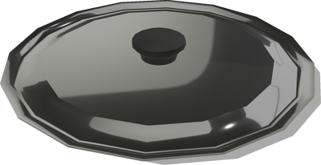

%end

Derived from [Solid](../reference/solid.md).

```
Lid {
  SFVec3f    translation 0 0.068 0
  SFRotation rotation    0 0 1 0
  SFString   name        "lid"
  SFColor    color       0.7 0.7 0.7
  SFFloat    mass        0.19
}
```

> **File location**: "[WEBOTS\_HOME/projects/objects/kitchen/utensils/protos/Lid.proto]({{ url.github_tree }}/projects/objects/kitchen/utensils/protos/Lid.proto)"

> **License**: Copyright Cyberbotics Ltd. Licensed for use only with Webots.
[More information.](https://cyberbotics.com/webots_assets_license)

#### Lid Field Summary

- `color`: Defines the color of the lid.

- `mass`: Defines the mass of the lid in kg.

### Plate

A customizable (dimensions, texture, etc. ) plate.

%figure

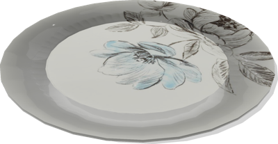

%end

Derived from [Solid](../reference/solid.md).

```
Plate {
  SFVec3f    translation 0 0 0
  SFRotation rotation    0 0 1 0
  SFString   name        "plate"
  MFString   textureUrl  "textures/floral_plate.jpg"
  SFFloat    height      0.01
  SFFloat    radius      0.11
  SFFloat    mass        0.3
}
```

> **File location**: "[WEBOTS\_HOME/projects/objects/kitchen/utensils/protos/Plate.proto]({{ url.github_tree }}/projects/objects/kitchen/utensils/protos/Plate.proto)"

> **License**: Copyright Cyberbotics Ltd. Licensed for use only with Webots.
[More information.](https://cyberbotics.com/webots_assets_license)

#### Plate Field Summary

- `textureUrl`: Defines the textures used for of the plate.

- `height`: Defines the height of the plate.

- `radius`: Defines the radius of the plate.

- `mass`: Defines the mass of the plate in kg.

### Spoon

A spoon.

%figure

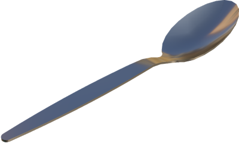

%end

Derived from [Solid](../reference/solid.md).

```
Spoon {
  SFVec3f     translation 0 0 0
  SFRotation  rotation    0 0 1 0
  SFString    name        "spoon"
  SFColor     color       0.75 0.75 0.75
  SFString    type        "table"
}
```

> **File location**: "[WEBOTS\_HOME/projects/objects/kitchen/utensils/protos/Spoon.proto]({{ url.github_tree }}/projects/objects/kitchen/utensils/protos/Spoon.proto)"

> **License**: Copyright Cyberbotics Ltd. Licensed for use only with Webots.
[More information.](https://cyberbotics.com/webots_assets_license)

#### Spoon Field Summary

- `color`: Defines the color of the spoon.

- `type`: Defines the type of spoon. The value should be either `table` or `tea`.

### Wineglass

A wine glass.

%figure

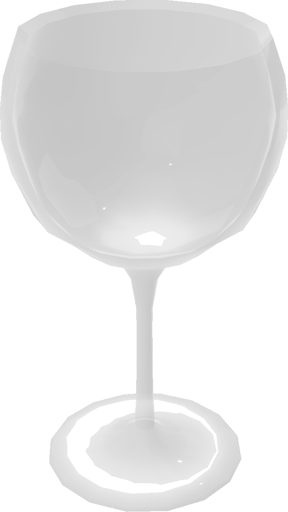

%end

Derived from [Solid](../reference/solid.md).

```
Wineglass {
  SFVec3f    translation 0 0 0
  SFRotation rotation    0 0 1 0
  SFString   name        "wine glass"
  SFFloat    mass        0.2
}
```

> **File location**: "[WEBOTS\_HOME/projects/objects/kitchen/utensils/protos/Wineglass.proto]({{ url.github_tree }}/projects/objects/kitchen/utensils/protos/Wineglass.proto)"

> **License**: Copyright Cyberbotics Ltd. Licensed for use only with Webots.
[More information.](https://cyberbotics.com/webots_assets_license)

#### Wineglass Field Summary

- `mass`: Defines the mass of the wine glass in kg.

### WoodenSpoon

A wooden spoon.

%figure

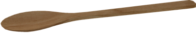

%end

Derived from [Solid](../reference/solid.md).

```
WoodenSpoon {
  SFVec3f    translation 0 0 0
  SFRotation rotation    0 0 1 0
  SFString   name        "wooden spoon"
  MFString   textureUrl  "textures/wooden_spoon.jpg"
}
```

> **File location**: "[WEBOTS\_HOME/projects/objects/kitchen/utensils/protos/WoodenSpoon.proto]({{ url.github_tree }}/projects/objects/kitchen/utensils/protos/WoodenSpoon.proto)"

> **License**: Copyright Cyberbotics Ltd. Licensed for use only with Webots.
[More information.](https://cyberbotics.com/webots_assets_license)

#### WoodenSpoon Field Summary

- `textureUrl`: Defines the texture used for the spoon.

