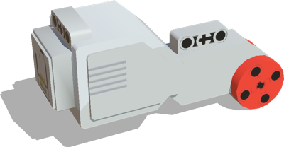
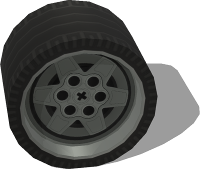

# Lego

## LegoLargeMotor

LEGO Mindstorm EV3 large motor. Part id: 6009430.

%figure



%end

Derived from [Solid](../reference/solid.md).

```
LegoLargeMotor {
  SFVec3f    translation 0 0 0
  SFRotation rotation    0 1 0 0
  SFString   name        "LEGO large motor"
  MFColor    recognitionColors []
}
```

> **File location**: "[WEBOTS\_HOME/projects/objects/lego/protos/LegoLargeMotor.proto]({{ url.github_tree }}/projects/objects/lego/protos/LegoLargeMotor.proto)"

> **License**: Copyright Cyberbotics Ltd. Licensed for use only with Webots.
[More information.](https://cyberbotics.com/webots_assets_license)

## LegoWheel

LEGO Mindstrom EV 3 wheel. Parts id: 4634091 & 6035364.

%figure



%end

Derived from [Solid](../reference/solid.md).

```
LegoWheel {
  SFVec3f    translation 0 0.0219974 0
  SFRotation rotation    0 1 0 0
  SFString   name        "LEGO wheel"
  MFColor    recognitionColors []
}
```

> **File location**: "[WEBOTS\_HOME/projects/objects/lego/protos/LegoWheel.proto]({{ url.github_tree }}/projects/objects/lego/protos/LegoWheel.proto)"

> **License**: Copyright Cyberbotics Ltd. Licensed for use only with Webots.
[More information.](https://cyberbotics.com/webots_assets_license)

