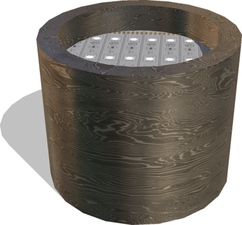
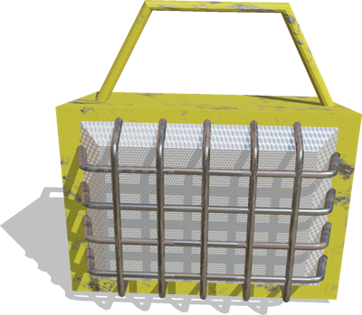
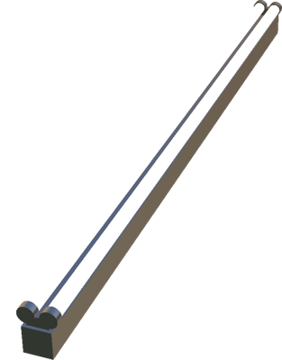
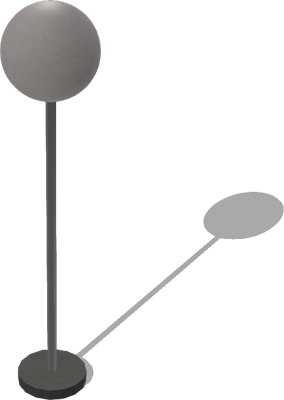

# Lights

## CeilingLight

A ceiling light (0.19 x 0.19 x 0.8 m).

%figure


%end

Derived from [Solid](../reference/solid.md).

```
CeilingLight {
  SFVec3f    translation                0 0 2.4
  SFRotation rotation                   0 0 1 0
  SFString   name                       "ceiling light"
  SFColor    bulbColor                  1 1 1
  MFString   bulbTextureUrl             "textures/light_bulb.jpg"
  SFColor    supportColor               1 1 1
  MFString   supportTextureUrl          "textures/light_support_base_color.jpg"
  SFColor    pointLightColor            1 1 1
  SFFloat    pointLightIntensity        1
  SFFloat    pointLightRadius           100
  SFBool     pointLightCastShadows      FALSE
  SFBool     castShadows                TRUE
}
```

> **File location**: "[WEBOTS\_HOME/projects/objects/lights/protos/CeilingLight.proto]({{ url.github_tree }}/projects/objects/lights/protos/CeilingLight.proto)"

> **License**: Copyright Cyberbotics Ltd. Licensed for use only with Webots.
[More information.](https://cyberbotics.com/webots_assets_license)

### CeilingLight Field Summary

- `bulbColor`: Defines the color of the light bulb.

- `bulbTextureUrl`: Defines the texture used for the light bulb.

- `supportColor`: Defines the color of the light support.

- `supportTextureUrl`: Defines the texture used for the light support.

- `pointLightColor`: Defines the color of the point light.

- `pointLightIntensity`: Defines the intensity of the point light.

- `pointLightRadius`: Defines the radius of the point light.

- `pointLightCastShadows`: Defines whether the point light should cast shadows.

- `castShadows`: Defines whether this object should cast shadows.

## CeilingSpotLight

A ceiling spot light.

%figure



%end

Derived from [Solid](../reference/solid.md).

```
CeilingSpotLight {
  SFVec3f    translation               0 0 1
  SFRotation rotation                  0 0 1 0
  SFString   name                      "ceiling light"
  SFNode     supportAppearance         DamascusSteel { }
  SFColor    spotLightColor            1 1 1
  SFFloat    spotLightIntensity        1
  SFFloat    spotLightRadius           100
  SFBool     spotLightCastShadows      FALSE
}
```

> **File location**: "[WEBOTS\_HOME/projects/objects/lights/protos/CeilingSpotLight.proto]({{ url.github_tree }}/projects/objects/lights/protos/CeilingSpotLight.proto)"

> **License**: Copyright Cyberbotics Ltd. Licensed for use only with Webots.
[More information.](https://cyberbotics.com/webots_assets_license)

### CeilingSpotLight Field Summary

- `supportAppearance`: Defines the appearance of the light support.

- `spotLightColor`: Defines the color of the spot light.

- `spotLightIntensity`: Defines the intensity of the spot light.

- `spotLightRadius`: Defines the radius of the spot light.

- `spotLightCastShadows`: Defines whether the spot light should cast shadows.

## ConstructionLamp

A construction lamp.

%figure



%end

Derived from [Solid](../reference/solid.md).

```
ConstructionLamp {
  SFVec3f    translation               0 0 0.07
  SFRotation rotation                  0 0 1 0
  SFString   name                      "construction lamp"
  SFNode     supportAppearance         MetalPipePaint { }
  SFColor    spotLightColor            1 1 1
  SFFloat    spotLightIntensity        2
  SFFloat    spotLightRadius           100
  SFBool     spotLightCastShadows      FALSE
}
```

> **File location**: "[WEBOTS\_HOME/projects/objects/lights/protos/ConstructionLamp.proto]({{ url.github_tree }}/projects/objects/lights/protos/ConstructionLamp.proto)"

> **License**: Copyright Cyberbotics Ltd. Licensed for use only with Webots.
[More information.](https://cyberbotics.com/webots_assets_license)

### ConstructionLamp Field Summary

- `supportAppearance`: Defines the appearance of the light support.

- `spotLightColor`: Defines the color of the spot light.

- `spotLightIntensity`: Defines the intensity of the spot light.

- `spotLightRadius`: Defines the radius of the spot light.

- `spotLightCastShadows`: Defines whether the spot light should cast shadows.

## DoubleFluorescentLamp

A double fluorescent lamp.
It does not contain any actual Light node, it only uses emissive color.

%figure



%end

Derived from [Solid](../reference/solid.md).

```
DoubleFluorescentLamp {
  SFVec3f    translation     0 0 0
  SFRotation rotation        0 0 1 0
  SFString   name            "double fuorescent lamp"
  SFFloat    intensity       10
}
```

> **File location**: "[WEBOTS\_HOME/projects/objects/lights/protos/DoubleFluorescentLamp.proto]({{ url.github_tree }}/projects/objects/lights/protos/DoubleFluorescentLamp.proto)"

> **License**: Copyright Cyberbotics Ltd. Licensed for use only with Webots.
[More information.](https://cyberbotics.com/webots_assets_license)

### DoubleFluorescentLamp Field Summary

- `intensity`: Defines the intensity of the emissive color.

## FloorLight

A floor light (0.19 x 0.19 x 1.6 m).

%figure



%end

Derived from [Solid](../reference/solid.md).

```
FloorLight {
  SFVec3f    translation                0 0 0
  SFRotation rotation                   0 0 1 0
  SFString   name                       "floor light"
  SFColor    bulbColor                  1 1 1
  MFString   bulbTextureUrl             "textures/light_bulb.jpg"
  SFColor    supportColor               1 1 1
  MFString   supportTextureUrl          "textures/light_support_base_color.jpg"
  SFColor    pointLightColor            1 1 1
  SFFloat    pointLightIntensity        1
  SFFloat    pointLightRadius           100
  SFBool     pointLightCastShadows      FALSE
  SFNode     physics                    NULL
}
```

> **File location**: "[WEBOTS\_HOME/projects/objects/lights/protos/FloorLight.proto]({{ url.github_tree }}/projects/objects/lights/protos/FloorLight.proto)"

> **License**: Copyright Cyberbotics Ltd. Licensed for use only with Webots.
[More information.](https://cyberbotics.com/webots_assets_license)

### FloorLight Field Summary

- `bulbColor`: Defines the color of the light bulb.

- `bulbTextureUrl`: Defines the texture used for the light bulb.

- `supportColor`: Defines the color of the light support.

- `supportTextureUrl`: Defines the texture used for the light support.

- `pointLightColor`: Defines the color of the point light.

- `pointLightIntensity`: Defines the intensity of the point light.

- `pointLightRadius`: Defines the radius of the point light.

- `pointLightCastShadows`: Defines whether the point light should cast shadows.

