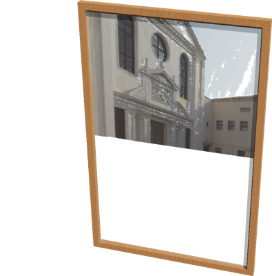

# Mirror

## Mirror PROTO

A simple mirror made of a display attached to a camera.
The reflected image does not depend on the viewpoint position.

%figure



%end

Derived from [Robot](../reference/robot.md).

```
Mirror {
  SFVec3f    translation     0 0 0
  SFRotation rotation        0 0 1 0
  SFString   name            "mirror"
  SFString   controller      "mirror"
  SFString   window          "<none>"
  SFBool     supervisor      FALSE
  SFFloat    fieldOfView     0.785398
  SFFloat    width           0.5
  SFFloat    height          0.8
  SFFloat    frameThickness  0.02
  SFNode     physics         NULL
  SFNode     frameAppearance VarnishedPine {}
}
```

> **File location**: "[WEBOTS\_HOME/projects/objects/mirror/protos/Mirror.proto]({{ url.github_tree }}/projects/objects/mirror/protos/Mirror.proto)"

> **License**: Copyright Cyberbotics Ltd. Licensed for use only with Webots.
[More information.](https://cyberbotics.com/webots_assets_license)

### Mirror Field Summary

- `controller`: Defines the controller of the mirror. This controller should simply enable the camera and attach it to the display.

- `fieldOfView`: Defines the field of view of the mirror camera.

- `width`: Defines the width of the mirror.

- `height`: Defines the height of the mirror.

- `frameThickness`: Defines the thickness of the mirror frame.

- `frameAppearance`: Defines the appearance of the mirror frame.

