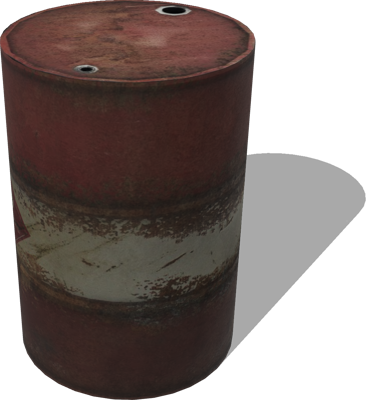
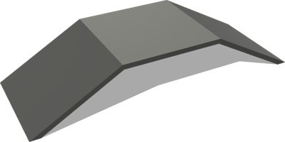
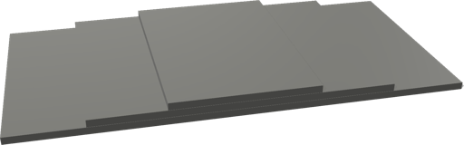

# Obstacles

## OilBarrel

Resizable oil barrel.

%figure



%end

Derived from [Solid](../reference/solid.md).

```
OilBarrel {
  SFVec3f    translation         0 0.44 0
  SFRotation rotation            0 1 0 0
  SFString   name                "oil barrel"
  SFFloat    height              0.88
  SFFloat    radius              0.305
  SFNode     physics             NULL
  MFNode     immersionProperties []
}
```

> **File location**: "[WEBOTS\_HOME/projects/objects/obstacles/protos/OilBarrel.proto]({{ url.github_tree }}/projects/objects/obstacles/protos/OilBarrel.proto)"

> **License**: Copyright Cyberbotics Ltd. Licensed for use only with Webots.
[More information.](https://cyberbotics.com/webots_assets_license)

### OilBarrel Field Summary

- `height`: Defines the height of the barrel.

- `radius`: Defines the radius of the barrel.

## Ramp30deg

A simple ramp made of two 30° slopes and a flat top.
The ramp is a static object (not physics-enabled) so it will not move when hit.

%figure



%end

Derived from [Solid](../reference/solid.md).

```
Ramp30deg {
  SFVec3f    translation  0 0 0
  SFRotation rotation     0 1 0 0
  SFString   name         "ramp 30 degrees"
  SFColor    color        0.5 0.5 0.5
  MFColor    recognitionColors []
}
```

> **File location**: "[WEBOTS\_HOME/projects/objects/obstacles/protos/Ramp30deg.proto]({{ url.github_tree }}/projects/objects/obstacles/protos/Ramp30deg.proto)"

> **License**: Copyright Cyberbotics Ltd. Licensed for use only with Webots.
[More information.](https://cyberbotics.com/webots_assets_license)

### Ramp30deg Field Summary

- `color`: Defines the color of the ramp.

## ThreeSteps

Three steps with customizable height and color.
This is not a physics-enabled object so it will not move when hit.

%figure



%end

Derived from [Solid](../reference/solid.md).

```
ThreeSteps {
  SFVec3f    translation  0 -0.5 0
  SFRotation rotation     0 1 0 0
  SFString   name         "three steps"
  SFVec3f    increment    0 0.1 0
  SFColor    color        0.5 0.5 0.5
  MFColor    recognitionColors []
}
```

> **File location**: "[WEBOTS\_HOME/projects/objects/obstacles/protos/ThreeSteps.proto]({{ url.github_tree }}/projects/objects/obstacles/protos/ThreeSteps.proto)"

> **License**: Copyright Cyberbotics Ltd. Licensed for use only with Webots.
[More information.](https://cyberbotics.com/webots_assets_license)

### ThreeSteps Field Summary

- `increment`: Defines the translation between each step.

- `color`: Deines the color of the steps.

